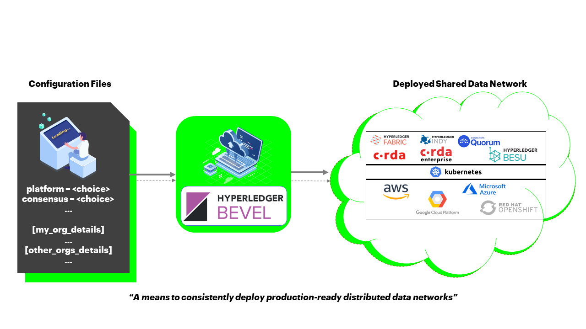
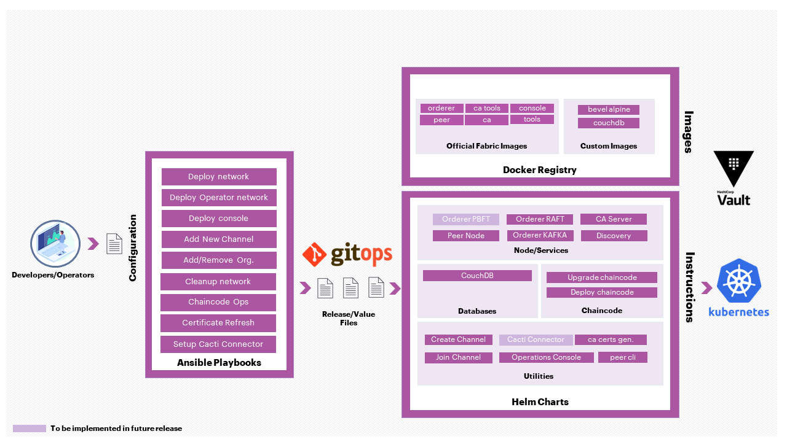
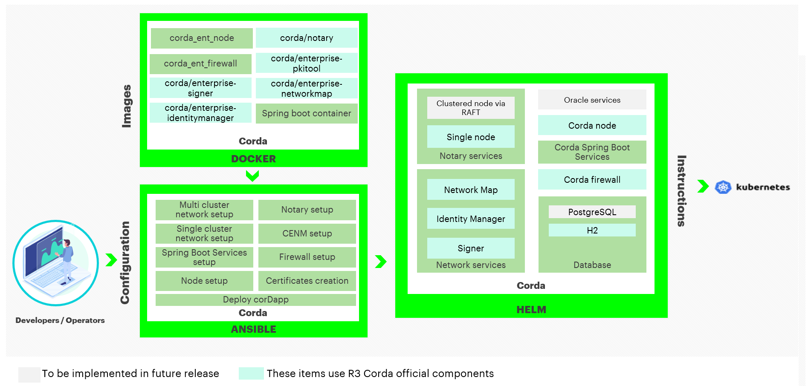
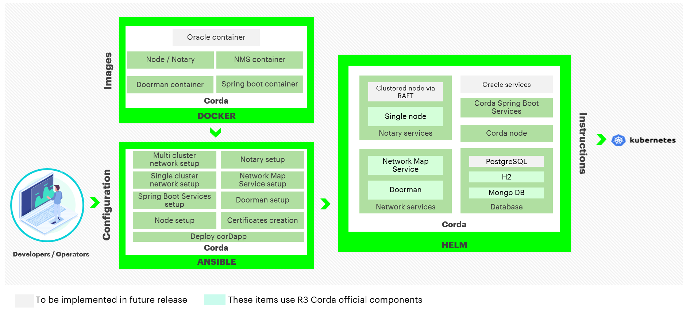
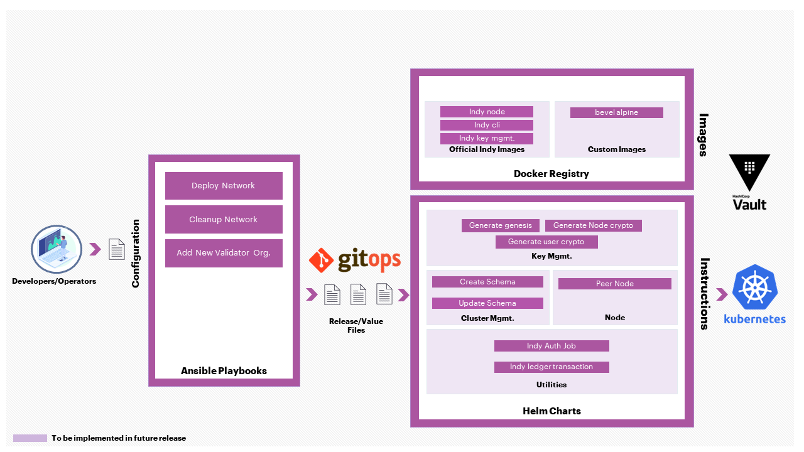
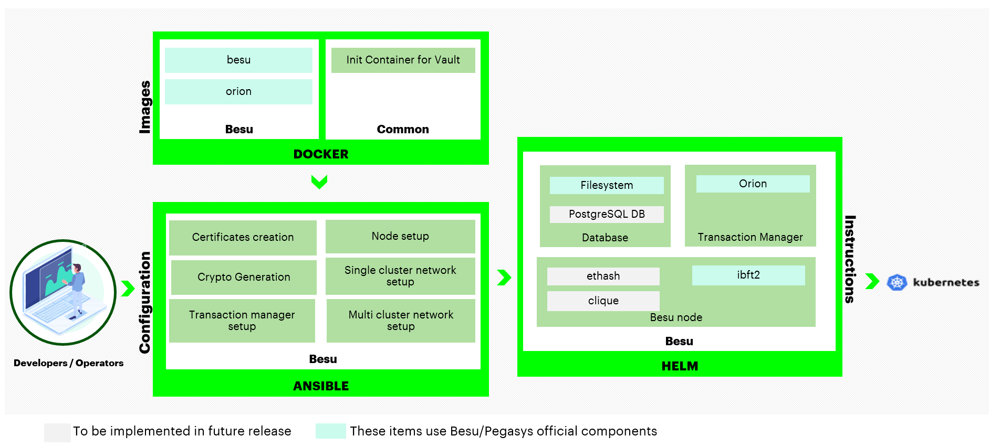

# Hyperledger Bevel [![join the chat][chat-image]][chat-url]

[chat-url]: https://discord.gg/hyperledger
[chat-image]: https://img.shields.io/discord/905194001349627914?logo=Hyperledger&style=plastic.svg

[](LICENSE) [](https://hyperledger-bevel.readthedocs.io/en/latest/?badge=latest) [](https://bestpractices.coreinfrastructure.org/projects/3548)
[](https://github.com/hyperledger/bevel/actions/workflows/dci_lint.yml)

- [Short Description](#short-description)
- [Scope of Project](#scope-of-project)
  - [Getting Started](#getting-started)
  - [Hyperledger Fabric](#hyperledger-fabric)
  - [Corda Enterprise](#corda-enterprise)
  - [Corda Opensource](#corda-opensource)
  - [Hyperledger Indy](#hyperledger-indy)
  - [Quorum](#quorum)
  - [Hyperledger Besu](#hyperledger-besu)
- [Contact](#contact)
- [Contributing](#contributing)
- [Initial Committers](#initial-committers)
- [Sponsor](#sponsor)

## Short Description
An automation framework for rapidly and consistently deploying production-ready Distributed Ledger Technology (DLT) platforms.

## Scope of Project
Hyperledger Bevel delivers an automation framework for rapidly and consistently deploying production-ready DLT platforms to cloud infrastructure.



Hyperledger Bevel is an accelerator/tool that helps developers rapidly set up and deploy secure, scalable and production-ready DLT network(s) that also allows new organizations to be easily on-boarded on the network. Bevel facilitates a safe and secure way of deploying and operating different DLT platforms.

It includes: 
- Helm charts to deploy different DLT nodes and to generate the related crypto/identities. 
- Helm charts for various operational features like adding new nodes, and deploying smart contracts.
- Helm charts to deploy Hyperledger Cacti connectors for Fabric, Quorum and Besu networks. 
- Ansible playbooks and modular role definitions to automate the deployment of Helm charts.
- Ansible playbooks and roles to automate deployment of Hyperledger fabric using  bevel-operator-fabric(Kubernetes operator for managing Hyperledger Fabric networks).
- Integrated CD using GitOps so that once the network is set up, all changes can be done via git PRs/merges.
- Configuration for Ambassador Edge Stack, HAProxy (for Hyperledger Fabric) and Isto Ingress (for Substrate) to act as Ingress Controller. 

Hyperledger Bevel currently supports R3 Corda OS and Enterprise, Hyperledger Fabric, Hyperledger Indy, Hyperledger Besu, Quorum and Substrate. Other DLT platforms can easily be added.

### Getting Started

To get started with the framework quickly, follow our [Getting Started guidelines](https://hyperledger-bevel.readthedocs.io/en/latest/gettingstarted.html).

Detailed operator and developer documentation is available on [our ReadTheDocs site](https://hyperledger-bevel.readthedocs.io/en/latest/index.html).

The documentation can also be built locally be following instructions in the `docs` folder.

### Hyperledger Fabric
For Hyperledger Fabric, we use the official Docker containers provided by that project. A number of different Ansible scripts will allow you to either create a new network (across clouds) or join an existing network.



### Corda Enterprise
For Corda Enterprise, we build Docker containers from the Corda source with licensed jars. A number of different Ansible scripts will allow you to either create a new network (across clouds) or join an existing network.



### Corda Opensource
For Corda Opensource, we build Docker containers from the Corda source. A number of different Ansible scripts will allow you to either create a new network (across clouds) or join an existing network.



### Hyperledger Indy
For Hyperledger Indy, we build Docker containers from our source code. A number of different Ansible scripts will allow you to create a new network (across clouds).



### Quorum
For Quorum, we use the official Docker containers provided by Quorum. A number of different Ansible scripts will allow you to either create a new network (across clouds) with choice of Consensus (between IBFT and RAFT) and a transaction Manager.


### Hyperledger Besu
For Hyperledger Besu, we use the official Docker containers provided by that project. A number of different Ansible scripts will allow you to create a new network (across clouds).



## Contact
We welcome your questions & feedback on our [Discord channel](https://discord.com/channels/905194001349627914/941739691336679454). [Please join our Discord first](https://discord.gg/hyperledger).

## Contributing
We welcome contributions to Hyperledger Bevel in many forms, and there’s always plenty to do!

Please review [contributing](./CONTRIBUTING.md) guidelines to get started.

# Build
If you are not using the provided Jenkins automation scripts, you can run the provisioning scripts within a docker runtime independent from your target Kubernetes cluster.
```
# Build provisioning image
docker build . -t ghcr.io/hyperledger/bevel-build

# Run the provisioning scripts
docker run -it -v $(pwd):/home/bevel/ ghcr.io/hyperledger/bevel-build
```

## Initial Committers
- [tkuhrt](https://github.com/tkuhrt)
- [jonathan-m-hamilton](https://github.com/jonathan-m-hamilton)
- [sownak](https://github.com/sownak)


## Sponsor
Mark Wagner (Github: [n1zyz](https://github.com/n1zyz), email: [mwagner@redhat.com](mailto:mwagner@redhat.com)) - TSC Member
