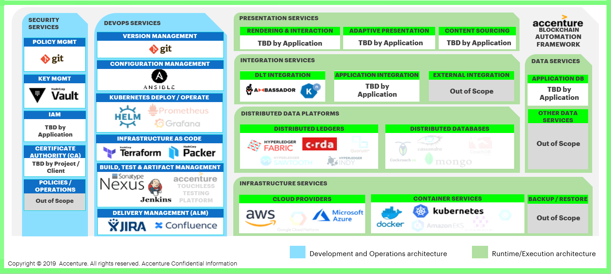

Architecture Reference
======================

   Figure: Hyperledger Bevel Physical Architecture

Security Services
-----------------
These are the services to enable the security of cryptographic keys, users, nodes and transactions along with the infrastructure supporting those services.

Policy Management
~~~~~~~~~~~~~~~~~

Policy management is the process of creating, communicating, and maintaining policies and procedures within an organization. Policy Management is a key feature used in development as well as operational phase of any product as it dictates who has what control in the dev/test/prod environment(s).

In Hyperledger Bevel, Policy Management is provided by the Git repository. Bevel uses :doc:`keyConcepts/gitops` for deployment and operations, hence all policies are defined in the Git repository.
Git branches with appropriate rights to users is maintained for releases in each environment. Read/write access, admin access to git repository, access to add access keys in repository, pull request based merge in main branch are some of the key features that is used in Bevel.

Key Management
~~~~~~~~~~~~~~

Key Management is the process of overseeing the generation, exchange, storage, use and destruction of cryptographic keys. Key Management is an important consideration for blockchain as all transactions in blockchain are signed using digital keys. Loss of keys can lead to financial loss as well as brand impact to the organization conducting the transaction.

Hyperledger Bevel uses `Hashicorp Vault`_ to hold secrets that are used by the DLT/Blockchain platform. A secret is anything that you want to tightly control access to (e.g. API keys, passwords, certificates). Vault provides a unified interface to any secret, while providing tight access control and recording a detailed audit log. `Hashicorp Vault`_ provides an abstraction on top of a Cloud KMS and does not create Cloud Platform lock-in.
See the `Platform-Specific Reference Guides`_ for specific details on the structure of the Vault. Vault is a pre-requisite for Bevel and should be configured and available before the automation is triggered.

Identity and Access Management (IAM)
~~~~~~~~~~~~~~~~~~~~~~~~~~~~~~~~~~~~

Identity and Access Management (IAM) is the process of defining and managing the access privileges of network users and determining how users are granted or denied those privileges. IAM is the front door for all blockchain applications and hence has to be designed upfront to reduce risk. Strong authentication techniques and user level permissioning will help shift left some of the security concerns.

Hyperledger Bevel does not provide IAM controls. This is to be developed and applied by the application/use-case.

Certificate Authority (CA)
~~~~~~~~~~~~~~~~~~~~~~~~~~

A Certificate Authority dispenses certificates to different actors. These certificates are digitally signed by the CA and bind together the actor with the actor’s public key (and optionally with a comprehensive list of properties). As a result, if one trusts the CA (and knows its public key), it can trust that the specific actor is bound to the public key included in the certificate, and owns the included attributes, by validating the CA’s signature on the actor’s certificate.

For test and dev environments, Hyperledger Bevel generates certificates and keys (for all Platforms) and also provides CA servers (Fabric only). 

For production use, generation of certificates, keys and CA servers via Hyperledger Bevel is not recommended. The existing certificates and keys can be placed in Vault in the paths described under subsections of `Platform-Specific Reference Guides`_ .

Policies/Operations
~~~~~~~~~~~~~~~~~~~

Policies/Operations refers to the actual security policies that an organization may/should have governing their business processes, operations and management.

This part of the reference architecture is out of scope for Hyperledger Bevel.

DevOps Services
---------------
These services enable the development of on-ledger (e.g. smart contracts) or off-ledger services based on SDK’s and IDE’s (e.g. Web APIs) including the maintenance, monitoring and administration of the distributed ledger and its on- and off-ledger services.

Version Management
~~~~~~~~~~~~~~~~~~

Version Management capabilities enable change control of smart contract and decentralized applications. This enables developers and operators to track different version of the code as well as releases.

Hyperledger Bevel utilizes Git as the version management tool.

Configuration Management
~~~~~~~~~~~~~~~~~~~~~~~~

Configuration management involves automation of scripts and ad-hoc practices in a consistent, reliable and secure way. Configuration Management enables operators to set-up DLT/Blockchain networks idempotently by using minimum configuration changes.

Hyperledger Bevel utilizes Ansible for configuration management. Ansible features a state driven, goal oriented resource model that describes the desired state of computer systems and services, not the paths to get them to this state. No matter what state a system is in, Ansible understands how to transform it to the desired state (and also supports a "dry run" mode to preview needed changes). This allows reliable and repeatable IT infrastructure configuration, avoiding the potential failures from scripting and script-based solutions that describe explicit and often irreversible actions rather than the end goal.

Kubernetes Deploy/Operate
~~~~~~~~~~~~~~~~~~~~~~~~~

Kubernetes Deploy/Operate consists of the services that are used to deploy desired state of various services on Kubernetes clusters. It is also used for maintenance and operations of these services. 

Hyperledger Bevel uses Helm to achieve this. Helm uses a packaging format called charts. A chart is a collection of files that describe a related set of Kubernetes resources. A single chart might be used to deploy something simple, like a memcached pod, or something complex, like a full web app stack with HTTP servers, databases, caches, and so on, which in our case, is the desired blockchain platform. While using helm, we can deploy a set of services and deployments together as a release.

Infrastructure as Code
~~~~~~~~~~~~~~~~~~~~~~

Infrastructure as Code (IaC) is the process of managing and provisioning cloud hardware through machine-readable definition files, rather than physical hardware configuration or interactive configuration tools.
IaC can be versioned and hence, maintained easily and can be used to deploy cloud environments idempotently.

This part of the reference architecture is out of scope for Hyperledger Bevel.

Build, Test, and Artifact Management
~~~~~~~~~~~~~~~~~~~~~~~~~~~~~~~~~~~~

Build, Test, and Artifact Management capabilities enable continuous delivery management by ensuring automation of the build and deployment of artefacts.

Hyperledger Bevel  uses TravisCI for running static tests, building and storing of Docker images. 
Jenkins Pipelines (as code) are also available for continuous deployment/reset of DLT network. 
Artefact management is not implemented yet, but GitHub Releases can be used for this.

Delivery Management
~~~~~~~~~~~~~~~~~~~
Delivery Management is the process where all software, artifacts and data from disparate tools used to move a product or feature from initial idea to max adoption are integrated into a unified common data layer, with the key information connected and easily accessible, giving each individual and team an unprecedented level of insight into bottlenecks and inefficiencies dramatically improving the speed at which better software gets to users safely.

As it is opensource and a Hyperledger Foundation project, Hyperledger Bevel integrates with GitHub for reporting and tracking new features, bugs/issues and releases. Bevel uses ReadTheDocs for sharing documentation.
In specific implementations, Hyperledger Bevel can be integrated with tools like Jira and Confluence.

Presentation Services
---------------------

The presentation services specify how the application will be provided to the end-user. It also defines the on-ledger and off-ledger services and capabilities via different channels.

This part of the reference architecture is out of scope for Hyperledger Bevel  and will be determined by the application using Bevel.

Integration Services
--------------------
These are combination of the services to interact with on- and off-ledger services via APIs or ledger protocols including runtime and operations services.

DLT Integration
~~~~~~~~~~~~~~~

DLT integration refers to how the presentation services will talk to the DLT Platform. This will depend on the presentation service as such.

Hyperledger Bevel provides a sample application :doc:`example/supplychain`, which uses Express Nodejs API as the integration layer to talk to the underlying DLT platform.
Each DLT/Blockchain platform also enables this by providing SDKs or APIs themselves.

Application Integration
~~~~~~~~~~~~~~~~~~~~~~~

Application Integration refers to how the application will talk to different components of the same application.

This part of the reference architecture is out of scope for Hyperledger Bevel  and will be determined by the application using Bevel.

External Integration
~~~~~~~~~~~~~~~~~~~~

External integration is required when the blockchain application interfaces with systems outside of the application or DLT platform.

This part of the reference architecture is out of scope for Hyperledger Bevel  and will be determined by the application using Bevel.

Distributed Data Platforms
--------------------------

Distributed Data Platforms form the core of any distributed architecture solution. Hyperledger Bevel  aims to support both Distributed Ledgers and Distributed Databases. 
Bevel currently supports DLT/Blockchain Platforms: `Corda`_, `Hyperledger Fabric`_, `Hyperledger Indy`_, `Hyperledger Besu`_, and `Quorum`_.

Infrastructure Services
-----------------------
Infrastructure services refer to the various services needed to run or deploy the different services of a distributed ledger architecture. 

Cloud Providers
~~~~~~~~~~~~~~~

A Cloud Provider is a company that delivers cloud computing based services with features like scalibility and easy maintainance.

Hyperledger Bevel is built on Kubernetes, so will run on any Cloud provider providing Kubernetes as a service; this includes private and hybrid clouds.

Container Services
~~~~~~~~~~~~~~~~~~

Container services allows users to deploy and manage containers using container based virtualization. Containers allow a developer to package up an application with all of the parts it needs, such as libraries and other dependencies, and ship it all out as one package.

Hyperledger Bevel  uses 2 containerization technologies: Docker and Kubernetes.
Kubernetes (K8s) is an open-source system for automating deployment, scaling, and management of containerized applications.
Docker is a tool designed to make it easier to create, deploy, and run applications by using containers.

Backup/Restore
~~~~~~~~~~~~~~

Disaster recovery involves a set of policies, tools and procedures to enable the recovery of vital technology infrastructure and systems following a natural or human-induced disaster. Even though blockchain applications are self replicating, complete auto recovery is not always possible. Therefore it is  important to have guidelines around backing up the data in a distributed store and restoring it using a conventional restoring mechanism. Backup is the process of copying and archiving data. Restore is the process of returning data that has been lost, stolen or damaged from secondary storage.

This part of the reference architecture is out of scope for Hyperledger Bevel.

Other Data Services
-------------------

Data services are related to on-ledger storage and data processing.

This part of the reference architecture is out of scope for Hyperledger Bevel.

Platform-Specific Reference Guides
----------------------------------

.. toctree::
   :maxdepth: 1

   architectureref/corda-ent
   architectureref/certificates_path_list_corda_ent
   architectureref/corda
   architectureref/certificates_path_list_corda
   architectureref/hyperledger-fabric
   architectureref/certificates_path_list_fabric
   architectureref/hyperledger-indy
   architectureref/certificates_path_list_indy
   architectureref/quorum
   architectureref/certificates_path_list_quorum
   architectureref/hyperledger-besu
   architectureref/certificates_path_list_besu
   architectureref/substrate
   architectureref/certificates_path_list_substrate

.. _Corda: https://docs.corda.net/
.. _Hyperledger Fabric: https://hyperledger-fabric.readthedocs.io
.. _Hashicorp Vault: https://www.vaultproject.io/
.. _Hyperledger Indy: https://hyperledger-indy.readthedocs.io/en/latest/
.. _Quorum: https://www.goquorum.com/
.. _Hyperledger Besu: https://besu.hyperledger.org/en/stable/
.. _Substrate: https://www.parity.io/technologies/substrate/
