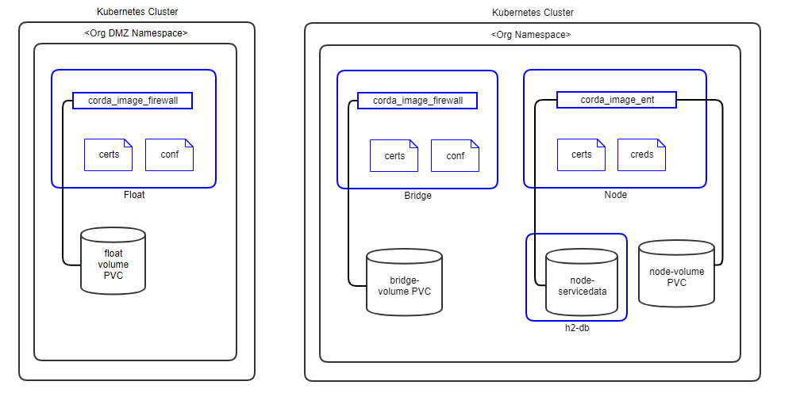
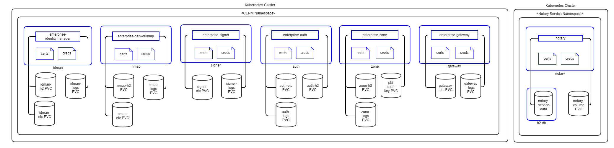

# Corda Enterprise Architecture Reference

## Kubernetes
### Peer Nodes
The following diagram shows how Corda peer nodes will be deployed on your Kubernetes instance.



**Notes:**
1. Pods are shown in blue in the diagram.
1. Certificates are mounted as in-memory volumes from the [Vault](#vault-config).
1. The h2 database is a separate pod running in the same namespace. In future release, PostgreSQL will be implemented as well.
1. All storage uses a Kubernetes Persistent Volume.
1. Release 0.6.0.0 does not implement Corda firewall components. These will be implemented in later releases based on demand.

### Support Services
The following diagram shows how the Corda Enterprise Network Map Services (**Identity Manager**, **Networkmap**, **Signer** and **Notary**) will be deployed on your Kubernetes instance(s).



**Notes:**
1. Pods are shown in blue in the diagram.
1. Certificates are mounted as in-memory volumes from the [Vault](#vault-config).
1. All CENM pods (except Notary) have separate H2 volume for data storage. In future release, PostgreSQL will be implemented as well.
1. Notary service has a separate H2 pod for data storage. In future release, PostgreSQL will be implemented as well.
1. All storage uses a Kubernetes Persistent Volume.
1. Release 0.6.0.0 implements Notary in the same namespace as other CENM services. They will be separated when HA Notary is implemented in later releases.

## Components


### Docker Images

For Corda Enterprise, the *corda_ent_node* and *corda_ent_firewall* docker images should be built and put in a private docker registry. Please follow [these instructions](https://github.com/Accenture-BAF/corda-kubernetes-deployment/tree/master/docker-images) to build docker images for Corda Enterprise. 

The official Corda images are available on [Docker Hub](https://hub.docker.com/u/corda). These are evaluation only, for production implementation, please aquire licensed images from R3, upload them into your private docker registry and update the tags accordingly.

Following Corda Docker Images are used and needed by the Blockchain Automation Framework.
* [Corda Network Map Service](https://hub.docker.com/r/corda/enterprise-networkmap) (Built as per [these instructions](https://github.com/hyperledger-labs/blockchain-automation-framework/tree/master/platforms/r3-corda-ent/images))
* [Corda Identity Manager Service](https://hub.docker.com/r/corda/enterprise-identitymanager)
* [Corda Signer](https://hub.docker.com/r/corda/enterprise-signer)
* [Corda PKITool](https://hub.docker.com/r/corda/enterprise-pkitool) (Built as per [these instructions](https://github.com/hyperledger-labs/blockchain-automation-framework/tree/master/platforms/r3-corda-ent/images))
* [Corda Notary](https://hub.docker.com/r/corda/notary) (Built as per [these instructions](https://github.com/hyperledger-labs/blockchain-automation-framework/tree/master/platforms/r3-corda-ent/images))
* Corda Node (Built as per [these instructions](https://github.com/Accenture-BAF/corda-kubernetes-deployment/tree/master/docker-images))
* Corda Firewall (Built as per [these instructions](https://github.com/Accenture-BAF/corda-kubernetes-deployment/tree/master/docker-images))

### Ansible Playbooks

Detailed information on ansible playbooks can be referred [here](../developer/corda-ent-ansible) and the execution process can be referred [here](../operations/setting_dlt.md).

### Helm Charts
Detailed information on helm charts can be referred [here](../developer/corda-ent-helmcharts.md).


<a name="vault-config"></a>
## Vault Configuration WIP
The Blockchain Automation Framework stores their `crypto` and `credentials` immediately within the secret secrets engine.
Optionally, `secret_path` can be set on the network.yaml to change the secret engine from the default `secret/`.

| Crypto Material Path | Credentials Path     |
|----------------------|----------------------|
| `secret/<servicename>`      | `secret/<servicename>/credentials` |

*  `secrets/notary/credentials/database` - Contains password for notary database for admin and user:

```
sa="newh2pass" notaryUser1="xyz1234" notaryUser2="xyz1236"
```
*  `secrets/notary/credentials/keystore` - Contains password for notary keystore:

```
keyStorePassword="newpass" trustStorePassword="newpass" defaultTrustStorePassword"=trustpass" defaultKeyStorePassword="cordacadevpass" sslkeyStorePassword="sslpass" ssltrustStorePassword="sslpass"
```
*  `secrets/notary/credentials/networkmappassword` - Contains password for networkmap:

```
sa="admin"
```
*  `secrets/notary/credentials/rpcusers` - Contains password for rpc users:
```
notaryoperations="usera" notaryoperations1="usera" notaryoperations2="usera" notaryadmin="usera"
```
*  `secrets/notary/credentials/vaultroottoken` - Contains password for vault root token in the format:

```
rootToken="<vault.root_token>"
```
*  `secrets/<org-name>/credentials/database` - Contains password for notary database for admin and user:

```
sa="newh2pass" <org-name>User1="xyz1234" <org-name>User2="xyz1236"
```
*  `secrets/<org-name>/credentials/keystore` - Contains password for notary keystore:

```
keyStorePassword="newpass" trustStorePassword="newpass" defaultTrustStorePassword"=trustpass" defaultKeyStorePassword="cordacadevpass" sslkeyStorePassword="sslpass" ssltrustStorePassword="sslpass"
```
*  `secrets/<org-name>/credentials/networkmappassword` - Contains password for networkmap:

```
sa="admin"
```
*  `secrets/<org-name>/credentials/rpcusers` - Contains password for rpc users:

```
<org-name>operations="usera" <org-name>operations1="usera" <org-name>operations2="usera" <org-name>admin="usera"
```
*  `secrets/<org-name>/credentials/vaultroottoken` - Contains password for vault root token in the format:

```
rootToken="<vault.root_token>"
```

The complete Corda Enterprise Certificate and key paths in the vault can be referred [here](certificates_path_list_corda_ent).
