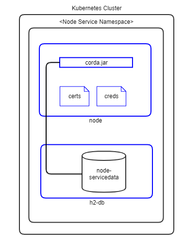
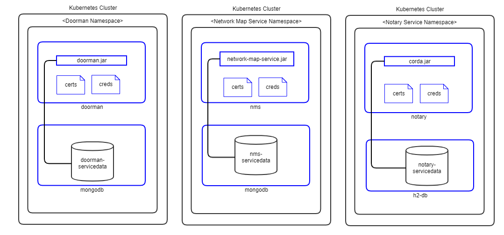
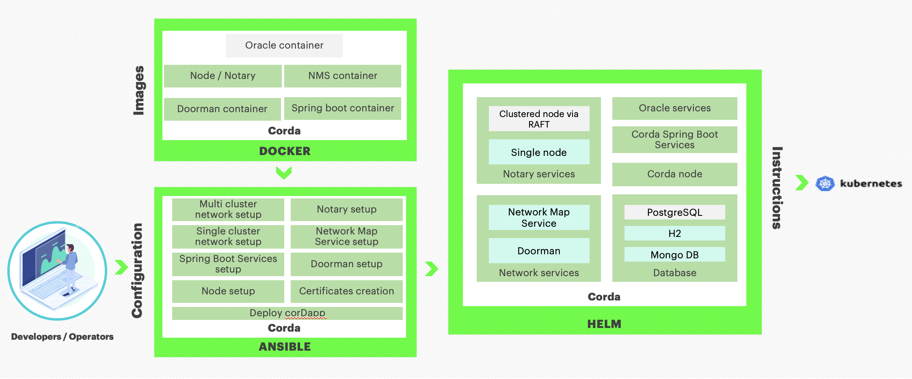

# Corda Opensource Architecture Reference

## Kubernetes
### Peer Nodes
The following diagram shows how Corda peer nodes will be deployed on your Kubernetes instance.



**Notes:**
1. Pods are shown in blue in the diagram.
1. Certificates are mounted as in-memory volumes from the [vault](#vault-config).
1. The node-pod runs corda.jar.
1. The h2 database is a separate pod running in the same namespace
1. All storage uses a Kubernetes Persistent Volume.

### Support Services
The following diagram shows how the Corda Support Services (**Doorman**, **Networkmap** and **Notary**) will be deployed on your Kubernetes instance.



**Notes:**
1. Pods are shown in blue in the diagram.
1. Certificates are mounted as in-memory volumes from the [vault](#vault-config).
1. Doorman and Networkmap services have a separate MongoDB pod for data storage.
1. Notary service has a separate H2 pod for data storage.
1. All storage uses a Kubernetes Persistent Volume.

## Components


### Docker Images

The Blockchain Automation Framework creates/provides a set of Corda Docker images that can be found in the [Hyperledger-Labs repository](https://hub.docker.com/u/hyperledgerlabs) or can be built as per [configuring prerequisites](../operations/configure_prerequisites.md). 
The following Corda Docker Images are used and needed by the Blockchain Automation Framework.
* [Corda Network Map Service](https://hub.docker.com/r/hyperledgerlabs/networkmap-linuxkit) 
* [Corda Doorman Service](https://hub.docker.com/r/hyperledgerlabs/doorman-linuxkit)
* [Corda Node](https://hub.docker.com/r/hyperledgerlabs/corda)

### Ansible Playbooks

Detailed information on ansible playbooks can be referred [here](../developer/corda-ansible) and the execution process can be referred [here](../operations/setting_dlt.md)

### Helm Charts
Detailed information on helm charts can be referred [here](../developer/corda-helmcharts.md)


<a name="vault-config"></a>
## Vault Configuration
The Blockchain Automation Framework stores their `crypto` and `credentials` immediately within the secret secrets engine.

| Crypto Material Path | Credentials Path     |
|----------------------|----------------------|
| `secret/<servicename>`      | `secret/<servicename>/credentials` |

*  `secrets/doorman/credentials/mongodb` - Contains password for doorman mongodb database.

```
mongodbPassword="admin"
```

*  `secrets/doorman/credentials/userpassword` - Contains password for doorman mongodb database user:

```
sa="newdbnm"
```
*  `secrets/networkmap/credentials/mongodb` - Contains password for networkmap mongodb database:

```
mongodbPassword="newdbnm"
```
*  `secrets/networkmap/credentials/userpassword` - Contains password for networkmap mongodb database user:

```
sa="admin"
```
*  `secrets/notary/credentials/database` - Contains password for notary database for admin and user:

```
sa="newh2pass" notaryUser1="xyz1234" notaryUser2="xyz1236"
```
*  `secrets/notary/credentials/keystore` - Contains password for notary keystore:

```
keyStorePassword="newpass" trustStorePassword="newpass" defaultTrustStorePassword"=trustpass" defaultKeyStorePassword="cordacadevpass" sslkeyStorePassword="sslpass" ssltrustStorePassword="sslpass"
```
*  `secrets/notary/credentials/networkmappassword` - Contains password for networkmap:

```
sa="admin"
```
*  `secrets/notary/credentials/rpcusers` - Contains password for rpc users:
```
notaryoperations="usera" notaryoperations1="usera" notaryoperations2="usera" notaryadmin="usera"
```
*  `secrets/notary/credentials/vaultroottoken` - Contains password for vault root token in the format:

```
rootToken="<vault.root_token>"
```
*  `secrets/<org-name>/credentials/database` - Contains password for notary database for admin and user:

```
sa="newh2pass" <org-name>User1="xyz1234" <org-name>User2="xyz1236"
```
*  `secrets/<org-name>/credentials/keystore` - Contains password for notary keystore:

```
keyStorePassword="newpass" trustStorePassword="newpass" defaultTrustStorePassword"=trustpass" defaultKeyStorePassword="cordacadevpass" sslkeyStorePassword="sslpass" ssltrustStorePassword="sslpass"
```
*  `secrets/<org-name>/credentials/networkmappassword` - Contains password for networkmap:

```
sa="admin"
```
*  `secrets/<org-name>/credentials/rpcusers` - Contains password for rpc users:

```
<org-name>operations="usera" <org-name>operations1="usera" <org-name>operations2="usera" <org-name>admin="usera"
```
*  `secrets/<org-name>/credentials/vaultroottoken` - Contains password for vault root token in the format:

```
rootToken="<vault.root_token>"
```

The complete Certificate and key paths in the vault can be referred [here](certificates_path_list_corda)
