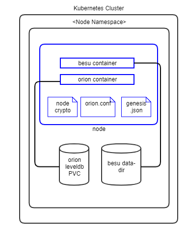
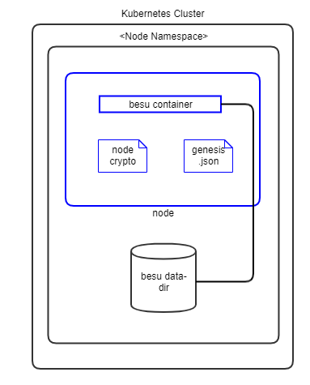

# Hyperledger Besu Architecture Reference

## Kubernetes

### Nodes with Orion Transaction Manager

The following diagram shows how Besu peer nodes with Orion TM will be deployed on your Kubernetes instance.

**Notes:**

1. Pods are shown in blue in the diagram.

1. Each peer pod will have two init-containers: `certificates-init` to read crypto from Vault and `liveness-check` to check that if the bootnode endpoint is available, only when bootnode is used.

1. Each peer pod will then have two containers: `orion` and `besu` running. Since they are in the same pod, Kubernetes always schedules them on the same VM and they can communicate to each other through localhost. This guarantees minimal latency between them.

1. The storage uses a Kubernetes Persistent Volume.

1. In future releases, the levelDB PVC will be replaced by a containerised database.

### Validator Nodes

The following diagram shows how Besu Validator nodes will be deployed on your Kubernetes instance.

**Notes:**

1. Pods are shown in blue in the diagram.

1. Each peer pod will have one init-containers: `certificates-init` to read crypto from Vault.

1. Each peer pod will then have one container `besu` running. 

1. The storage uses a Kubernetes Persistent Volume for storing the besu data-dir.

## Components

### Docker Images
The Blockchain Automation Framework uses the officially published Besu Docker images from [hub.docker.com](https://hub.docker.com/u/hyperledger). The following Besu Images are used by the Blockchain Automation Framework.

*  [besu](https://hub.docker.com/r/hyperledger/besu) - Besu Peer and Validator Node

*  [orion](https://hub.docker.com/r/pegasyseng/orion) - Orion Transaction Manager

Additionally, following common images are also used:

*  [alpine-utils](https://hub.docker.com/r/hyperledgerlabs/alpine-utils) - Used as a utility to get crypto from Hashicorp Vault server

### Ansible Playbooks
Detailed information on ansible playbooks can be referred [here](../developer/besu-ansible.md) and the execution process can be referred [here](../operations/setting_dlt.md).

### Helm Charts
Detailed information on helm charts can be referred [here](../developer/besu-helmcharts.md).

## Vault Configuration

The Blockchain Automation Framework stores their `crypto` immediately in the Hashicorp Vault secrets engine.
The crypto is stored by each organization under path `secret/org_namespace` - it contains node keys, keystore, passwords, TM keys, and CA certificates for proxy connections.

The complete key paths in the Vault can be referred [here](certificates_path_list_besu.md).