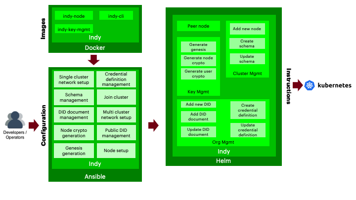

# Hyperledger Indy Architecture Reference

## Components

### Docker Images
The Blockchain Automation Framework uses own Docker images, which are based on Ubuntu and consist with official Hyperledger Indy libraries (indy-plenum and indy-node).

* [indy-cli](../../../platforms/hyperledger-indy/images/indy-cli/README.md) - Docker image contains Indy CLI, which is used to issue transactions again an Indy pool.
* [indy-key-mgmt](../../../platforms/hyperledger-indy/images/indy-key-mgmt/README.md) - Docker image for indy key management, which generates identity crypto and stores it into Vault or displays it onto the terminal in json format.
* [indy-node](../../../platforms/hyperledger-indy/images/indy-node/README.md) - Docker image of an Indy node (runs using a Steward identity)

### Ansible Playbooks
Detailed information on ansible playbooks can be referred [here](../developer/indy-ansible.md) and the execution process can be referred [here](../operations/setting_dlt.md)

### Helm Charts
Detailed information on helm charts can be referred [here](../developer/indy-helmcharts.md)

## Vault Configuration

The Blockchain Automation Framework stores their `crypto` immediately within the secret secrets engine.
the `crypto` is stored by each organization under `/org_name_lowercase` - it contains provate/public keys, dids and seeds.

The complete key paths in the vault can be referred [here](certificates_path_list_indy.md)