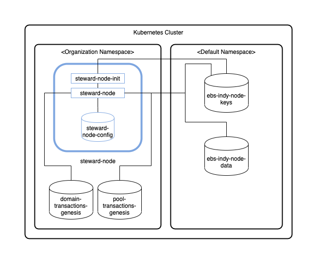

[//]: # (##############################################################################################)
[//]: # (Copyright Accenture. All Rights Reserved.)
[//]: # (SPDX-License-Identifier: Apache-2.0)
[//]: # (##############################################################################################)

# Hyperledger Indy Architecture Reference

## Kubernetes

### Peer Nodes

The following diagram shows how Hyperledger Indy peer nodes will be deployed on your Kubernetes instance.

**Notes:**

1. Pods are shown in blue in the diagram.

2. Each StatefulSet will have `steward-node-init` for initialization (read crypto from Vault) and `steward-node` containers running. Since they are in the same pod, Kubernetes always schedules them on the same VM and they can communicate to each other through localhost. This guarantees minimal latency between them.

4. The storage uses a Kubernetes Persistent Volume.

## Components

### Docker Images
Hyperledger Bevel creates/provides own Docker images, which are based on Ubuntu and consist with official Hyperledger Indy libraries (indy-plenum and indy-node).

* [indy-cli](https://github.com/hyperledger/bevel/tree/main/platforms/hyperledger-indy/images/indy-cli) - Docker image contains Indy CLI, which is used to issue transactions again an Indy pool.
* [indy-key-mgmt](https://github.com/hyperledger/bevel/tree/main/platforms/hyperledger-indy/images/indy-key-mgmt) - Docker image for indy key management, which generates identity crypto and stores it into Vault or displays it onto the terminal in json format.
* [indy-node](https://github.com/hyperledger/bevel/tree/main/platforms/hyperledger-indy/images/indy-node) - Docker image of an Indy node (runs using a Steward identity).

## Vault Configuration

Hyperledger Bevel stores their `crypto` immediately within the secret secrets engine.
The `crypto` is stored by each organization under `/org_name_lowercase` - it contains provate/public keys, dids and seeds.

The complete key paths in the vault can be referred [here](../certificates/indy.md).