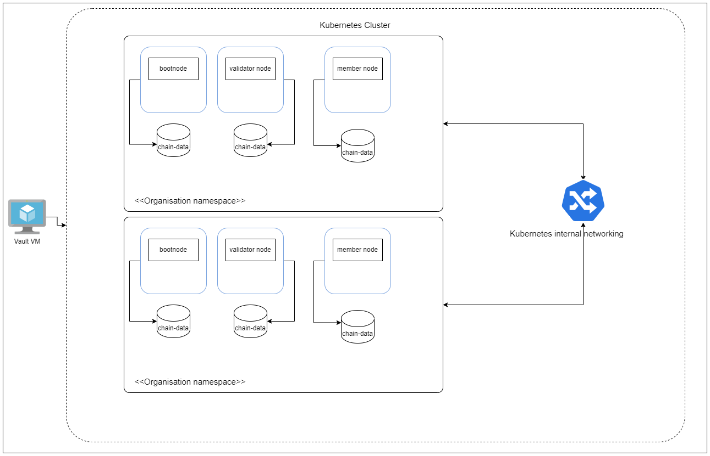
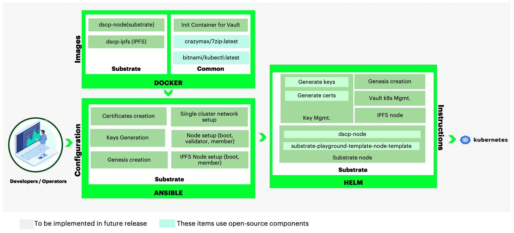

[//]: # (##############################################################################################)
[//]: # (Copyright Accenture. All Rights Reserved.)
[//]: # (SPDX-License-Identifier: Apache-2.0)
[//]: # (##############################################################################################)

# Substrate Architecture Reference

## Kubernetes

### Nodes with Ambassador proxy

The following diagram shows how substrate boot, member and validator nodes be deployed on your Kubernetes instance.

**Notes:**

1. Pods are shown in blue in the diagram.

1. Each peer pod will have five init-containers: `node-secrets` to get node-key, aura and grandpa secret seeds from Vault, `retrieve-chainspec` to retrieve the genesis file from Vault, `download-chain-spec` to download the chain spec if customChainspecUrl is defined and `query-services` to query the chain services.

1. Each peer pod will then have one containers: `{{ .Values.node.chain }}` this being the name of the chain definied in the chart. This container is the substrate node.

1. The storage uses a Kubernetes Persistent Volume.

### Nodes with Kubernetes internal networking

The following diagram shows how substrate boot, member and validator nodes be deployed on your Kubernetes instance.

**Notes:**

1. Pods are shown in blue in the diagram.

1. Each peer pod will have five init-containers: `node-secrets` to get node-key, aura and grandpa secret seeds from Vault, `retrieve-chainspec` to retrieve the genesis file from Vault, `download-chain-spec` to download the chain spec if customChainspecUrl is defined and `query-services` to query the chain services.

1. Each peer pod will then have one containers: `{{ .Values.node.chain }}` this being the name of the chain definied in the chart. This container is the substrate node.

1. The storage uses a Kubernetes Persistent Volume.

## Components

### Docker Images
As Substrate is a technology to build the perfect blockchain for your needs, we are using a Substrate Node built for the DSCP/Inteli project.

The following Quorum Images are used by Hyperledger Bevel.

*  [dscp-node](https://github.com/inteli-poc/dscp-node) - DSCP Substrate Node

*  [dscp-ipfs](https://github.com/inteli-poc/dscp-ipfs) - DSCP IPFS Manager

Additionally, following common images are also used:

*  [7zip](https://hub.docker.com/r/crazymax/7zipsybox) - Used for operating chainspec/genesis file

*  [mysql-server](https://hub.docker.com/r/bitnami/kubectl) - Used as utility to get Kubernetes network addresses

*  [alpine-utils](https://github.com/hyperledger/bevel/pkgs/container/bevel-alpine-utils) - Used as a utility to get crypto from Hashicorp Vault server

## Vault Configuration

Hyperledger Bevel stores their `crypto` immediately in the Hashicorp Vault secrets engine.
The crypto is stored by each organization under path `secretsv2/org_namespace` - it contains node keys, keystore, passwords, sudo keys, and CA certificates for proxy connections.
Optionally, `secret_path` can be set on the network.yaml to change the secret engine from the default `secretsv2/`.

The complete key paths in the Vault can be referred [here](../certificates/substrate.md).
