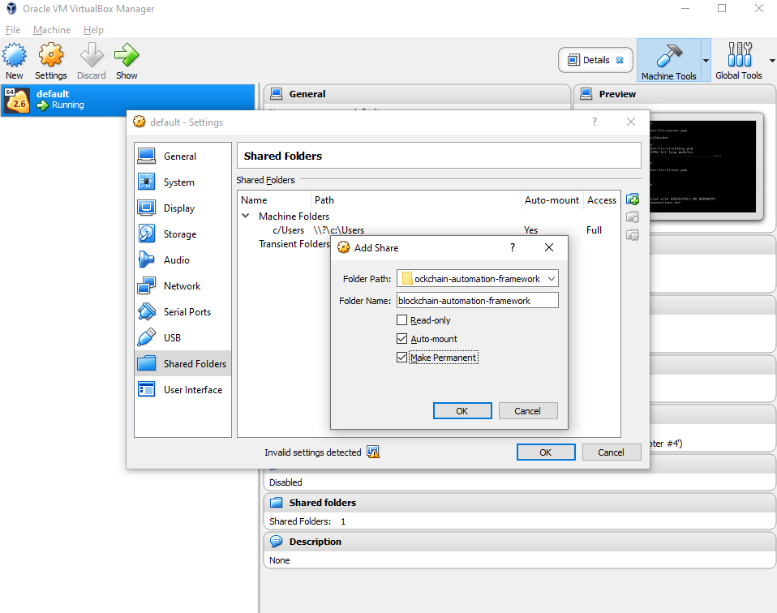

# Running BAF DLT network on Minikube

## Pre-requisites

Before proceeding, first make sure that you've completed [Developer Pre-requisites](https://blockchain-automation-framework.readthedocs.io/en/develop/developer/dev_prereq.html).

## Clone forked repo

1. If you have not already done so, fork [blockchain-automation-framework](https://github.com/hyperledger-labs/blockchain-automation-framework) and clone the forked repo to your machine.

   ```bash
   cd ~/project
   git clone git@github.com:<githubuser>/blockchain-automation-framework.git
   ```

1. Add a “local” branch to your machine
   ```bash
   cd ~/project/blockchain-automation-framework
   git checkout -b local
   git push --set-upstream origin local
   ```

## Update kubeconfig file

1. Create a `build` folder inside your BAF repository:
   ```bash
   cd ~/project/blockchain-automation-framework
   mkdir build
   ```
1. Copy ca.crt, client.key, client.crt from `~/.minikube` to build:

   ```bash
   cp ~/.minikube/ca.crt build/
   cp ~/.minikube/client.key build/
   cp ~/.minikube/client.crt build/
   ```

1. Copy `~/.kube/config` file to build:

   ```bash
   cp ~/.kube/config build/
   ```

1. Open the above config file and remove the paths for certificate-authority, client-certificate and client-key as in the figure below.

   

   ***

   **NOTE**: If you ever delete and recreate minikube, the above steps have to be repeated.

   ***

1. Copy gitops file from ~/.ssh to build. (This is the private key file which you used to authenticate to your GitHub in pre-requisites)
   ```bash
   cp ~/.ssh/gitops build/
   ```

### Additional Windows configurations

1. Ensure that you have set the following git config before cloning the repo.

   ```bash
   git config --global core.autocrlf false
   ```

1. If not, update the EOL to LF for platforms/hyperledger-fabric/scripts/\*.sh files.

1. Execute following to correctly set docker environment.
   ```bash
   eval $('docker-machine.exe' env)
   ```
   <a name = "windows_mount"></a>
1. Mount windows local folder (blockchain-automation-framework folder) to VirtualBox docker VM ( the machine named “default” by default) from right-click menu, Settings -> Shared Folders. All paths in network.yaml should be the mounted path. Shut down and restart the "default" machine after this.

   

## Edit the configuration file

1. Choose the DLT/Blockchain platform you want to run and copy the relevant sample network.yaml to build folder; rename it to network.yaml.

   ```bash
   cd ~/project/blockchain-automation-framework
   cp platforms/hyperledger-fabric/configuration/samples/network-minikube.yaml build/network.yaml
   ```

1. Update Docker configurations:
   ```yaml
   docker:
     url: "index.docker.io/hyperledgerlabs"
     username: "<your docker username>"
     password: "<your docker password/token>"
   ```
1. For each `organization`, update ONLY the following and leave everything else as-is:

   ```yaml
   vault:
     url: "http://<Your Vault local IP address>:8200" # Use the local IP address rather than localhost e.g. http://192.168.0.1:8200
     root_token: "<your vault_root_token>"
   gitops:
     git_ssh: "<ssh url of your forked repo>" #e.g. "ssh://git@github.com/hyperledger-labs/blockchain-automation-framework.git"
     git_push_url: "<https url of your forked repo without the https://>" #e.g. "github.com/hyperledger-labs/blockchain-automation-framework.git"
     username: "<github_username>"
     password: "<github token/password>"
     email: "<github_email>"
   ```

If you need help, you can use each platform's sample network-minikube.yaml:

- For Fabric, use `platforms/hyperledger-fabric/configuration/samples/network-minikube.yaml`
- For Quorum, use `platforms/quorum/configuration/samples/network-minikube.yaml`
- For Corda, use `platforms/r3-corda/configuration/samples/network-minikube.yaml`

And simply replace the placeholder values.

---

**NOTE:** If you have 2-Factor Authentication enabled on your GitHub account, you have to use GitHub token. Otherwise, password is fine.

<details>
  <summary>How To Generate GitHub Token</summary>
  
   1. On GitHub page, click your profile icon and then click **Settings**.
   2. On the sidebar, click **Developer settings**.
   3. On the sidebar, click **Personal access tokens**.
   4. Click **Generate new token**.
   5. Add a token description, enable suitable access and click **Generate token**.
   6. Copy the token to a secure location or password management app.

For security reasons, after you leave the page, you can no longer see the token again.

</details>

---

1. Deploying the sample “supplychain” chaincode is optional, so you can delete the “chaincode” section. If deploying chaincode, update the following for the peers.
   ```yaml
   chaincode:
     repository:
       username: "<github_username>"
       password: "<github_token>"
   ```

## Execute

Make sure that Minikube and Vault server are running. Double-check by running:

```bash
minikube status
vault status
```

Now run the following to deploy BAF Fabric on minikube:

```bash
docker run -it -v $(pwd):/home/blockchain-automation-framework/ hyperledgerlabs/baf-build
```

Windows users should use following (make sure that the local volume was mounted as per [this step](#windows_mount)):

```bash
docker run -it -v /blockchain-automation-framework:/home/blockchain-automation-framework/ hyperledgerlabs/baf-build
```

Meanwhile you can also check if pods are being deployed:

```bash
kubectl get pods --all-namespaces -w
```

---

**NOTE:** If you need public address for nodes in your `network.yaml` file, you can use the output of `minikube ip`.

## Troubleshooting

**`Failed to establish a new connection: [Errno 111] Connection refused`**

This is because you have re-created minikube but have not updated K8s `config` file. Repeat _"Update kubeconfig file"_ steps 3 - 4 and try again.

**`kubernetes.config.config_exception.ConfigException: File does not exists: /Users/.minikube/ca.crt`**

This is because you have not removed the absolute paths to the certificates in `config` file. Repeat _"Update kubeconfig file"_ step 4 and try again.

**`error during connect: Get http://%2F%2F.%2Fpipe%2Fdocker_engine/v1.40/version: open //./pipe/docker_engine: The system cannot find the file specified. In the default daemon configuration on Windows, the docker client must be run elevated to connect. This error may also indicate that the docker daemon is not running`**

This is because docker isn't running. To start it, just close all the instances of  Docker Quickstart Terminal and open again.

**`ERROR! the playbook: /home/blockchain-automation-framework/platforms/shared/configuration/site.yaml could not be found`**

This is because the blockchain-automation-framework repository isn't mounted to the default VM. Check [this step](#windows_mount)).
