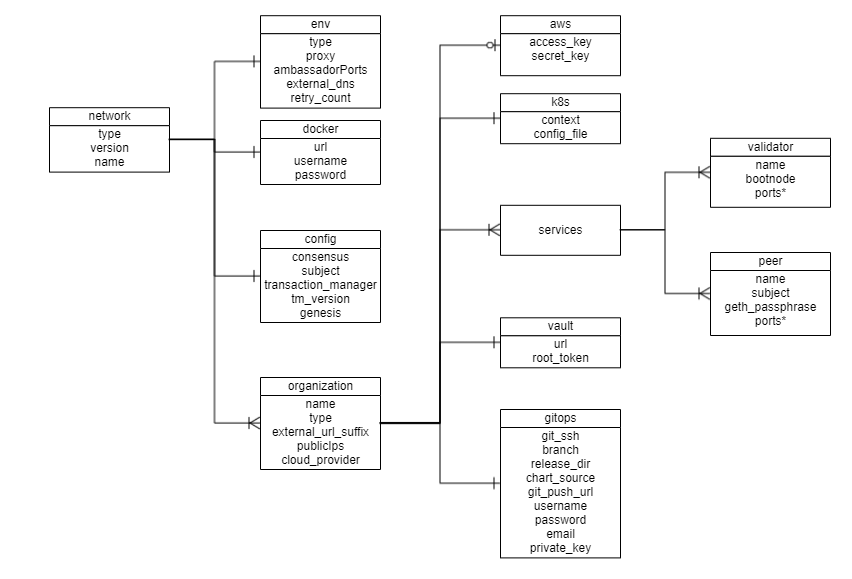

[//]: # (##############################################################################################)
[//]: # (Copyright Accenture. All Rights Reserved.)
[//]: # (SPDX-License-Identifier: Apache-2.0)
[//]: # (##############################################################################################)

# Configuration file specification: Hyperledger Besu
A network.yaml file is the base configuration file designed in Hyperledger Bevel for setting up a Hyperledger Besu DLT/Blockchain network. This file contains all the configurations related to the network that has to be deployed. Below shows its structure.


Before setting up a Hyperledger Besu DLT/Blockchain network, this file needs to be updated with the required specifications.  
A sample configuration file is provided in the repo path:  
`platforms/hyperledger-besu/configuration/samples/network-besu.yaml` 

A json-schema definition is provided in `platforms/network-schema.json` to assist with semantic validations and lints. You can use your favorite yaml lint plugin compatible with json-schema specification, like `redhat.vscode-yaml` for VSCode. You need to adjust the directive in template located in the first line based on your actual build directory:

`# yaml-language-server: $schema=../platforms/network-schema.json`

The configurations are grouped in the following sections for better understanding.

* [type](#type)

* [version](#version)

* [env](#env)

* [docker](#docker)

* [config](#config)

* [organizations](#organizations)

Although, the file itself has comments for each key-value, here is a more detailed description with respective snippets.
=== "Hyperledger-Besu"
    Use this [sample configuration file](https://github.com/hyperledger/bevel/blob/main/platforms/hyperledger-besu/configuration/samples/network-besu.yaml) as a base.
    ```yaml
    --8<-- "platforms/hyperledger-besu/configuration/samples/network-besu.yaml:7:15"
    ```

The sections in the sample configuration file are  
<a name="type"></a>
type
: `type` defines the platform choice like corda/fabric/indy/quorum/besu, here in the example it's **besu**.

<a name="version"></a>
version
:  `version` defines the version of platform being used. The current Hyperledger Besu version support is for **21.10.6** and **22.10.2**.

<a name="permissioning"></a>
permissioning
: `permissioning` section contains the flag to enable permissioning in the network

```yaml
--8<-- "platforms/hyperledger-besu/configuration/samples/network-besu.yaml:17:18"
```

<a name="env"></a>
env
: `env` section contains the environment type and additional (other than 443) Ambassador port configuration. Value for proxy field under this section can be 'ambassador' as 'haproxy' has not been implemented for Besu.

The snippet of the `env` section with example value is below

```yaml
--8<-- "platforms/hyperledger-besu/configuration/samples/network-besu.yaml:21:41"
```

The fields under `env` section are 

| Field      | Description                                 |
|------------|---------------------------------------------|
| type       | Environment type. Can be like dev/test/prod.|
| proxy      | Choice of the Cluster Ingress controller. Currently supports 'ambassador' only as 'haproxy' has not been implemented for Hyperledger Besu |
| ambassadorPorts   | Any additional Ambassador ports can be given here. This is only valid if `proxy: ambassador`. These ports are enabled per cluster, so if you have multiple clusters you do not need so many ports to be opened on Ambassador. Our sample uses a single cluster, so we have to open 4 ports for each Node. These ports are again specified in the `organization` section.     |
| loadBalancerSourceRanges | (Optional) Restrict inbound access to a single or list of IP addresses for the public Ambassador ports to enhance Bevel network security. This is only valid if `proxy: ambassador`.  |
| retry_count       | Retry count for the checks. Use a high number if your cluster is slow. |
|external_dns       | If the cluster has the external DNS service, this has to be set `enabled` so that the hosted zone is automatically updated. |
| namespace         | (Optional) K8s Namespace on which proxy will be installed. Default value is `default`|
| labels.service    | (Optional) Labels to be added to kubernetes services |
| labels.pvc    | (Optional) Labels to be added to kubernetes pvc |
| labels.deployment    | (Optional) Labels to be added to kubernetes deployment/statefulset/pod |

<a name="docker"></a>
docker
:  `docker` section contains the credentials of the repository where all the required images are built and stored.

The snippet of the `docker` section with example values is below
```yaml
--8<-- "platforms/hyperledger-besu/configuration/samples/network-besu.yaml:56:59"
```
The fields under `docker` section are

| Field    | Description                            |
|----------|----------------------------------------|
| url      | Docker registry url                    |
| username | Username required for login to docker registry|
| password | Password required for login to docker registry|


<a name="config"></a>
config
:  `config` section contains the common configurations for the Hyperledger Besu network.

The snippet of the `config` section with example values is below
```yaml
--8<-- "platforms/hyperledger-besu/configuration/samples/network-besu.yaml:62:83"
```
The fields under `config` are

| Field       | Description                                              |
|-------------|----------------------------------------------------------|
| consensus   | Currently supports `ibft`,`qbft`, `ethash` and `clique`. Please update the remaining items according to the consensus chosen as not all values are valid for all the consensus.                                 |
| chain_id    | Custom chain Id, default value is `2018` |
| subject     | This is the subject of the root CA which will be created for the Hyperledger Besu network. The root CA is for development purposes only, production networks should already have the root certificates.   |
| transaction_manager    | Supports `tessera`. |
| tm_version         | This is the version of transaction manager docker image that will be deployed. Supported versions: `21.7.3` for `tessera`. |
| tm_tls | Options are `True` and `False`. This enables TLS for the transaction manager and Besu node. `False` is not recommended for production. |
| tm_trust | Options are: `ca-or-tofu`, `ca`, `tofu`. This is the trust relationships for the transaction managers. More details [on modes here]( https://docs.tessera.consensys.net/en/stable/HowTo/Configure/TLS/#trust-modes ).|
| genesis | This is the path where `genesis.json` will be stored for a new network; for adding new node, the existing network's genesis.json should be available in json format in this file. |
| tm_nodes | This is an array. Provide at least one tessera node details which will act as bootstrap for other tessera nodes |


<a name="organizations"></a>
organizations
:  The `organizations` section contains the specifications of each organization.  

In the sample configuration example, we have four organization under the `organizations` section.

The snippet of an organization field with sample values is below
```yaml
--8<-- "platforms/hyperledger-besu/configuration/samples/network-besu.yaml:86:97"
```
Each `organization` under the `organizations` section has the following fields. 

| Field                                    | Description                                 |
|------------------------------------------|-----------------------------------------------------|
| name                                        | Name of the organization     |
| type | Can be `member` for peer/member organization and `validator` for Validator organization.|
| external_url_suffix                         | Public url suffix for the cluster. This is used to discover nodes between different clusters and to establish communication between nodes         |
| cloud_provider                              | Cloud provider of the Kubernetes cluster for this organization. This field can be aws, azure, gcp or minikube |
| aws                                         | Contains the AWS CLI credentials when the organization cluster is on AWS |
| k8s                                         | Kubernetes cluster deployment variables.|
| vault                                       | Contains Hashicorp Vault server address and root-token |
| gitops                                      | Git Repo details which will be used by GitOps/Flux. |
| services                                    | Contains list of services which could be validator/peer based on the type of organization |

For the `aws`, `k8s` and `vault` fields, a snippet is below
```yaml
--8<-- "platforms/hyperledger-besu/configuration/samples/network-besu.yaml:98:112"
```

The `aws` field under each organization contains: (This will be ignored if cloud_provider is not `aws`)

| Field       | Description                                              |
|-------------|----------------------------------------------------------|
| access_key                              | AWS Access key  |
| secret_key                              | AWS Secret key  |
| region            | The AWS region where K8s cluster and the EIPs reside |

The `k8s` field under each organization contains

| Field       | Description                                              |
|-------------|----------------------------------------------------------|
| context                                 | Context/Name of the cluster where the organization entities should be deployed                                   |
| config_file                             | Path to the kubernetes cluster configuration file                                                                |

For gitops fields the snippet from the sample configuration file with the example values is below
```yaml
--8<-- "platforms/hyperledger-besu/configuration/samples/network-besu.yaml:115:125"
```

The gitops field under each organization contains

| Field       | Description                                              |
|-------------|----------------------------------------------------------|
| git_protocol | Option for git over https or ssh. Can be `https` or `ssh` |
| git_url                              | SSH or HTTPs url of the repository where flux should be synced                                                            |
| branch                               | Branch of the repository where the Helm Charts and value files are stored                                        |
| release_dir                          | Relative path where flux should sync files                                                                       |
| chart_source                         | Relative path where the helm charts are stored                                                                   |
| git_repo                         | Gitops git repo URL https URL for git push like "github.com/hyperledger/bevel.git"             |
| username                             | Username which has access rights to read/write on repository                                                     |
| password                             | Password of the user which has access rights to read/write on repository (Optional for ssh; Required for https)  |
| email                                | Email of the user to be used in git config                                                                       |
| private_key                          | Path to the private key file which has write-access to the git repo (Optional for https; Required for ssh)       |

The services field for each organization under `organizations` section of Hyperledger Besu contains list of `services` which could be peers or validators.

Each organization with type as `member` will have a peers service. The snippet of peers service with example values is below
```yaml
--8<-- "platforms/hyperledger-besu/configuration/samples/network-besu.yaml:187:208"
```
The fields under `peer` service are

| Field       | Description                                              |
|-------------|----------------------------------------------------------|
| name            | Name of the peer                |
| subject     | This is the alternative identity of the peer node    |
| geth_passphrase | This is the passphrase used to generate the geth account. |
| lock   | (for future use). Sets Besu node to lock or unlock mode. Can be true or false|
| p2p.port   | P2P port for Besu|
| p2p.ambassador | The P2P Port when exposed on ambassador service|
| rpc.port   | RPC port for Besu|
| rpc.ambassador | The RPC Port when exposed on ambassador service|
| ws.port   | Webservice port for Besu|
| db.port   | Port for MySQL database which is only applicable for `tessera`|
| tm_nodeport.port   | Port used by Transaction manager `tessera`. |
| tm_nodeport.ambassador | The tm port when exposed on ambassador service. |
| tm_clientport.port   | Client Port used by Transaction manager `tessera`. This is the port where Besu nodes connect to their respective transaction manager. |

The peer in an organization with type as `member` can be used to deploy the smartcontracts with additional field `peer.smart_contract`. The snapshot of peers service with example values is below
```yaml
        peers:
        - peer:
          name: carrier
          subject: "O=Carrier,OU=Carrier,L=51.50/-0.13/London,C=GB" # This is the node subject. L=lat/long is mandatory for supplychain sample app
          geth_passphrase: "12345"  # Passphrase to be used to generate geth account
          p2p:
            port: 30303
            ambassador: 15010       #Port exposed on ambassador service (use one port per org if using single cluster)
          rpc:
            port: 8545
            ambassador: 15011       #Port exposed on ambassador service (use one port per org if using single cluster)
          ws:
            port: 8546
          tm_nodeport:
            port: 8888         
            ambassador: 15013   # Port exposed on ambassador service (Transaction manager node port)
          tm_clientport:
            port: 8080       
          geth_url: "http://manufacturerrpc.test.besu.blockchaincloudpoc.com"  # geth url of the node
          # smartcontract to be deployed only from one node (should not be repeated in other nodes)
          smart_contract:
            name: "General"           # Name of the smart contract or Name of the main Smart contract Class
            deployjs_path: "examples/supplychain-app/besu/smartContracts" # location of folder containing deployment script from Bevel directory
            contract_path: "../../besu/smartContracts/contracts"       # Path of the smart contract folder relative to deployjs_path
            iterations: 200           # Number of Iteration of execution to which the gas and the code is optimised
            entrypoint: "General.sol" # Main entrypoint solidity file of the contract 
            private_for: "hPFajDXpdKzhgGdurWIrDxOimWFbcJOajaD3mJJVrxQ=,7aOvXjjkajr6gJm5mdHPhAuUANPXZhJmpYM5rDdS5nk=" # Node public keys for the privateFor         
```
The additional fields under `peer` service are

| Field       | Description                                              |
|-------------|----------------------------------------------------------|
| geth_url  | RPC url for the `besu` node  |
| smart_contract.name | Name of the main smartcontract class  |
| smart_contract.deployjs_path | location of folder containing deployment script relative to Bevel directory  |
| smart_contract.contract_path | Path of the smart contract folder relative to deployjs_path  |
| smart_contract.iterations | Number of Iteration of executions for which the gas and the code is optimised  |
| smart_contract.entrypoint | Main entrypoint solidity file of the smart contract   |
| smart_contract.private_for | Comma separated string of `tessera` Public keys for the `privateFor`  |

Each organization with type as `validator` will have a validator service. The snippet of validator service with example values is below
```yaml
--8<-- "platforms/hyperledger-besu/configuration/samples/network-besu.yaml:128:143"
```
The fields under `validator` service are

| Field       | Description                                              |
|-------------|----------------------------------------------------------|
| name            | Name of the validator                |
| bootnode     | `true` if the validator node is used also a bootnode for the network ***    |
| p2p.port   | P2P port for Besu|
| p2p.ambassador | The P2P Port when exposed on ambassador service|
| rpc.port   | RPC port for Besu|
| rpc.ambassador | The RPC Port when exposed on ambassador service|
| ws.port   | Webservice port for Besu|
| metrics.enabled | Enable metrics for Besu node |
| metrics.port | Metrics port for Besu |

*** feature is in future scope

