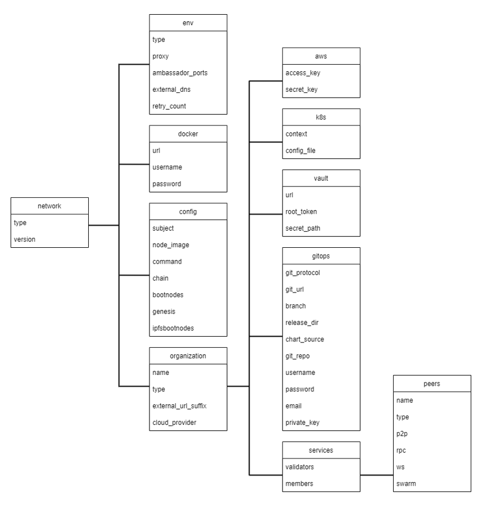

[//]: # (##############################################################################################)
[//]: # (Copyright Accenture. All Rights Reserved.)
[//]: # (SPDX-License-Identifier: Apache-2.0)
[//]: # (##############################################################################################)

# `Configuration file specification: Substrate`
A `network.yaml` file is the base configuration file designed in Hyperledger Bevel for setting up a Substrate DLT network. This file contains all the configurations related to the network that has to be deployed. Below shows its structure. 

??? note "Schema Definition"

    A json-schema definition is provided in `platforms/network-schema.json` to assist with semantic validations and lints. You can use your favorite yaml lint plugin compatible with json-schema specification, like `redhat.vscode-yaml` for VSCode. You need to adjust the directive in template located in the first line based on your actual build directory:

    `# yaml-language-server: $schema=../platforms/network-schema.json`

The configurations are grouped in the following sections for better understanding.

* [type](#type)

* [version](#version)

* [env](#env)

* [docker](#docker)

* [config](#config)

* [organizations](#organizations)

Before setting up a Substrate DLT/Blockchain network, this file needs to be updated with the required specifications.  

Use this [sample configuration file](https://github.com/hyperledger/bevel/blob/main/platforms/substrate/configuration/samples/substrate-network-config.yaml) as a base. 


```yaml
--8<-- "platforms/substrate/configuration/samples/substrate-network-config.yaml:7:15"
```

**The sections in the sample configuration file are**: 

<a name="type"></a>

## type
- `type` defines the platform choice like corda/fabric/indy/substrate, here in the example it's **substrate**.

<a name="version"></a>

## version
- `version` defines the version of platform being used. The current substrate version support is for **latest**

<a name="env"></a>

## env
- `env` section contains the environment type and additional (other than 443) Ambassador port configuration. Value for proxy field under this section can only be Ambassador as haproxy has not been implemented for substrate.

The snapshot of the `env` section with example value is below
```yaml
--8<-- "platforms/substrate/configuration/samples/substrate-network-config.yaml:18:30"
```

**The fields under `env` section are**:

| **Field**      | **Description**                                 |
|------------    |---------------------------------------------|
| type       | Environment type. Can be like dev/test/prod.|
| proxy     | Choice of the Cluster Ingress controller. Currently supports 'ambassador' only as 'haproxy' has not been implemented for Substrate |
| proxy_namespace      | Namespace in which the pods of the Cluster Ingress controller were deployed |
| ambassadorPorts   | Any additional Ambassador ports can be given here. This is only valid if `proxy: ambassador`. These ports are enabled per cluster, so if you have multiple clusters you do not need so many ports to be opened on Ambassador. Our sample uses a single cluster, so we have to open 4 ports for each Node. These ports are again specified in the `organization` section.     |
| retry_count       | Retry count for the checks. Use a high number if your cluster is slow. |
|external_dns       | If the cluster has the external DNS service, this has to be set `enabled` so that the hosted zone is automatically updated. |


<a name="docker"></a>

## docker
- `docker` section contains the credentials of the repository where all the required images are built and stored.

The snapshot of the `docker` section with example values is below

```yaml
--8<-- "platforms/substrate/configuration/samples/substrate-network-config.yaml:32:38"
```

**The fields under `docker` section are**:

| **Field**| **Description**                        |
|----------|----------------------------------------|
| url      | Docker registry url                    |
| username | Username required for login to docker registry (remove this for public registry)|
| password | Password required for login to docker registry (remove this for public registry)|

<a name="config"></a>

## config
- `config` section contains the common configurations for the Substrate network.

The snapshot of the `config` section with example values is below

```yaml
--8<-- "platforms/substrate/configuration/samples/substrate-network-config.yaml:40:55"
```

**The fields under `config` are**:

| **Field**   | **Description**                                              |
|-------------|----------------------------------------------------------|
| subject    | This is the subject of the root CA which will be created for the Substrate network. The root CA is for development purposes only, production networks should already have the root certificates.   |
| node_image | This is image name in which will be pulled from the specified docker registry. |
| command | This is the command which will run on the substrate node once it is alive.|
| chain | This is the name of the chain which is used for the substrate nodes and genesis.|
| bootnodes | Location where bootnode information is read or stored if empty, this is for bootnodes specified in the organization section of the configuration file. |
| genesis | This is the path where genesis.json will be stored for a new network.|
| ipfsbootnodes | Location where IPFS bootnode information is read or stored if empty, this is for IPFS nodes when you are deploying a DSCP network. |


<a name="organizations"></a>

## Organizations

- The `organizations` section contains the specifications for the organization.

- In the sample configuration example, we have and support only one organization under the `organizations` section.

### Organization Field Snapshot with Sample Values:

The `organization` under the `organizations` section has the following fields. 

| **Field**            | **Description** |
|----------------------|-------------|
| name                 | Name of the organization |
| type                 | Specifies the organization as the superuser/owner. |
| persona              | This is used for DSCP app and can be buyer, supplier or thirdparty. |
| external_url_suffix  | Public url suffix of the cluster. |
| cloud_provider  | Cloud provider of the Kubernetes cluster for this organization. This field can be `aws`, `azure`, `gcp` or `minikube` |
| aws                  | When the organization cluster is on `AWS` |
| k8s                  | Kubernetes cluster deployment variables.|
| vault                | Contains Hashicorp Vault server address and root-token in the example |
| gitops               | Git Repo details which will be used by GitOps/Flux. |
| services             | Contains list of services which could ca/peer/orderers/consensus based on the type of organization |

For the `aws`, `k8s` and `vault` field the snapshot with sample values is below

```yaml
--8<-- "platforms/substrate/configuration/samples/substrate-network-config.yaml:66:80"
```

**The `aws` field under each organization contains**:

> NOTE: This will be ignored if cloud_provider is not `aws`

| **Field**     | **Description** |
|-------------  |-----------------|
|  access_key   | AWS Access key  |
|  secret_key   | AWS Secret key  |

**The `k8s` field under each organization contains**:

| **Field**       | **Description**                                                                 |
|-------------    |----------------------------------------------------------                       |
| context         | Context/Name of the cluster where the organization entities should be deployed  |
| config_file     | Path to the kubernetes cluster configuration file                               |

**The `vault` field under each organization contains**:

| **Field**     | **Description**                                              |
|-------------  |----------------------------------------------------------|
| url           | url of the vault server including port  |
| root_token    | root token of the vault server required to access the contents of the vault    |
| secret_path   | the path in which secrets are stored, used to store and retrieve secrets from the vault   |

For gitops fields the snapshot from the sample configuration file with the example values is below

```yaml
--8<-- "platforms/substrate/configuration/samples/substrate-network-config.yaml:84:96"
```

**The gitops field under each organization contains**: 

| **Field**       | **Description**                                              |
|-------------    |----------------------------------------------------------|
| git_protocol    | Option for git over https or ssh. Can be `https` or `ssh` |
| git_url         | SSH or HTTPs url of the repository where flux should be synced |
| branch          | Branch of the repository where the Helm Charts and value files are stored |
| release_dir     | Relative path where flux should sync files |
| chart_source    | Relative path where the helm charts are stored |
| git_repo        | Gitops git repo URL https URL for git push like "github.com/hyperledger/bevel.git" |
| username        | Username which has access rights to read/write on repository |
| password        | Password of the user which has access rights to read/write on repository (Optional for ssh; Required for https) |
| email           | Email of the user to be used in git config |
| private_key     | Path to the private key file which has write-access to the git repo (Optional for https; Required for ssh) |

Within the organizations section, there is one listed organization. This organization contains a services section that provides details for all peers, where each participating node is named as a peer. Below is a snapshot of the peers service with example values:

```yaml
--8<-- "platforms/substrate/configuration/samples/substrate-network-config.yaml:98:173"
```

The fields under `peer` are

| **Field**         | **Description**                                              |
|-------------      |----------------------------------------------------------|
| name              | Name of the peer                |
| subject           | This is the alternative identity of the peer node    |
| type              | Type can be `bootnode`, `validator` or `member` |
| p2p.port          | P2P port |
| p2p.ambassador    | The P2P Port when exposed on ambassador service|
| rpc.port          | RPC port |
| ws.port           | WebSocket port |
