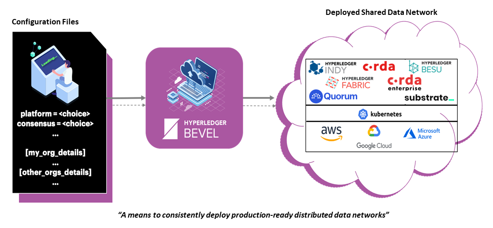

# Introduction

Hyperledger Bevel is a sophisticated automation framework designed for the deployment of production-ready Distributed Ledger Technology (DLT) networks across cloud infrastructures. By eliminating the need for complex solution architecture, Bevel empowers teams to deliver with precision and efficiency.

## Key Features

  - **Helm Charts**: Simplifies the deployment of complex DLT networks.
  - **Security**: Implements best practices in key management.
  - **Scalability**: Designed for seamless expansion.
  - **Accelerated Deployment**: Expedites the creation of complex DLT environments.
  - **Developer Flexibility**: Option to deploy without Hahsicorp Vault and Flux for streamlined development.

## Supported DLT Platforms

Hyperledger Bevel currently supports the following DLT/Blockchain Platforms:

  * [R3 Corda](https://docs.corda.net/)
  * [Hyperledger Fabric](https://hyperledger-fabric.readthedocs.io)
  * [Hyperledger Indy](https://hyperledger-indy.readthedocs.io/en/latest/)
  * [Hyperledger Besu]( https://besu.hyperledger.org/en/stable/)
  * [Quorum]( https://www.goquorum.com/)
  * [Substrate](https://www.parity.io/technologies/substrate/)

Get started with the [pre-requisites](./getting-started/prerequisites.md) to rapidly deploy blockchain networks.

You can also [create a local development network](tutorials/bevel-minikube-setup.md) on minikube.

## Questions?

If you have any questions about Bevel, ask on the **bevel** channel on
[Hyperledger Discord](https://discord.gg/hyperledger).

Learn more about the [Hyperledger Foundation](https://www.hyperledger.org/about). You can also [contribute](contributing/how-to-contribute.md) to this project.
