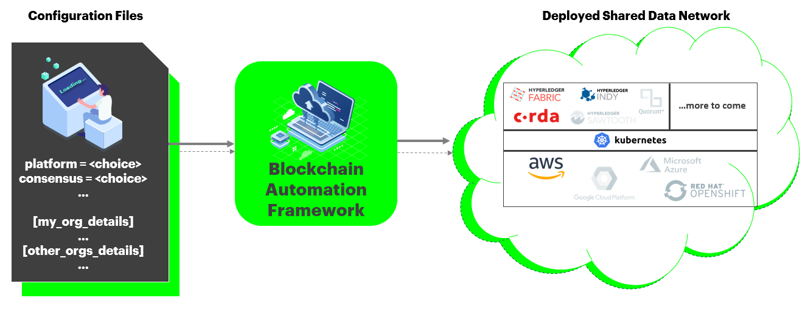

# Introduction

At its core, blockchain is a new type of data system that maintains and records data in a way that
allows multiple stakeholders to confidently share access to the same data and information. A
blockchain is a type of Distributed Ledger Technology (DLT), meaning it is a data ledger that is
shared by multiple entities operating on a distributed network. This technology operates by
recording and storing every transaction across the network in a cryptographically linked block
structure that is replicated across network participants. Every time a new data block is created, it
is appended to the end of the existing chain formed by all previous transactions, thus creating a
chain of blocks called the blockchain. This blockchain format contains records of all transactions
and data starting from the inception of that data structure.

Setting up a new DLT network or maintaining an existing DLT network in a production-scale environment is not straightforward. For the existing DLT platforms, each has its own architecture, which means the same way of setting up one DLT network cannot be applied to others. Therefore, when blockchain developers are asked to use an unfamilar DLT platform, it requires a great deal of effort for even experienced technicians to properly setup the DLT network. This is especially true in large-scale production projects across heterogeneous corporate environments which require other key aspects such as security and service availablity.

Having an awareness of the potential difficulty and complexity of getting a productin-scale DLT network ready, cloud vendors such as AWS and Azure have provisioned their own managed Blockchain services (aka Blockchain as a Service or BaaS) to help alleviate various painpoints during the process. However, limitations can still be identified in their BasS solutions, e.g. limited network size, locked to all nodes on a single cloud provider, or limited choice of DLT platform, etc.

## **The Blockchain Automation Framework Automated Platform**
The objective of the Blockchain Automation Framework is to provide a consistent means by which developers can deploy production-ready distributed networks across public and private cloud providers. This enables developers to focus on building business applications quickly, knowing the framework upon which they are building can be adopted by an enterprise IT production operations organization. The Blockchain Automation Framework is not intended soley to quickly provision development environments which can be done more efficently with other projects/scripts. Likewise, the Blockchain Automation Framework is not intended to replace BaaS offerings in the market, but instead, the Blockchain Automation Framework is an alternative when existing BaaS offerings do not support a consoritum's current set of requirements. 

## **How is it different from other BaaS?**
- The Blockchain Automation Framework deployment scripts can be reused across cloud providers like AWS, Azure, GCP, and OpenShift
- Can deploy networks and smart contracts across different DLT platforms
- Supports heterogeneous deployments in a multi-cloud, multi-owner model where each node is completely owned and managed by separate organizations
- Bring Your Own Infrastructure (BYOI) - You provide GIT, Kubernetes cluster(s), and Hashicorp Vault services provisioned to meet your specific requirements and enterprise standards
- No network size limit
- Specify only the number of organizations and the number of nodes per organization in a [network.yaml file](./operations/fabric_networkyaml.md) uniquely designed in the Blockchain Automation Framework for a new DLT network set-up and its future maintainance
- Provides an example supply chain application which runs on multiple DLT platforms that can be used as a reference pattern for how to safely abstract application logic from the underlying DLT platform

### What next?
We have been actively searching for partners who share the same vision about what the Blockchain Automation Framework can be, and also try to identify the market needs for those partners so that we can reduce the friction of adoption.