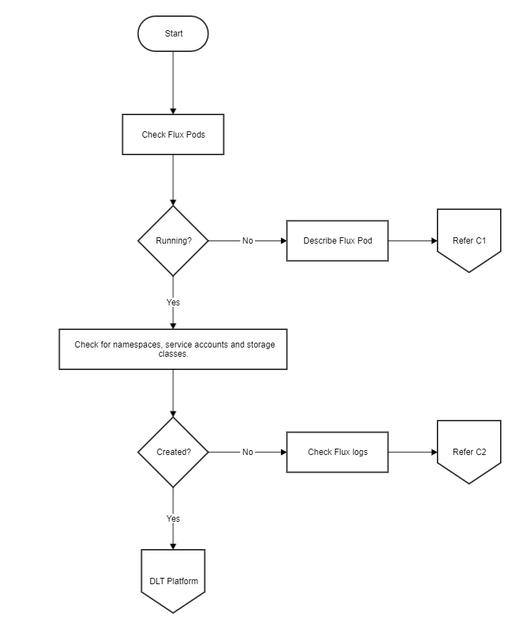
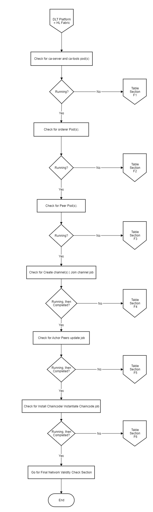
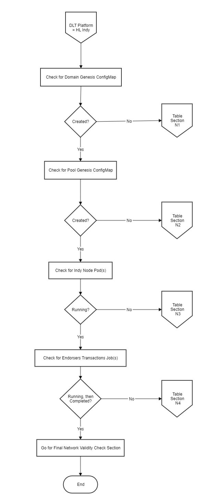
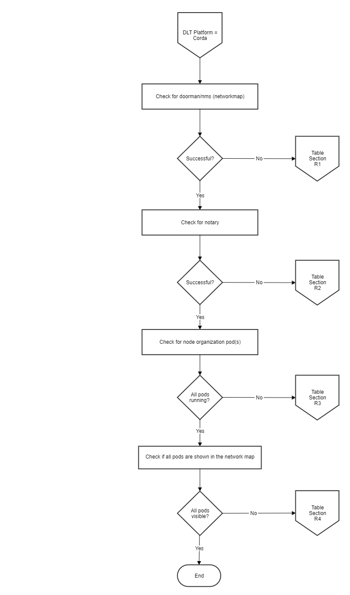
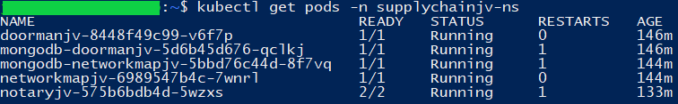
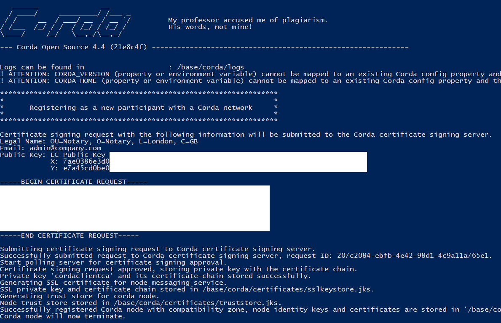
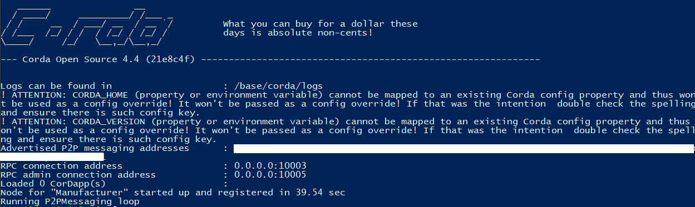
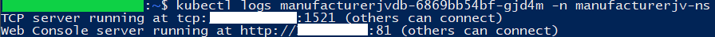
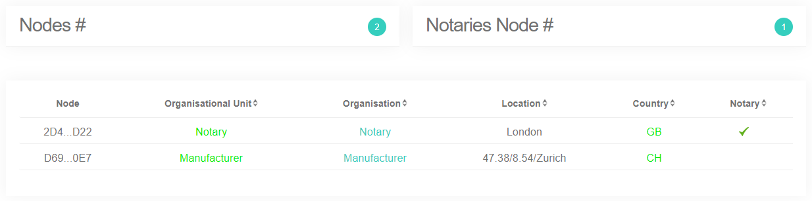
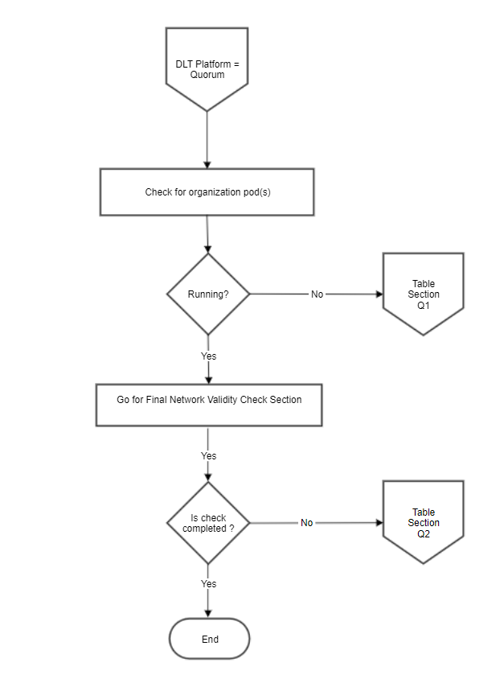

[//]: # (##############################################################################################)
[//]: # (Copyright Accenture. All Rights Reserved.)
[//]: # (SPDX-License-Identifier: Apache-2.0)
[//]: # (##############################################################################################)

# How to debug a Bevel deployment
While deploying a DLT/Blockchain network using Bevel, the pods and other components take some time to start. The Bevel automation (Ansible component) waits for the components to be at a "Running" or "Completed" state before proceeding with further steps. This is where you can see the message "FAILED - RETRYING: ... "


Each component has a retry count which can be configured in the configuration file (network.yaml). When everything is fine, the components are usually up in 10-15 retries. Meanwhile, you can check the components while the retries occurs to avoid unnecessary wait time till the error/Failed message occurs in Ansible logs.


## Bevel Deployment Flowchart

This flow chart shows the Bevel Deployment process flow. To verify the steps of deployment, follow the flow chart and check verification table 'C' to troubleshoot the general errors.
   


### Common Troubleshooting
### Table 'C'


| Section | Sub-section | Problem                                                        | Possible Cause                                                                                                                                           | Solution                                                                                                                                                                                                                                                                                                                                                                                                       |
|---------|-------------|----------------------------------------------------------------|----------------------------------------------------------------------------------------------------------------------------------------------------------|----------------------------------------------------------------------------------------------------------------------------------------------------------------------------------------------------------------------------------------------------------------------------------------------------------------------------------------------------------------------------------------------------------------|
| C1      | a           | Unable to mount config-map **git-auth-{{ network.env.type }}** | Gitops key file path is wrong or file is unreadable by Ansible controller                                                                                | Check the **gitops.private_key** in network.yaml value is an absolute path, and the file is readable by the Ansible controller. Update this for all organizations and re-run the playbook after reset.                                                                                                                                                                                                         |
| C2      | a           | Unable to clone repository                                     | Correct permissions have not been given to the gitops public key                                                                                         | Check that the public key corresponding to the gitops.private_key has been added to the Git repo with read-write permissions. As mentioned [here](../developer/dev_prereq.html#setting-up-github)                                                                                                                                                |
| C2      | b           | Unable to clone repository                                     | git_ssh value is wrong                                                                                                                                   | The **gitops.git_url** should be the SSH or HTTPs clone address of the git repository. For example for GitHub it will be like `https://github.com/<username>/bevel.git`                                                                                                                                                                                                                     |
| C2      | c           | Unable to clone repository                                     | SSH is blocked from Kubernetes                                                                                                                           | Check that you can clone the git repo using ssh from another pod on the same Kubernetes cluster. If not, check your organization security groups to allow port 22 access outbound                                                                                                                                                                                                                              |
| C2      | d           | No such file or directory                                      | Files are not getting committed to the git repo from Ansible controller                                                                                  | Check **gitops** section of each organization for possible mistakes in branch, password/token, git_url, etc                                                                                                                                                                                                                                                                                                |
| C2      | e           | No such file or directory                                      | Files are not getting committed to the git repo from Ansible Controller                                                                                  | Check whether git branch is right. Ansible playbook should be run from the same branch as specified in network.yaml in gitops section <br /> Check the Ansible logs to see if your local repo is in sync with the remote <br />Check whether the git password/token is valid                                                                                                                                                |
| C2      | f           | The storageclass SC_NAME is invalid                       | The storageclass template is wrong and not according to Kubernetes defined rules                                                                         | Check that the new StorageClass template that you have added is valid by manually creating a storage class using the same template. (This error will occur only if you have added or changed the Storageclass template). Refer to [Bevel Operations Guide](./../operations/adding_new_storageclass.html)  on how to add a new storage class template |
| C2      | g           | Retries exhausted while waiting for service account to come up | If the flux pod is in crashloopbackoff, and flux pod log mentions <br /> **"extracting public key: Load key \"/etc/fluxd/ssh/identity\": invalid format\r\n"** | Re-create the public/private key for gitops, add the gitops private key path to the network.yaml, add the public key to the repository, reset the network and run again. To reset the network **ansible-playbook platforms/shared/configurations/site.yaml -e "" -e "reset=true"**                                                                                                                             |

#### NOTE:  
If the components are not able to connect to each other, there could be some issue with load balancer. Check the haproxy or external DNS logs for more debugging. Also verify the security groups for any possible conflicts.

If any pod/component of the network is not running (in crashloopbackoff or in error state) or is absent in the get pods list.

Check the flux logs if it has been deployed or not.
Check the helm release. Check the status as well as if the key-values are generated properly.
For further debugging check for pod/container logs.
If components are there but not able to talk to each, check whether the ambasssador/ haproxy is working properly, urls are properly mapped and ports are opened for communication or not.  

---   

## Hyperledger Fabric Checks

The flow chart shows the Fabric Deployment process. To verify the steps of deployment, follow the verification Table 'F', to troubleshoot the general errors.



----
### Fabric Troubleshooting
### Table 'F'


| Section | Sub-section | Problem                                                                                                                                                                                                                                                                                                                                                                                                                           | Possible Cause                                                                                                                         | Solution                                                                                                                                                                                                                                                                                                                                                                                                                                                                                                                                                                                                                                                                                                                                   |
|---------|-------------|-----------------------------------------------------------------------------------------------------------------------------------------------------------------------------------------------------------------------------------------------------------------------------------------------------------------------------------------------------------------------------------------------------------------------------------|----------------------------------------------------------------------------------------------------------------------------------------|--------------------------------------------------------------------------------------------------------------------------------------------------------------------------------------------------------------------------------------------------------------------------------------------------------------------------------------------------------------------------------------------------------------------------------------------------------------------------------------------------------------------------------------------------------------------------------------------------------------------------------------------------------------------------------------------------------------------------------------------|
| F1      | a           | **Ansible playbook failed after exhausting retry counts**  or <br/> **CA pod is in Init:Crashloopbackoff state** <br /> Playbook execution terminated at <br /> **Role**: create/ca-tools <br /> **Task**: Waiting for the CA server to be created in ORG_NAME-net <br /> **Error**: Retries exhausted                                                                                                                                             | Issues with Vault connectivity                                                                                                         | If the pod **ca-random_suffix** has status as **Init:Crashloopbackoff**. Check the logs of the init container **certificates-init** of this pod. This can be checked using the command <br /> ``` kubectl logs ca-random_suffix -c certificates-init -n ORG_NAME-net ```                                                                                                                                                                                                                                                                                                                                                                                                                                                               |
| F1      | b           | **Ansible playbook failed after exhausting retry counts**  or <br/> **CA pod is in Init:Crashloopbackoff state** <br /> Playbook execution terminated at <br /> **Role**: create/ca-tools <br /> **Task**: Waiting for the CA server to be created in ORG_NAME-net <br /> **Error**: Retries exhausted                                                                                                                                             | Issue with Vault authentication                                                                                                        | If the logs mention "access denied", make sure that the Vault authentications were created correctly by checking all the tabs on Vault UI. <br /> Any Vault authentication problem is because of running different configurations (network.yaml) on the same Vault. Please ensure that you reset the network before re-running with a different network.yaml.                                                                                                                                                                                                                                                                                                                                                                                |
| F1      | c           | **Ansible playbook failed after exhausting retry counts** <br /> Playbook execution terminated at <br /> **Role**: create/ca_tools <br /> **Task**: Waiting for pod CA in ORG_NAME-net <br /> **Error**: Retry count exhausted <br />                                                                                                                                                                                                     | Storage class is incorrect                                                                                                             | Check the description of the pod **ca-random_suffix** under the namespace **ORG_NAME-net** . This can be done using the command <br /> ``` kubectl describe pod ca-random_suffix -n ORG_NAME-net ``` <br /> If the events (at the end of description says) **"pod has unbound immediate PersistentVolumeClaims (repeated n times)"** then this can possibly check <br /> a. If you haven't modified any storage class templates, then check **network.organization.cloud_provider** for incorrect cloud provider <br /> b.  If you have modified storage class, please make sure that the storage class works with the mentioned cloud provider under **network.organization.cloud_provider**                                              |
| F2      | a           | **Orderer(s) pods aren't deployed** <br /> Ansible playbook failed at <br /> **Role**: create/crypto/peer <br /> **Task**: Copy tls ca.crt from auto generated path to given path <br /> **Error**: Msg: Destination directory ORDERER_TLS_CERT_DIR does not exist                                                                                                                                                                      | Orderer TLS certificate path errors or inconsistency <br /> with the orderer definitions in the orderer section <br/>and the orderer organizations | Ensure the path **network.orderer.certificate** is an accessible (read and write) by the Ansible controller and is an absolute path.                                                                                                                                                                                                                                                                                                                                                                                                                                                                                                                                                                                                       |
| F2      | b           | **Orderer(s) pods aren't deployed** <br /> Ansible playbook failed at <br /> **Role**: create/crypto/peer <br /> **Task**: Copy tls ca.crt from auto generated path to given path <br /> **Error**: Msg: Destination directory ORDERER_TLS_CERT_DIR does not exist                                                                                                                                                                      | Orderer TLS certificate path errors or inconsistency <br /> with the orderer definitions in the orderer section <br/>and the orderer organizations | This also occur only when the orderer section under the organization with type as orderer and the orderer section under **network.orderers** are inconsistent. Check network.yaml and reset and re-run after fixing the inconsistency.                                                                                                                                                                                                                                                                                                                                                                                                                                                                                                     |
| F2      | c           | **Orderer(s) pods aren't deployed** <br /> Playbook execution terminated at <br /> **Role**: create/crypto/peer <br /> **Task**: Create ambassador credentials <br /> **Error**: error: Cannot read file ./build/crypto-config/peerOrganizations/<br />ORG_NAME-net/PEER_NAME-ORG_NAME-net-certchain.pem, <br /> open ./build/crypto-config/peerOrganizations/<br />ORG_NAME-net/PEER_NAME-ORG_NAME-net-certchain.pem: <br /> no such file or directory | When having multi peers, the naming convention is incorrect                                                                            | This error usually comes when the peers aren't named in sequential order. Bevel currently supports peer naming in sequential order. So if there are 3 peers, they should always be named as peer0, peer1 and peer2. Check network.yaml and reset and re-run after fixing the inconsistency.                                                                                                                                                                                                                                                                                                                                                                                                                                                  |
| F2      | d           | **Ansible playbook failed after exhausting retry counts**  or <br/> **orderer pod is in Init:Crashloopbackoff state** <br /> Playbook execution terminated at <br /> **Role**: create/channels <br /> **Task**: `Waiting for orderer pod ORDERER_NAME in ORG_NAME-net` <br /> **Error**: Retries exhausted                                                                                                                                         | Issues with Vault connectivity                                                                                                         | If the pod **ORDERER_NAME-0** has status as **Init:Crashloopbackoff**. Check the logs of the init container **certificates-init** of this pod. This can be checked using the command <br /> ``` kubectl logs ORDERER_NAME-0 -n ORG_NAME-net -c certificates-init ```<br /> If the logs mention non accessibility of the Vault, make sure that the Vault is up and running and is accessible from the cluster                                                                                                                                                                                                                                                                                                                             |
| F2      | e           | **Ansible playbook failed after exhausting retry counts**  or <br/> **orderer pod is in Init:Crashloopbackoff state** <br /> Playbook execution terminated at <br /> **Role**: create/channels <br /> **Task**: `Waiting for orderer pod ORDERER_NAME in ORG_NAME-net` <br /> **Error**: Retries exhausted                                                                                                                                         | Issues with Vault authentication                                                                                                       | If the logs mention "access denied", make sure that the Vault authentications were created correctly by checking all the tabs on Vault UI. Any Vault authentication problem is because of running different configurations (network.yaml) on the same Vault. Please ensure that you reset the network before re-running with a different network.yaml.                                                                                                                                                                                                                                                                                                                                                                                     |
| F3      | a           | **Ansible playbook failed after exhausting retry counts**  or <br/> **peer pod is in Init:Crashloopbackoff state** <br /> Playbook execution terminated at <br /> **Role**: create/channels <br /> **Task**: `Waiting for peer pod PEER_NAME in ORG_NAME-net` <br /> **Error**: Retries exhausted/stuck                                                                                                                                            | Issue with Vault connectivity                                                                                                          | If the pod **PEER_NAME-0** has the status as **Init:Crashloopbackoff**. Check the logs of the init container **certificates-init** of this pod. This can be checked using the command <br /> ``` kubectl logs PEER_NAME-0 -n ORG_NAME-net -c certificates-init ``` <br /> If the logs mention non accessibility of the Vault, make sure that the Vault is up and running and is accessible from the cluster                                                                                                                                                                                                                                                                                                                              |
| F3      | b           | **Ansible playbook failed after exhausting retry counts**  or <br/> **peer pod is in Init:Crashloopbackoff state** <br /> Playbook execution terminated at <br /> **Role**: create/channels <br /> **Task**: `Waiting for peer pod PEER_NAME in ORG_NAME-net` <br /> **Error**: Retries exhausted/stuck                                                                                                                                            | Issues with Vault authentication                                                                                                       | If the logs mention "access denied", make sure that the Vault authentications were created correctly by checking all the tabs on Vault UI. Any Vault authentication problem is because of running different configurations (network.yaml) on the same Vault. Please ensure that you reset the network before re-running with a different network.yaml.                                                                                                                                                                                                                                                                                                                                                                                     |
| F4      | a           | **Ansible playbook failed after exhausting retry counts**  or <br/> **createchannel job pod is in Init:Crashloopbackoff state** <br /> Playbook execution terminated at <br /> **Role**: create/channels_join <br /> **Task**: `waiting for PEER_NAME to create channel CHANNEL_NAME` <br /> **Error**: Retries exhausted/stuck                                                                                                                    | Issues with Vault connectivity                                                                                                         | If the pod **createchannel-CHANNEL_NAME-random_suffix** has the status as **Init:Crashloopbackoff**. Check the logs of the init container **certificates-init** of this pod. This can be checked using the command <br /> ``` kubectl logs createchannel-CHANNEL_NAME-random_suffix -n ORG_NAME-net -c certificates-init ``` <br /> If the logs mention non accessibility of the Vault, make sure that the Vault is up and running and is accessible from the cluster                                                                                                                                                                                                                                                                |
| F4      | b           | **Ansible playbook failed after exhausting retry counts**  or <br/> **createchannel job pod is in Init:Crashloopbackoff state** <br /> Playbook execution terminated at <br /> **Role**: create/channels_join <br /> **Task**: `waiting for PEER_NAME to create channel CHANNEL_NAME` <br /> **Error**: Retries exhausted/stuck                                                                                                                    | Issue with Vault authentication                                                                                                        | If the logs mention "access denied", make sure that the Vault authentications were created correctly by checking all the tabs on Vault UI. Any Vault authentication problem is because of running different configurations (network.yaml) on the same Vault. Please ensure that you reset the network before re-running with a different network.yaml.                                                                                                                                                                                                                                                                                                                                                                                     |
| F4      | c           | **Create channel pod is in crashloopbackoff**  or <br/> **error state** <br /> Ansible playbook is stuck on the retries at <br /> **Role**: create/channels_join <br /> **Task**:  `Waiting for ORG_NAME to create channel CHANNEL_NAME` <br /> **Error**: Stuck at retries                                                                                                                                                                        | Non-accessibility of proxy URL(s)                                                                                                      | Check the logs of the pod **createchannel-CHANNEL_NAME-random_suffix**. This can be checked using the command <br /> ``` kubectl logs createchannel-CHANNEL_NAME-random_suffix -n ORG_NAME-net ``` <br /> If the logs mentions at the end <br /> **Error: failed to create deliver client: orderer client failed to connect to ORDERER_NAME.EXTERNAL_URL_SUFFIX:443:failed to create new connection: context deadline exceeded** <br /> For this error, check the external URL suffix being available and check its access from the security groups of the VPC. <br /> This error is not expected when using minikube.                                                                                                                |
| F4      | d           | **Ansible playbook retry count over for the task and no create_channel pod is visible** <br /> Ansible playbook exhausted the total retry at <br /> **Role**: create/channels_join <br /> **Task**:  `Waiting for ORG_NAME to create channel CHANNEL_NAME <br /> **Error**: Retry count exhausted                                                                                                                                      | Job failed more than 6 times due to an error                                                                                           | All jobs in Bevel disappear if they failed for 6 times. To re-run the jobs, delete the HelmRelease resource using the command <br /> ``` kubectl delete hr channel-ORG_NAME -n ORG_NAME-net ``` <br /> and then wait for the pod **createchannel-CHANNEL_NAME-random_suffix** <br /> Once the pods come up, they will fail again, refer to solution mentioned above for possible resolution.                                                                                                                                                                                                                                                                                                                                               |
| F4      | e           | **JoinChannel pod is/are in crashloopbackoff or error state** <br /> Ansible playbook is stuck on the retries at <br /> **Role**: create/channels_join <br /> **Task**: Wait for job joinchannel-PEER_NAME-CHANNEL_NAME in ORG_NS <br /> **Error**: Stuck at retries                                                                                                                                                                | Peer has already joined the channel                                                                                                    | Check the logs of the pod **joinchannel-PEER_NAME-CHANNEL_NAME-random_suffix**. This can be checked using the command <br /> ``` kubectl logs joinchannel-PEER_NAME-CHANNEL_NAME-random_suffix -n ORG_NAME-net ``` <br /> If the logs mentions at the end that <br /> **Error: proposal failed (err: bad proposal response 500: cannot create ledger from genesis block: LedgerID already exists** <br /> For this, reset the network if you want to start fresh and re-run the network. <br /> Alternatively, start deploying the ansible playbook from after the task role mentioned in first column.                                                                                                                                |
| F4      | f           | **Ansible playbook retry count over for the task and no join_channel pod is visible** <br /> Ansible playbook exhausted the total retry at <br /> **Role**: create/channels_join <br /> **Task**: Wait for job joinchannel-PEER_NAME-CHANNEL_NAME in ORG_NS <br /> **Error**: Retries exhausted                                                                                                                                     | Job failed more than 6 times due to an error                                                                                           | All jobs in Bevel disappear if they failed for 6 times. To re-run the jobs, delete the HelmRelease resource using the command <br /> ``` kubectl delete hr join-CHANNEL_NAME-ORG_NAME-PEER_NAME -n ORG_NAME-net ``` <br /> and then wait for the pod **joinchannel-PEER_NAME-CHANNEL_NAME-random_suffix**. Once the pods come up, they will fail again, refer to solution mentioned above for possible resolution.                                                                                                                                                                                                                                                                                                                 |
| F5      | a           | **Ansible playbook failed after exhausting retry counts**  or <br/> **anchorpeer job pod is in Init:Crashloopbackoff state** <br /> Playbook execution terminated at <br /> **Role**: create/chaincode/install <br /> **Task**: Waiting for the job anchorpeer-CHANNEL_NAME-ORG_NAME <br /> **Error**: Retries exhausted/stuck                                                                                                                   | Issues with Vault connectivity                                                                                                         | If the pod **anchorpeer-PEER_NAME-CHANNEL_NAME-random_suffix** has the status as **Init:Crashloopbackoff**. Check the logs of the init container **certificates-init** of this pod. This can be checking using the command <br /> ``` kubectl logs anchorpeer-PEER_NAME-CHANNEL_NAME-random_suffix -n ORG_NAME-net -c certificates-init ``` <br /> If the logs mention non accessibility of the Vault, make sure that the Vault is up and running and is accessible from the cluster                                                                                                                                                                                                                                             |
| F6      | a           | **Ansible playbook execution failed after exhausting retry counts**  or <br/> **createchannel/joinchannel job pod is in Init:Crashloopbackoff state** <br /> Playbook execution failed at <br /> **Role**: create/chaincode/instantiate <br /> **Task**: Waiting for chaincode to be installed on {{ peer.name }} <br /> **Error**: Retry count exhaunted, playbook stopped                                                                          | The chaincode git credentials are wrong/absent                                                                                         | Check the git credentials under **network.organization.services.peer.chaincode.repository** for possible incorrect credentials                                                                                                                                                                                                                                                                                                                                                                                                                                                                                                                                                                                                             |
| F6      | b           | **Ansible playbook execution failed after exhausting retry counts**  or <br/> **createchannel/joinchannel job pod is in Init:Crashloopbackoff state** <br /> Playbook execution failed at <br /> **Role**: create/chaincode/instantiate <br /> **Task**: Waiting for chaincode to be installed on {{ peer.name }} <br /> **Error**: Retry count exhaunted, playbook stopped                                                                          | Issues with Vault connectivity                                                                                                         | If the pod **installchaincode-PEER_NAME-CHAINCODE_NAME-1-random_suffix** or **instantiatechaincode-PEER_NAME-CHAINCODE_NAME-1-random_suffix** has the status as **Init:Crashloopbackoff**. Check the logs of the init container **certificates-init** of this pod. You can check this using the command <br /> ``` kubectl logs installchaincode-PEER_NAME-CHAINCODE_NAME-1-random_suffix -n ORG_NAME-net -c certificates-init  ```<br /> or <br /> ```  kubectl logs instantiatechaincode-PEER_NAME-CHAINCODE_NAME-1-random_suffix -n ORG_NAME-net -c certificates-init ``` <br /> If the logs mention non accessibility of the Vault, make sure that the Vault is up and running and is accessible from the cluster. |
| F7      | a           | **Ansible playbook execution failed** <br /> Playbook execution failed at <br /> **Role**: create/channels_join <br /> **Task**: waiting for {{ peer.name }} to join {{ channel_join }} <br /> **Error**: genesis block file not found open allchannel.block: no such file or directory                                                                                                                                                   | The orderer certificates aren't provided/non-accessible/incorrect                                                                      | This error comes when the orderer certificate mentioned in the orderer block **network.orderers[*].certificate** is invalid, the path not readable or contains the wrong tls certificate of orderer. Fix the errors and reset and re-run the playbook.|


#### Final network validy check
For final checking of the validity of the fabric network.

- Create a CLI pod for any organization. (Now Peer CLI can be enabled from network.yaml itself. Check the [sample network.yaml](./../operations/fabric_networkyaml.md) for reference)

  Use this sample template.
  ```yaml
    metadata:
      namespace: ORG_NAME-net
    images:
      fabrictools: hyperledger/fabric-tools:2.0
      alpineutils: ghcr.io/hyperledger/alpine-utils:1.0
    storage:
      class: ORG_NAMEsc
      size: 256Mi
    vault:
      role: ault-role
      address: VAULT_ADDR
      authpath: ORG_NAME-net-auth
      adminsecretprefix: secretsv2/crypto/peerOrganizations/ORG_NAME-net/users/admin
      orderersecretprefix: secretsv2/crypto/peerOrganizations/ORG_NAME-net/orderer
      serviceaccountname: vault-auth
      imagesecretname: regcred
      tls: false
    peer:
      name: PEER_NAME
      localmspid: ORG_NAMEMSP
      tlsstatus: true
      address: PEER_NAME.ORG_NAME-net.EXTERNAL_URL_SUFFIX:443
    orderer:
      address: ORDERER_ADDRESS:PORT
  ```

- To install the CLI
  ```
  helm install -f cli.yaml /bevel/platforms/hyperledger-fabric/charts/fabric-cli/ -n <CLI_NAME>
  ```

- Get the CLI pod
  ```
  export ORG1_NS=ORG_NAME-net
  export CLI=$(kubectl get po -n ${ORG1_NS} | grep "cli" | awk '{print $1}')
  ```

- Copy the CLI pod name from the output list and enter the CLI using.
  ```
  kubectl exec -it $CLI -n ORG_NAME-net -- bash
  ```

- To see which chaincodes are installed
  ```
  peer chaincode list --installed (after exec into the CLI)
  ```

- Check if the chaincode is instantiated or not
  ```
  peer chaincode list --instantiated -C allchannel (after exec into the CLI)
  ```

- Execute a transaction

  For init:
  ```
  peer chaincode invoke -o <orderer url> --tls true --cafile <path of orderer tls cert> -C <channel name> -n <chaincode name> -c '{"Args":[<CHAINCODE_INSTANTIATION_ARGUMENT>]}' (after exec into the cli)
  ```

Upon successful invocation, should display a `status 200` msg.


---  


## Hyperledger Indy Checks

The flow chart shows the Indy Deployment process. To verify the steps of deployment, follow the Verification Table 'N', to troubleshoot the general errors.



----
### Indy Troubleshooting
### Table 'N'


|Section|Sub-Section|Problem                                                                                                                                                                                                                            |Possible Cause                                                     |Solution                                                                                                                                                                                                                                                                                                                                                         |
|-------|-----------|-----------------------------------------------------------------------------------------------------------------------------------------------------------------------------------------------------------------------------------|-------------------------------------------------------------------|-----------------------------------------------------------------------------------------------------------------------------------------------------------------------------------------------------------------------------------------------------------------------------------------------------------------------------------------------------------------|
|N1     |a          |**Ansible playbook successful** <br />Playbook execution terminated at <br />**Role:** setup/domain_genesis <br />**Task:** Create domain genesis <br />**Error:** Ansible vars or dict object not found, domain genesis was not created   |network.yaml not properly configured                               |Please check `organisation.service.trustees`,  `organisation.service.stewards` and `organisation.service.endorsers` is properly configured for the failing `organisation` in your `network.yaml`.<br />Please refer to [indy_sample.yaml](./../operations/indy_networkyaml.html) for more details.     |
|N1     |b          |**Ansible playbook failed** <br />Playbook execution terminated at <br />**Role:** setup/domain_genesis <br />**Task:** Create domain genesis <br />**Error:** Vault Access denied, Root Token invalid, Vault Sealed                       |Vault connectivity                                                 |If the logs mention "access denied", make sure that the Vault authentications were created correctly by checking all the tabs on Vault UI.<br />Any Vault authentication problem is because of running different configurations (network.yaml) on the same Vault.<br />Please ensure that you reset the network before re-running with a different network.yaml.     |
|N2     |a          |**Ansible playbook successful** <br />Playbook execution terminated at <br />**Role:** setup/pool_genesis <br />**Task:** Create pool genesis <br />**Error:** Ansible vars or dict object not found, pool genesis was not created                |network.yaml not properly configured                               |Please check `organisation.service.trustees`,  `organisation.service.stewards` and `organisation.service.endorsers` is properly configured for the failing `organisation` in your `network.yaml`.<br />Please refer to [indy_sample.yaml](./../operations/indy_networkyaml.html) for more details.     |
|N2     |b          |**Ansible playbook failed** <br />Playbook execution terminated at <br />**Role:** setup/pool_genesis <br />**Task:** Create pool genesis <br />**Error:** Vault Access denied, Root Token invalid, Vault Sealed                           |Vault connectivity                                                 |If the logs mention "access denied", make sure that the Vault authentications were created correctly by checking all the tabs on Vault UI.<br />Any Vault authentication problem is because of running different configurations (network.yaml) on the same Vault.<br />Please ensure that you reset the network before re-running with a different network.yaml.     |
|N3     |a          |**Ansible playbook successful** <br />Playbook execution terminated at <br />**Role:** setup/node <br />**Task:** Wait until steward pods are running <br />**Error:** logs of the nodes show that the nodes cannot connect with each other|Port/IP blocked from firewall                                      |You can check the logs of node pods using:  ` $> kubectl logs -f -n university university-university-steward-1-node-0 ` Properly configure the required outbound and inbound rules for the firewall settings for `Ambassador Pod`.<br />E.g.<br />if you using AWS the firewall setting for the `Ambassador Pod` will be K8S Cluster's `worker-sg` Security Group.   |
|N3     |b          |**Ansible playbook successful** <br />Playbook execution terminated at <br />**Role:** setup/node <br />**Task:** Wait until steward pods are running <br />**Error:** Not able to connect to the indy pool                                |Ambassador IP does not match the PublicIps provided in network.yaml|Check the `Ambassador Host's IP` using  ` $> host <Ambassador Public URL> `  and verify if the same is present in the `PublicIps:` section of your `network.yaml`                                                                                                                                                                                                |
|N3     |c          |**Ansible playbook successful** <br />Playbook execution terminated at <br />**Role:** setup/node <br />**Task:** Wait until steward pods are running <br />**Error:** Not able to connect to the indy pool                                |Port/IP blocked from firewall                                      |Properly configure the required outbound and inbound rules for the firewall settings for `Ambassador Pod`.<br />E.g.<br />if you using AWS the firewall setting for the `Ambassador Pod` will be K8S Cluster's `worker-sg` Security Group.                                                                                                                           |
|N3     |d          |**Ansible playbook failed** <br />Playbook execution terminated at <br />**Role:** setup/node <br />**Task:** Wait until steward pods are running <br />**Error:** Vault Access denied, Root Token invalid, Vault Sealed                   |Vault connectivity                                                 |If the logs mention "access denied", make sure that the Vault authentications were created correctly by checking all the tabs on Vault UI.<br />Any Vault authentication problem is because of running different configurations (network.yaml) on the same Vault.<br />Please ensure that you reset the network before re-running with a different network.yaml.     |
|N4     |a          |**Ansible playbook successful** <br />Playbook execution terminated at <br />**Role:** setup/endorsers <br />**Task:** Wait until identities are creating <br />**Error:** not able to connect to indy pool                                |Port/IP blocked from firewall                                      |Properly configure the required outbound and inbound rules for the firewall settings for `Ambassador Pod`.<br />E.g.<br />if you using AWS the firewall setting for the `Ambassador Pod` will be K8S Cluster's `worker-sg` Security Group.                                                                                                                           |
|N4     |b          |**Ansible playbook successful** <br />Playbook execution terminated at <br />**Role:** setup/endorsers <br />**Task:** Wait until identities are creating <br />**Error:** not able to connect to indy pool                                |Ambassador IP does not match the PublicIps provided in network.yaml|Check the `Ambassador Host's IP` using  ` $> host <Ambassador Public URL> `  and verify if the same is present in the `PublicIps:` section of your `network.yaml`                                                                                                                                                                                                |
|N4     |c          |**Ansible playbook successful** <br />Playbook execution terminated at <br />**Role:** setup/endorsers <br />**Task:** Wait until identities are creating <br />**Error:** Resource Temporarily Unavailable                                |Insufficient memory issues leads to RockDB getting locked |The `steward node pods` are not getting sufficient memory to turn up the RocksDB service hence it results in the nDB to get locked. Recommedation is to either scale up the k8s nodes or increase the memory of existing k8s nodes                                                                                                                                                                                                 |
|N4     |d          |**Ansible playbook failed** <br />Playbook execution terminated at <br />**Role:** setup/endorsers <br />**Task:** Wait until identities are creating <br />**Error:** Vault Access denied, Root Token invalid, Vault Sealed               |Vault connectivity                                                 |If the logs mention "access denied", make sure that the Vault authentications were created correctly by checking all the tabs on Vault UI.<br />Any Vault authentication problem is because of running different configurations (network.yaml) on the same Vault.<br />Please ensure that you reset the network before re-running with a different network.yaml.     |


#### Final network validity check
For final checking of the validity of the indy network.

- Please find the generated pool genesis inside your releases/__ReleaseName__/__OrgName__/__OrgName-ptg__ folder as pool_genesis.yaml.

  `NOTE: All the organisations will have the same pool genesis. Hence, you can pick from any organization`

  The sample ConfigMap:
  ```yaml
  apiVersion: helm.fluxcd.io/v1
  kind: HelmRelease
  metadata:
    name: employer-ptg
    annotations:
      fluxcd.io/automated: "false"
    namespace: employer-ns
  spec:
    releaseName: employer-ptg
    chart:
      path: platforms/hyperledger-indy/charts/indy-pool-genesis
      git: https://github.com/<username>/bevel.git
      ref: main
    values:
      metadata:
        name: employer-ptg
        namespace: employer-ns
      organization:
        name: employer
      configmap:
        poolGenesis: |-
          {"reqSignature":{},"txn":{"data":{"data":{"alias":"university-steward-1","blskey":"3oYpr4xXDp1bgEKM6kJ8iaM66cpkHRe6vChvcEj52sFKforRkYbSq2G8ZF8dCSU4a8CdZWUJw6hJUYzY48zTKELYAgJrQyu7oAcmH1qQ5tqZc3ccp34wZaNFWEfWPt76cfd9BwGihzpMDRbQhMwLp68aasMXyYebn1MSbvkeg6UrmtM","blskey_pop":"RBS3XRtmErE6w1SEwHv69b7eSuHhnYh5tTs1A3NAjnAQwmk5SXeHUt3GNuSTB84L6MJskaziP8s7N6no34My4dizxkSbyuL7fWLEPTyxbAYZ3MGYzscZYWysXbSms2xFmYjT99n7uB78CgG8Chuo3iMuPJCAx6SBxTaAzTa7gAvtWB","client_ip":"127.0.0.1","client_port":15012,"node_ip":"127.0.0.1","node_port":15011,"services":["VALIDATOR"]},"dest":"Cj79w18ViZ7Q7gfb9iXPxYchHo4K4iVtL1oFjWbnrzBf"},"metadata":{"from":"NWpkXoWjzq9oQUTBiezzHi"},"type":"0"},"txnMetadata":{"seqNo":1,"txnId":"16bcef3d14020eac552e3f893b83f00847420a02cbfdc80517425023b75f124e"},"ver":"1"}
          {"reqSignature":{},"txn":{"data":{"data":{"alias":"university-steward-2","blskey":"4R1x9mGMVHu4vsWxiTgQEvQzPizyh2XspKH1KBr11WDNXt9dhbAVkSZBy2wgEzodjH9BcMzSjjVpHXQA3fJHgZJaGejH5DKzxyCm7XoEa8ff5rEnBfyGxMZRCtKio9GuovMBYmZkfA1XBexQcrZksPZc23NtnWJ9tWBonjWuzADiNKG","blskey_pop":"R14qoTS4urnSeNAMSgZzp2ryhi5kFLi1KCxK2ZP8Lk3Pa7FNFoqp6LrPanZxsdELVazsCEQv2B7fmexo3JGj3f2vtp2ZRzdaf9bAMReduFNZWe9vziQVYBA96maq82A7Ym2rSdK6hebJaix1ysv5LZy8jhNTYqjJoQ3fMEyRZ14EHM","client_ip":"127.0.0.1","client_port":15022,"node_ip":"127.0.0.1","node_port":15021,"services":["VALIDATOR"]},"dest":"ETdTNU6xrRwxuV4nPrXAecYsFGP6v8L5PpfGBnriC4Ao"},"metadata":{"from":"RhFtCjqTXAGbAhqJoVLrGe"},"type":"0"},"txnMetadata":{"seqNo":2,"txnId":"ab3146fcbe19c6525fc9c325771d6d6474f8ddec0f2da425774a1687a4afe949"},"ver":"1"}
          {"reqSignature":{},"txn":{"data":{"data":{"alias":"employer-steward-1","blskey":"2LieBpwUyP8gUVb16k7hGCUnZRNHdqazHVLbN2K2CgeE2cXt3ZC3yt8Gd8NheNHVdCU7cHcsEq5e1XKBS3LFXNQctiL6wMErxyXwcSWq8c9EtJwmqE7TESd5TaEYZhtrJ6TCDBdPU3BUFdw1q29g1omwYXRd6LZHmBsiWHYJbf4Mued","blskey_pop":"R9q58hsWHaVenRefuwh44fnhX8TcJMskiBX1Mf5ue7DEH8SGTajUcWVUbE3kT7mNeK2TeUMeXDcmboeSCkbpqtX2289ectbQAKj8pKWmkp7o5nkYjYwvqUsTaMutxXjSN6pvH9rLU13y86XkU1qDYoWvfJ6GT3qVetpEP26BGPv6Kq","client_ip":"127.0.0.1","client_port":15032,"node_ip":"127.0.0.1","node_port":15031,"services":["VALIDATOR"]},"dest":"C5F8eDsQZYQcUx1NPENenr9A1Jqr9ZCAXrcAoAcGkutY"},"metadata":{"from":"MKMbzGYtfpLk2NVhYSeSRN"},"type":"0"},"txnMetadata":{"seqNo":3,"txnId":"d85334ed1fb537b2ff8627b8cc4bcf2596d5da62c6d85244b80675ebae91fd07"},"ver":"1"}
          {"reqSignature":{},"txn":{"data":{"data":{"alias":"employer-steward-2","blskey":"36q2aZbJBp8Dpo16wzHqWGbsDs6zZvjxZwxxrD1hp1iJXyGBsbyfqMXVNZRokkNiD811naXrbqc8AfZET5sB5McQXni5as6eywqb9u1ECthYsemMq7knqZLGD4zRueLqhrAXLMVqdH4obiFFjjaEQQo9oAAzQKTfyimNWwHnwxp4yb3","blskey_pop":"QkYzAXabCzgbF3AZYzKQJE4sC5BpAFx1t32T9MWyxf7r1YkX2nMEZToAd5kmKcwhzbQZViu6CdkHTWrWMKjUHyVgdkta1QqQXQVMsSN7JPMSBwFSTc9qKpxC9xRabZHEmha5sD8nsEqwDCQ5iQ2dfuufGoPTEnrdNodW1m9CMRHsju","client_ip":"127.0.0.1","client_port":15042,"node_ip":"127.0.0.1","node_port":15041,"services":["VALIDATOR"]},"dest":"D2m1rwJHDo17nnCUSNvd7m1qRCiV6qCvEXxgGfuxtKZh"},"metadata":{"from":"P5DH5NEGC3agMBssdEMJxv"},"type":"0"},"txnMetadata":{"seqNo":4,"txnId":"1b0dca5cd6ffe526ab65f1704b34ec24096b75f79d4c0468a625229ed686f42a"},"ver":"1"}
  ```

- Copy the genesis block to a new file, say **__pool_genesis.txt__**
  ```
  pool_genesis.txt >>

  {"reqSignature":{},"txn":{"data":{"data":{"alias":"university-steward-1","blskey":"3oYpr4xXDp1bgEKM6kJ8iaM66cpkHRe6vChvcEj52sFKforRkYbSq2G8ZF8dCSU4a8CdZWUJw6hJUYzY48zTKELYAgJrQyu7oAcmH1qQ5tqZc3ccp34wZaNFWEfWPt76cfd9BwGihzpMDRbQhMwLp68aasMXyYebn1MSbvkeg6UrmtM","blskey_pop":"RBS3XRtmErE6w1SEwHv69b7eSuHhnYh5tTs1A3NAjnAQwmk5SXeHUt3GNuSTB84L6MJskaziP8s7N6no34My4dizxkSbyuL7fWLEPTyxbAYZ3MGYzscZYWysXbSms2xFmYjT99n7uB78CgG8Chuo3iMuPJCAx6SBxTaAzTa7gAvtWB","client_ip":"127.0.0.1","client_port":15012,"node_ip":"127.0.0.1","node_port":15011,"services":["VALIDATOR"]},"dest":"Cj79w18ViZ7Q7gfb9iXPxYchHo4K4iVtL1oFjWbnrzBf"},"metadata":{"from":"NWpkXoWjzq9oQUTBiezzHi"},"type":"0"},"txnMetadata":{"seqNo":1,"txnId":"16bcef3d14020eac552e3f893b83f00847420a02cbfdc80517425023b75f124e"},"ver":"1"}
  {"reqSignature":{},"txn":{"data":{"data":{"alias":"university-steward-2","blskey":"4R1x9mGMVHu4vsWxiTgQEvQzPizyh2XspKH1KBr11WDNXt9dhbAVkSZBy2wgEzodjH9BcMzSjjVpHXQA3fJHgZJaGejH5DKzxyCm7XoEa8ff5rEnBfyGxMZRCtKio9GuovMBYmZkfA1XBexQcrZksPZc23NtnWJ9tWBonjWuzADiNKG","blskey_pop":"R14qoTS4urnSeNAMSgZzp2ryhi5kFLi1KCxK2ZP8Lk3Pa7FNFoqp6LrPanZxsdELVazsCEQv2B7fmexo3JGj3f2vtp2ZRzdaf9bAMReduFNZWe9vziQVYBA96maq82A7Ym2rSdK6hebJaix1ysv5LZy8jhNTYqjJoQ3fMEyRZ14EHM","client_ip":"127.0.0.1","client_port":15022,"node_ip":"127.0.0.1","node_port":15021,"services":["VALIDATOR"]},"dest":"ETdTNU6xrRwxuV4nPrXAecYsFGP6v8L5PpfGBnriC4Ao"},"metadata":{"from":"RhFtCjqTXAGbAhqJoVLrGe"},"type":"0"},"txnMetadata":{"seqNo":2,"txnId":"ab3146fcbe19c6525fc9c325771d6d6474f8ddec0f2da425774a1687a4afe949"},"ver":"1"}
  {"reqSignature":{},"txn":{"data":{"data":{"alias":"employer-steward-1","blskey":"2LieBpwUyP8gUVb16k7hGCUnZRNHdqazHVLbN2K2CgeE2cXt3ZC3yt8Gd8NheNHVdCU7cHcsEq5e1XKBS3LFXNQctiL6wMErxyXwcSWq8c9EtJwmqE7TESd5TaEYZhtrJ6TCDBdPU3BUFdw1q29g1omwYXRd6LZHmBsiWHYJbf4Mued","blskey_pop":"R9q58hsWHaVenRefuwh44fnhX8TcJMskiBX1Mf5ue7DEH8SGTajUcWVUbE3kT7mNeK2TeUMeXDcmboeSCkbpqtX2289ectbQAKj8pKWmkp7o5nkYjYwvqUsTaMutxXjSN6pvH9rLU13y86XkU1qDYoWvfJ6GT3qVetpEP26BGPv6Kq","client_ip":"127.0.0.1","client_port":15032,"node_ip":"127.0.0.1","node_port":15031,"services":["VALIDATOR"]},"dest":"C5F8eDsQZYQcUx1NPENenr9A1Jqr9ZCAXrcAoAcGkutY"},"metadata":{"from":"MKMbzGYtfpLk2NVhYSeSRN"},"type":"0"},"txnMetadata":{"seqNo":3,"txnId":"d85334ed1fb537b2ff8627b8cc4bcf2596d5da62c6d85244b80675ebae91fd07"},"ver":"1"}
  {"reqSignature":{},"txn":{"data":{"data":{"alias":"employer-steward-2","blskey":"36q2aZbJBp8Dpo16wzHqWGbsDs6zZvjxZwxxrD1hp1iJXyGBsbyfqMXVNZRokkNiD811naXrbqc8AfZET5sB5McQXni5as6eywqb9u1ECthYsemMq7knqZLGD4zRueLqhrAXLMVqdH4obiFFjjaEQQo9oAAzQKTfyimNWwHnwxp4yb3","blskey_pop":"QkYzAXabCzgbF3AZYzKQJE4sC5BpAFx1t32T9MWyxf7r1YkX2nMEZToAd5kmKcwhzbQZViu6CdkHTWrWMKjUHyVgdkta1QqQXQVMsSN7JPMSBwFSTc9qKpxC9xRabZHEmha5sD8nsEqwDCQ5iQ2dfuufGoPTEnrdNodW1m9CMRHsju","client_ip":"127.0.0.1","client_port":15042,"node_ip":"127.0.0.1","node_port":15041,"services":["VALIDATOR"]},"dest":"D2m1rwJHDo17nnCUSNvd7m1qRCiV6qCvEXxgGfuxtKZh"},"metadata":{"from":"P5DH5NEGC3agMBssdEMJxv"},"type":"0"},"txnMetadata":{"seqNo":4,"txnId":"1b0dca5cd6ffe526ab65f1704b34ec24096b75f79d4c0468a625229ed686f42a"},"ver":"1"}
  ```

- Install indy-CLI, in case not installed already, follow the [official installation steps](https://hyperledger-indy.readthedocs.io/projects/sdk/en/latest/cli/README.html).


- Open the indy-CLI terminal
  ```shell
  ~$ indy-cli
  ```

- Create a pool
  ```shell
  indy> pool create <POOL_ALIAS> gen_txn_file=<Path to pool_genesis.txt>
  ```

- Connect to indy pool
  ```shell
  indy> pool connect <POOL_ALIAS>
  ```

Upon successful connection, should display a `Pool Connected Successfully` msg.


---  


## R3 Corda Checks

The flow chart shows the R3 Corda process. To verify the steps of deployment, follow the Verification Table 'R', to troubleshoot the general errors.



----
### R3 Corda Troubleshooting
### Table 'N'


|Section|Sub-Section|Problem|Possible Cause|Solution|
|-------|-----------|-------|--------------|--------|
| R1 | a | **Ansible playbook failed** <br />Playbook execution terminated at <br />**Role:** create/certificates/ambassador <br />**Task:** Copy generated ambassador tls certs to given build location. <br />**Error:** Destination directory, example: /home/[user]/build/corda/doorman/tls, <br/> does not exist | Folder to copy tls certs does not exist. | **network.network_services.certificate** value is either misspelled or directory doesn't exist. |
| R1 | b | **Ansible playbook failed** <br />Playbook execution terminated at <br />**Role:** setup/vault_kubernetes <br />**Task:** Write reviewer token <br />**Error:** Error writing data to auth/cordadoormanjv/config: Error making API request. <br/> Code: 403. Errors: permission denied. | Folder permission might be incorrect. | Fix the folder permission with chmod to grand access to the cert-file. |
| R1 | c | **Ansible playbook failed** <br />Playbook execution terminated at <br />**Role:** setup/vault_kubernetes <br />**Task:** Write reviewer token <br />**Error:** Error writing data to auth/cordadoormanjv/config: Error making API request. <br/> Code: 403. Errors: permission denied. | Vault root_token might be incorrect. | **network.organizations.organization.vault.root_token** value is incorrect. |
| R1 | d | **Ansible playbook failed** <br />Playbook execution terminated at <br />**Role:** *gitops_role* <br />**Task:** *gitops_task* <br />**Error:** *gitops_related_error* | Gitops variables are wrongly configured. | Please verify **all** the Gitops blocks in your network.yaml. |
| R1 | e | **Ansible playbook failed** <br />Playbook execution terminated at <br />**Role:** create/certificates/doorman <br />**Task:** *Any task that interacts with vault* <br />**Error:** Vault timeout or related error. | Vault was unavailable due to connection issues. | Please verify **all** Vault configuration field in the network.yaml. Additionally check if the Vault service/instance is online and reachable. |
| R1 | f | **Ansible playbook failed** <br />Playbook execution terminated at <br />**Role:** create/certificates/nms <br />**Task:** *Any task that interacts with vault* <br />**Error:** Vault timeout or related error. | Vault was unavailable due to connection issues. | Please verify **all** Vault configuration field in the network.yaml. Additionally check if the Vault service/instance is online and reachable. |
| R1 | g | **Ansible playbook failed** <br /> <br />**Error:** Doorman/NMS are unreachable HTTP error. <br />**Role:** ** <br />**Task:** Check that network services uri are reachable. | URI/URL could be misconfigured in the network.yaml. <br/>Something else went wrong that caused a timeout. | Reset network and retry, in addition you could you the logs for detailed reasons in why the init container is failing to start. |
| R2 | a | **Ansible playbook failed** <br />Playbook execution terminated at <br />**Role:** create/certificates/notary <br />**Task:** *Any task that interacts with vault* <br />**Error:** Vault timeout or related error. | Vault was unavailable due to connection issues. | Please verify **all** Vault configuration field in the network.yaml. Additionally check if the Vault service/instance is online and reachable. |
| R3 | a | **Ansible playbook failed** <br />Playbook execution terminated at <br />**Role:** create/node_component <br />**Task:** create value file for notaryjv job <br />**Error:** AnsibleUndefinedVariable: 'dict object' has no attribute 'corda-X.X' | Corda version is not supported | **network.version** value must be a supported Corda version. |
| R3 | b | **Init container failed** <br /> <br />**Error:** Notary DB Failed | Notary registration not happened properly or Notary store certificates failed. | Check the notary registration container logs (see below). Check vault path '/credentials' for nodekeystore, sslkeystore and truststore certificates or check for error in log (see below) store-certs container of notary-registration job. |
| R4 | a | **Ansible playbook failed** <br />Playbook execution terminated at <br />**Role:** create/certificates/node <br />**Task:** *Any task that interacts with vault* <br />**Error:** Vault timeout or related error. | Vault was unavailable due to connection issues. | Please verify **all** Vault configuration field in the network.yaml. Additionally check if the Vault service/instance is online and reachable. |
| R5 | a | One or more organization(s) are missing from the overview. | Something went wrong with the registration or connection issues occured. | Check the status of the pods to make sure they are running. Use the commands in the table below to confirm the succesful registration. |


### Final R3 Corda (Network) Validation

|What?|How?|Comments|
|-----|----|--------|
| Check if all* pods are running | `kubectl get pods -A` or `kubectl get pods -n <namespace>` <br /> Example: <br />  | *Keep in mind that pods are still initializing after Ansible is finished. |
| Check registration of notary nodes |	`kubectl logs <podname> -n <namespace> notary-initial-registration` <br /> Example: <br />  |	
| Check Corda logging |	`kubectl logs <podname> -n <namespace> -c corda-logs`	|
| Check Corda status |	`kubectl logs <podname> -n <namespace> -c corda-node` <br /> Example: <br />  |
| Check DB pods |	`kubectl logs <podname> -n <namespace>` <br /> Example: <br /> 	|
| Verify that all <br/> the nodes are shown in the network map |	Go to the URL, example: **https://networkmap.aws.blockchain.com:8443**, specified in the network.yaml. <br /> Example:<br />  |	*It takes time for the URL to become available. |

---

## Quorum Checks

The flow chart shows the Quorum Deployment process. To verify the steps of deployment, follow the verification Table 'Q', to troubleshoot the general errors.



----
### Quorum Troubleshooting
### Table 'Q'


| Section | Sub-section | Problem                                                                                                                                                                                                                                                                                                                                                                                                                           | Possible Cause                                                                                                                         | Solution                                                                                                                                                                                                                                                                                                                                                                                                                                                                                                                                                                                                                                                                                                                                   |
|---------|-------------|-----------------------------------------------------------------------------------------------------------------------------------------------------------------------------------------------------------------------------------------------------------------------------------------------------------------------------------------------------------------------------------------------------------------------------------|----------------------------------------------------------------------------------------------------------------------------------------|--------------------------------------------------------------------------------------------------------------------------------------------------------------------------------------------------------------------------------------------------------------------------------------------------------------------------------------------------------------------------------------------------------------------------------------------------------------------------------------------------------------------------------------------------------------------------------------------------------------------------------------------------------------------------------------------------------------------------------------------|
| Q1      | a           | **Organization(s) pods aren't deployed** <br /> Playbook execution failed at <br /> **Role**: create/genesis_nodekey  <br /> **Task**: Copy genesis.json file <br />  **Error**: Destination directory does not exist                                                                                                                                             | Build directory does not exist or not accessible                                                                                                         |  Ensure the path network.config.genesis/network.config.staticnodes folder path is accessible(read and write) by ansible controller and is an absolute path                                                                                                                                                                                                                                                                                                                                                                                                                                              |
| Q1      | b           | **Organization(s) pods aren't deployed** <br /> Playbook execution failed at <br /> **Role**: create/crypto/tessera  <br /> **Task**: Generate node tm keys <br />  **Error**: non-zero return code                                                                                                                                             | Campatability issue with JDK/JRE and Tessera version                                                                                                         |  Install the correct JDK/JRE for the version of Tessera you are using: Use JDK/JRE 11 for tessera version 0.10.3 and later and use JDK/JRE version 8 for 0.10.2 and earlier.                                                                                                                                                                                                                                                                                                                                                                                                                                              |
| Q1      | c           | **Organization(s) pods aren't deployed** <br /> Playbook execution failed at <br /> **Role**: setup/vault_kubernetes  <br /> **Task**: Vault Auth enable for organisation <br />  **Error**: Error enabling kubernetes auth: Error making API request                                                                                                                                             | Vault authentication issue                                                                                                         |  Ensure vault credentials are properly mentioned in network.yaml file/Access to the given path                                                                                                                                                                                                                                                                                                                                                                                                                                              |                                                                                                                                                                                                                                                                                                                                                                               |
| Q1      | d           | **Ansible playbook failed after exhausting retry counts**  or <br/> **peer pod is in Init:Crashloopbackoff state** <br /> Playbook execution terminated at <br /> **Role**: create/tessera <br /> **Task**: Waiting for peer pod PEER_NAME in ORG_NAME-quo <br /> **Error**: Retries exhausted/stuck                                                                                                                                            | Issue with Vault connectivity                                                                                                          | If the pod **PEER_NAME-0** has the status as **Init:Crashloopbackoff**. Check the logs of the init container **certificates-init** of this pod. This can be checked using the command <br /> ``` kubectl logs PEER_NAME-0 -n ORG_NAME-quo -c certificates-init ``` <br /> If the logs mention non accessibility of the Vault, make sure that the Vault is up and running and is accessible from the cluster                                                                                                                                                                         |                                                                                                                                                   
| Q1      | f           | **Ansible playbook failed**  <br /> Playbook execution terminated at <br /> **Role**: create/crypto/raft <br /> **Task**:Copy the crypto material to Vault <br /> **Error**: Vault Access denied, Root Token invalid, Vault Sealed                                                                                                                                            | Issue with Vault connectivity                                                                                                          | If the logs mention "access denied", make sure that the Vault authentications were created correctly by checking all the tabs on Vault UI. <br /> Any Vault authentication problem is because of running different configurations (network.yaml) on the same Vault. Please ensure that you reset the network before re-running with a different network.yaml.                                                                                                                                                                                                                                                                                                                              |
| Q1      | g           | **Ansible playbook failed**  <br /> Playbook execution terminated at <br /> **Role**: create/crypto/ibft <br /> **Task**: Copy the crypto material to Vault <br /> **Error**: Vault Access denied, Root Token invalid, Vault Sealed                                                                                                                                            | Issue with Vault connectivity                                                                                                          | If the logs mention "access denied", make sure that the Vault authentications were created correctly by checking all the tabs on Vault UI. <br /> Any Vault authentication problem is because of running different configurations (network.yaml) on the same Vault. Please ensure that you reset the network before re-running with a different network.yaml.                                                                                                                                                                                                                                                                                                                              |
| Q1      | h           | **Ansible playbook failed**  <br /> Playbook execution terminated at <br /> **Role**: create/tessera  <br /> **Task**: Create value file for Tessera TM for each node <br />  **Error**: could not locate file in lookup: network.config.genesis                                                                                                                                            | Genesis file not present in the location/not added in configuration file                                                                                                           | Ensure the path of genesis file of exising network is correct/accessible(read and write) by ansible controller and is an absolute path                                                                                                                                                                                                                                                                          |
| Q1      | i           | **Ansible playbook failed**  <br /> Playbook execution terminated at <br /> **Role**: create/tessera  <br /> **Task**: Create value file for Tessera TM for each node <br />  **Error**: could not locate file in lookup: network.config.staticnodes                                                                                                                                            | Staticnodes file not present in the location/not added in configuration file                                                                                                           | Ensure the path  of staticnodes file of exising network is correct/accessible(read and write) by ansible controller and is an absolute path                                                                                                                                                                                                                                                                                                   |
| Q2      | a           | **Organization(s) pods successfully deployed** <br />**Error**: Not able to connect to geth console of an organization(s)                                                                                                               | Check the logs of the tessera container **tessera** of this pod. <br />This can be checked using the command ``` kubectl logs PEER_NAME-0 -n ORG_NAME-quo -c tessera ```. <br />If logs says UnknownHostException then probable reason could be due to External Url Suffix not <br />properly configured/defined in network.yaml/problem in accessing it                                                                                                        | Ensure the mentioned external_url_suffix is added in DNS recordset and is different from other clusters incase configured.                                                                                                                                                                                                                                                                                                                                                                                |
| Q2      | b           | **Organization(s) pods successfully deployed** <br />**Error**: Issue in connecting to transaction manager                                                                                                                | Check the logs of the tessera container **tessera** of this pod. <br />This can be checked using the command ``` kubectl logs PEER_NAME-0 -n ORG_NAME-quo -c tessera ```. <br />If logs says SSLHandshakeException: Remote host terminated the handshake <br />when connecting to https://(peer.name).(org.external_url_suffix):(ambassador default port)                                                                                                        | Ensure the peer name and external url suffix mentioned correctly as per the configuration under network.config.tm_nodes                                                                                                                                                                                                                                                                                                                                                                                |


#### Final network validity check
For final checking of the validity of the quorum network.

- Start interactive java script console to the node by doing geth attach
   ```shell
    geth attach http://<peer.name>.<external_url_suffix>:<ambassador rpc port> 
   ```


- Use admin.peers to get a list of the currently connected peers to ensure all the nodes are up and connected as per the configuration on geth console.
   ```shell
    $ admin.peers
   ```
   

- Use '/upcheck' endpoint to check the health of transaction manager

   ```shell
   $ curl --location --request GET 'https://<peer.name>.<external_url_suffix>:<ambassador port>/upcheck' -k
   ```


Upon successfull connection, response should be `200 I'm up!`

``` NOTE: Use /partyinfo endpoint to know connected transaction manager,last connect time and public keys ```
