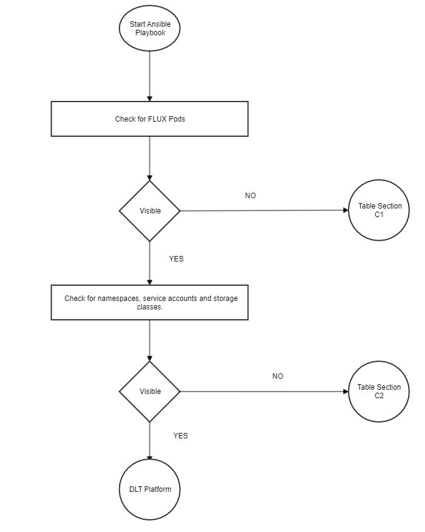

## DLT verification in BAF
While deploying a network through BAF, The pods and other components take some time to setup.
Each component has a retry of 100, but when every everything is fine ,the components are usually up in 8-10 retries. Meanwhile,  You can check the components while the retries occurs to avoid unnecessary wait time till the error/Failed message occurs in Ansible logs.

#### BAF Deployment Flowchart:

The flow chart shows the BAF Deployment process. To verify the steps of deployment, follow the flow chart and verification table 'C', to troubleshoot the general errors.

----

---
**Common Troubleshooting**
| Section | Problem                                                     | Possible Cause                                                                            | Solution                                                                                                                                                                                                                                                       |
|---------|-------------------------------------------------------------|-------------------------------------------------------------------------------------------|----------------------------------------------------------------------------------------------------------------------------------------------------------------------------------------------------------------------------------------------------------------|
| C1      | Flux Pods are not up                                        | 1. Git sync Fail                                                                          | 1.Check the deployment file for any incorrect branch name and other details.   kubectl edit deployment/flux-{{ network.env.type }}   2. Check 'network.organisation.gitops' section of the orgs for possible mistakes, eg. branch name, git token etc. |
| C2      | Namespaces, Service Accounts and storage classes are not up | 1.Value files are not properly generated    2. Value files are not pushed to git repo | 1. Check if the value files are correctly generated   2. Check whether git branch is right      - Check the Ansible logs to see if your local repo is in sync with the remote repo      - Check whether the git credentials are right.         |

**(Table 'C')**

----
**NOTE:**
If the components are not able to connect to each other, there could be some issue with load balancer. Check the haproxy or external DNS logs for more debugging.

If any pod/component of the network is not running (in crashloopbackoff or in error state) or is absent in the get pods list.

- Check the flux logs if it has been deployed or not.
- Check the helm release. Check the status as well as if the key-values are generated properly.
- For further debugging check for pod/container logs.
- If components are there but not able to talk to each, check whether the ambasssador/ haproxy is working properly, urls are properly mapped and ports are opened for communication or not.
