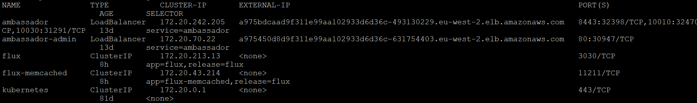
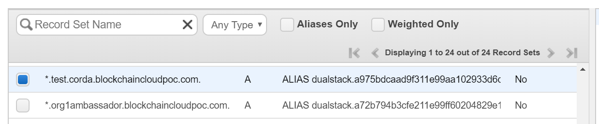

<a name = "configuring-prerequisites"></a>
# Configure Pre-requisites

- [Ansible Inventory file](#Ansible_Inventory)
- [Private Key for GitOps](#privatekey)
- [Docker Images](#docker)
- [Vault Initialization and unseal](#vaultunseal)
- [Ambassador](#ambassador)
- [External DNS](#externaldns)
- [HAProxy Ingress](#haproxy)

<a name = "Ansible_Inventory"></a>
## Ansible Inventory file

If not done already, configure the Ansible controller with this sample inventory file is located [here](https://github.com/hyperledger-labs/blockchain-automation-framework/tree/master/platforms/shared/inventory/ansible_provisioners). 

Add the contents of this file in your Ansible host configuration file (typically in file /etc/ansible/hosts).

Read more about Ansible inventory [here](https://docs.ansible.com/ansible/latest/user_guide/intro_inventory.html).

<a name = "privatekey"></a>
## Private Key for GitOps
For synchronizing the Git repo with the cluster, the Blockchain Automation Framework configures Flux for each cluster. The authentication is via SSH key, so this key should be generated before you run the playbooks. 
Run the following command to generate a private-public key pair named **gitops**.

```
ssh-keygen -q -N "" -f ./gitops
```

The above command generates an SSH key-pair: **gitops** (private key) and **gitops.pub** (public key).

Use the path to the private key (**gitops**) in the `gitops.private_key` section of the [configuration file](./corda_networkyaml.md).

---
**NOTE:** Ensure that the Ansible host has read-access to the private key file (gitops).

---

And add the public key contents (starts with **ssh-rsa**) as an Access Key (with read-write permissions) in your Github repository by following [this guide](https://help.github.com/en/github/authenticating-to-github/adding-a-new-ssh-key-to-your-github-account).

<a name = "docker"></a>
## Docker Images

The Blockchain Automation Framework provides pre-built docker images which are available on [Docker Hub](https://hub.docker.com/u/hyperledgerlabs). Ensure that the versions/tags you need are available. If not, raise it on our [RocketChat Channel](https://chat.hyperledger.org/channel/blockchain-automation-framework).

For Corda Enterprise, the docker images should be built and put in a private docker registry. Please follow [these instructions](../architectureref/corda-ent.html#docker-images) to build docker images for Corda Enterprise.

---
**NOTE:** The Blockchain Automation Framework recommends use of private docker registry for production use. The username/password for the docker registry can be provided in a **network.yaml** file so that the Kubernetes cluster can access the registry.

---

<a name = "vaultunseal"></a>
## Unseal Hashicorp Vault 

[Hashicorp Vault](https://www.vaultproject.io/) is one of the pre-requisites for the Blockchain Automation Framework. The Vault service should be accessible by the ansible host as well as the kubernetes cluster (proper inbound/outbound rules should be configured). If not initialised and unsealed already, complete the following steps to unseal and access the Vault.

* Install Vault client. Follow the instructions on [Install Vault](https://www.vaultproject.io/docs/install/).

* Set the environment Variable **VAULT_ADDR** to the Vault service. Note that this service should be accessible from the host where you are running this command from, as well as the Ansible controller and the Kubernetes nodes.
```
export VAULT_ADDR=http://my-vault-server:9000
```
* Now execute the following:
```
vault operator init -key-shares=1 -key-threshold=1
```
It will give following output:
```
Unseal Key 1: << unseal key>>

Initial Root Token: << root token>>
```
Save the root token  and unseal key in a secure location. This root token is to be updated in the Blockchain Automation Framework's network.yaml file before running the Ansible playbook(s) to deploy the DLT/Blockchain network.

* Unseal with the following command:
```
vault operator unseal << unseal-key-from-above >>
```
* Run this command to login and check if Vault is unsealed: 
```
vault login << give the root token >>
```
* Enable secrets engine
```
vault secrets enable -version=1 -path=secret kv
```

You may generate multiple root tokens at the time of initialising the Vault, and delete the one used in the network.yaml file as that is visible in ansible logs.

---
**NOTE**: It is recommended to use Vault auto-unseal using Cloud KMS for Production Systems. And use root token rotation.

---

<a name = "ambassador"></a>
## Ambassador

The Blockchain Automation Framework (BAF) uses [Ambassador](https://www.getambassador.io/about/why-ambassador/) for inter-cluster communication. To enable BAF Kubernetes services from one Kubernetes cluster to talk to services in another cluster, Ambassador needs to be configured as per the following steps:

* After Ambassador is deployed on the cluster (manually or using `platforms/shared/configuration/kubernetes-env-setup.yaml` playbook), get the external IP address of the Ambassador service.
```
kubectl get services -o wide
```
The output of the above command will look like this:


* Copy the **EXTERNAL-IP** for **ambassador** service from the output.
---
**NOTE:** If Ambassador is configured by the playbook, then this configuration has to be done while the playbook is being executed, otherwise the deployment will fail.

---

* Configure your subdomain configuration to redirect the external DNS name to this external IP. For example, if you want to configure the external domain suffix as **test.corda.blockchaincloudpoc.com**, then update the DNS mapping to redirect all requests to ***.test.corda.blockchaincloudpoc.com** towards **EXTERNAL-IP** from above as an ALIAS.
In AWS Route53, the settings look like below (in Hosted Zones).


---
**NOTE:** Ambassador for AWS and AWS-baremetal expose Hyperledger Indy nodes via a TCP Network Load Balancer with a fixed IP address. The fixed IP address is used as EIP allocation ID for all steward public IPs found in the network.yaml. The same public IP is specified for all stewards within one organization. All ports used by Indy nodes in the particular organization have to be exposed.

---

<a name = "externaldns"></a>
## External DNS

In case you do not want to manually update the route configurations every time you change DNS name, you can use [External DNS](https://github.com/kubernetes-sigs/external-dns) for automatic updation of DNS routes. 
Follow the steps as per your cloud provider, and then use `external_dns: enabled` in the `env` section of the BAF configuration file (network.yaml).

---
**NOTE:** Detailed configuration for External DNS setup is not provided here, please refer the link above.

---

<a name = "haproxy"></a>
## HAProxy Ingress

From Release 0.3.0.0 onwards, Blockchain Automation Framework (BAF) uses [HAProxy Ingress Controller](https://www.haproxy.com/documentation/hapee/1-9r1/traffic-management/kubernetes-ingress-controller/) for inter-cluster communication for Fabric network. To enable Fabric GRPC services from one Kubernetes cluster to talk to GRPC services in another cluster, HAProxy needs to be configured as per the following steps:

* Use `proxy: haproxy` in the `env` section of the BAF configuration file (network.yaml).

* Execute `platforms/shared/configuration/kubernetes-env-setup.yaml` playbook using the BAF configuration file, and then get the external IP address of the HAProxy controller service.
```
kubectl get services --all-namespaces -o wide
```

* Copy the **EXTERNAL-IP** for **haproxy-ingress** service in namespace **ingress-controller** from the output.

* Configure your subdomain configuration to redirect the external DNS name to this external IP. For example, if you want to configure the external domain suffix as **test.corda.blockchaincloudpoc.com**, then update the DNS mapping to redirect all requests to ***.test.corda.blockchaincloudpoc.com** towards **EXTERNAL-IP** from above as an ALIAS.
* Or, you can use [External DNS](#externaldns) above to configure the routes automatically.
