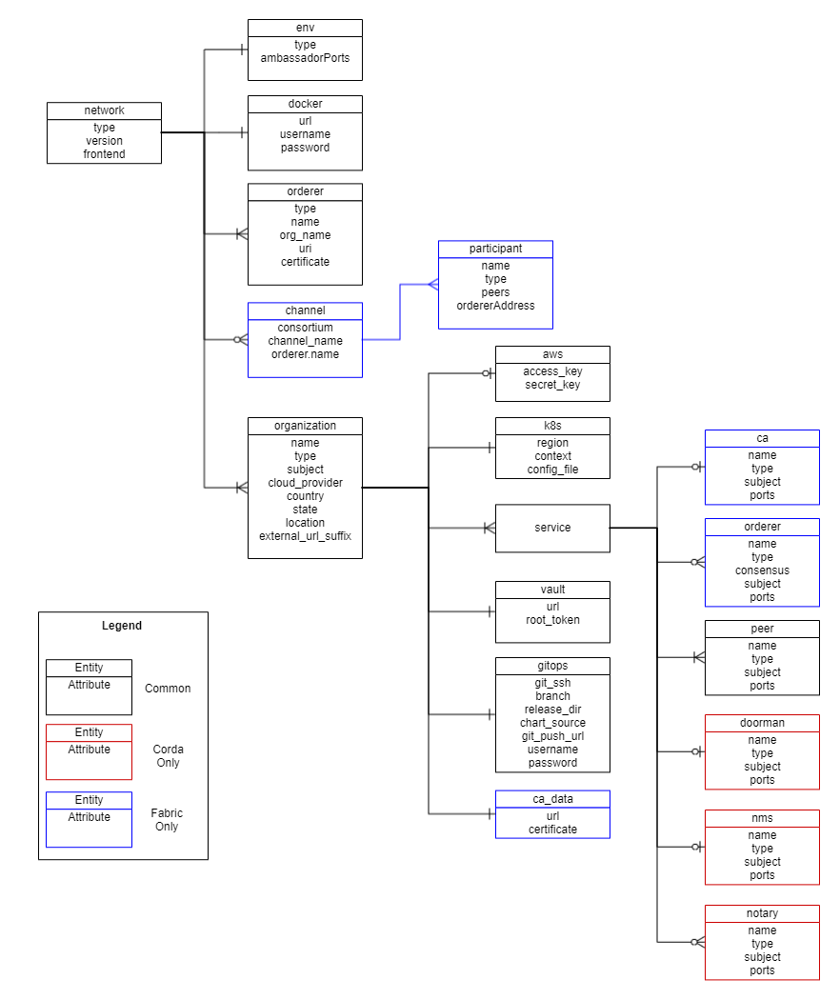

# Configuration file specification: R3 Corda
A network.yaml file is the base configuration file for setting up a Corda DLT network. This file contains all the information related to the infrastructure and network specifications. Here is the structure of it.

Before setting up a Corda DLT network, this file needs to be updated with the required specifications.
The configurations are grouped in the following sections for better understanding.

* type

* version

* frontend

* docker

* orderers

* organizations

`type` defines the platform information viz corda/fabric.
`version` defines the version of platform being used.
`frontend` is a flag which defines if frontend is enabled for nodes or not.

`docker` section contains the credentials of the repository where all the required images are built and stored.
(Note: Please use the [NMS Jenkins file](https://innersource.accenture.com/projects/BLOCKOFZ/repos/blockchain-automation-framework.git/browse/automation/r3-corda/NMS.Jenkinsfile) or/and [Doorman Jenkins file](https://innersource.accenture.com/projects/BLOCKOFZ/repos/blockchain-automation-framework.git/browse/automation/r3-corda/Doorman.Jenkinsfile) to build and store the docker images before running the Ansible playbooks)

| Field      | Description                                 |
|------------|---------------------------------------------|
| url        | Docker registry url                         | 
| username   | Username credential required for login      |
| password   | Password credential required for login      |

`orderers` section contains a list of doorman/networkmap which is exposed to the network.

| Field       | Description                                              |
|-------------|----------------------------------------------------------|
| name        | Name of the orderer                                      |
| org_name    | Name of the organization to which this orderer belong to |
| type        | Name of the orderer. In corda networkmap and doorman acts as a certificate authorities        and maintains CA certificates                                            |
| uri         | Orderer URL                                              |
| certificate | Location of custom certificates for Doorman and Networkmap. Currently certificates are generated and hence code needs to be updated to fetch the certificates from the mentioned path for custom certificates|

`organizations` section contains the specifications of each organization.

| Field                                       | Description                                                                                                      |
|---------------------------------------------|------------------------------------------------------------------------------------------------------------------|
| name                                        | Name of the organization                                                                                         |
| country                                     | Country of the organization                                                                                      |
| state                                       | State of the organization                                                                                        |
| location                                    |  Location of the organization                                                                                    |
| subject                                     | Subject format can be referred at [OpenSSL Subject](https://www.openssl.org/docs/man1.0.2/man1/openssl-req.html) |
| type                                        | This field can be doorman/nms/notary/peer                                                                                   |
| external_url_suffix                         | Public url of the cluster                                                                                        |
| cloud_provider                              | This field can be aws,azure or gcp                                                                               |
| aws.access_key                              | Access key when the organization cluster is based on aws cluster                                                         |
| aws.secret_key                              | Secret key when the organization is based on aws cluster                                                         |
| k8s.context                                 | Context of the cluster where the organization entities should be deployed                                        |
| k8s.config_file                             | Path to the kubernetes cluster configuration file                                                                |
| vault.url                                   | Unsealed Hashicorp Vault URL                                                                                     |
| vault.root_token                            | Unsealed Hashicorp Vault root token                                                                              |
| gitops.git_ssh                              | SSH url of the repository where flux should be synced                                                            |
| gitops.branch                               | Branch of the repository where the Helm Charts and value files are stored                                        |
| gitops.release_dir                          | Relative path where flux should sync files                                                                       |
| gitops.chart_source                         | Relative path where the helm charts are stored                                                                   |
| gitops.git_push_url                         | Gitops https URL for git push like "innersource.accenture.com/scm/blockofz/blockchain-automation-framework.git"                 |
| gitops.username                             | Username which has access rights to read/write on repository                                                     |
| gitops.password                             | Password of the user which has access rights to read/write on repository                                          |
| services.doorman.name                       | Doorman name                                                                                      |
| services.doorman.subject                    | Subject format can be referred at [OpenSSL Subject](https://www.openssl.org/docs/man1.0.2/man1/openssl-req.html) |
| services.doorman.type                       | Servicetype for doorman                                                                                          |
| services.doorman.ports.servicePort          | Grpc port number                                                                                                 |
| services.networkmap.name                    | Networkmapservice name                                                                                      |
| services.networkmap.subject                 | Subject format can be referred at [OpenSSL Subject](https://www.openssl.org/docs/man1.0.2/man1/openssl-req.html) |
| services.networkmap.type                    | Servicetype for networkmap                                                                                       |
| services.networkmap.ports.servicePort       | Grpc port number
                             |
| services.notaries.name                      | Notary name                                                                                      |
| services.notaries.subject                   | Subject format can be referred at [OpenSSL Subject](https://www.openssl.org/docs/man1.0.2/man1/openssl-req.html) |
| services.notaries.type                      | Servicetype for notaries                                                                                         |
| services.notaries.p2p.port                  | Corda Notary P2P port.Used for communication between the notary and nodes of same network
                             |
| services.notaries.p2p.targetport            | P2P Port where notary service is running.
                             |
| services.notaries.p2p.ambassadorport        | Port where ambassador service is running
                             |
| services.notaries.rpc.port                  | Corda Notary RPC port.Used for communication between the notary and nodes of same network
                             |
| services.notaries.rpc.targetport            | RPC Port where notary services is running.
                             |
| services.notaries.rpcadmin.port             | Corda Notary Rpcadmin port. Used for RPC admin binding
                             |
| services.notaries.dbtcp.port                | Corda Notary DbTcp port. Used to expose database to other services                                           |
| services.notaries.dbtcp.targetPort          | Corda Notary DbTcp target port. Port where the database services are running                               |
| services.notaries.dbweb.port                | Corda Notary dbweb port. Used to expose dbweb to other services                                                    |
| services.notaries.dbweb.targetPort          | Corda Notary dbweb target port. Port where the dbweb services are running                                        |
| services.peer.name                          | Name of the Corda Node                                                                                           |
| services.peer.type                          | Service type for Corda Nodes                                                                                     |
| services.peer.subject                       | Subject format can be referred at [OpenSSL Subject](https://www.openssl.org/docs/man1.0.2/man1/openssl-req.html) |
| services.peer.auth                          | Vault auth of the corda Node                                                                                     |
| services.peer.p2p.port                      | Corda Node P2P port.Used for communication between the nodes  of same network                                    |
| services.peer.rpc.port                      | Corda Node RPC port. Used for communication between the nodes of different network                               |
| services.peer.rpcadmin.port                 | Corda Node Rpcadmin port. Used for RPC admin binding                                                             |
| services.peer.dbtcp.port                    | Corda Node DbTcp port. Used to expose database to other services                                           |
| services.peer.dbtcp.targetPort              | Corda Node DbTcp target port. Port where the database services are running                               |
| services.peer.dbweb.port                    | Corda Node dbweb port. Used to expose dbweb to other services                                                    |
| services.peer.dbweb.targetPort              | Corda Node dbweb target port. Port where the dbweb services are running                                        |
| services.peer.springboot.port               | Springboot server port. Used to expose springboot to other    services                                           |
| services.peer.springboot.targetPort         | Springboot server  target port. Port where the springboot services are running                               |
| services.peer.expressapi.port               | Expressapi port. Used to expose expressapi to other services                                                     |
| services.peer.expressapi.targetPort         | Expressapi target port. Port where the expressapi services are running                                        |
