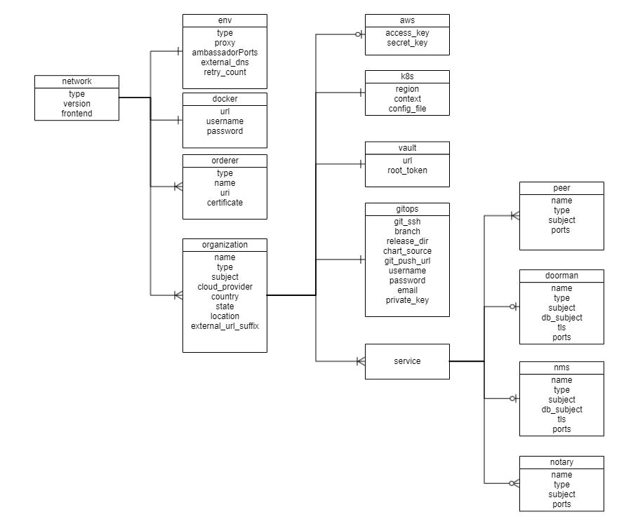
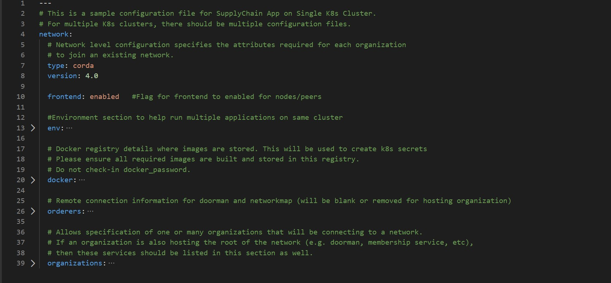

# Configuration file specification: R3 Corda
A network.yaml file is the base configuration file for setting up a Corda DLT network. This file contains all the information related to the infrastructure and network specifications. Here is the structure of it.


Before setting up a Corda DLT/Blockchain network, this file needs to be updated with the required specifications.
A sample configuration file is provide in the repo path:  
`platforms/r3-corda/configuration/samples/network-cordav2.yaml`  

The configurations are grouped in the following sections for better understanding.

* type

* version

* frontend

* env

* docker

* orderers

* organizations

Here is the snapshot from the sample configuration file



The sections in the sample configuration file are  

`type` defines the platform choice like corda/fabric/quorum, here in example its `corda`.

`version` defines the version of platform being used, here in example the Corda version is 4.0, the  corda version 4.1 and 4.4 is also supported and should be used. For **Corda Enterprise**, use like `4.4-enterprise`.

`frontend` is a flag which defines if frontend is enabled for nodes or not. Its value can only be enabled/disabled. This is only applicable if the sample Supplychain App is being installed.

`env` section contains the environment type and additional (other than 8443) Ambassador port configuration. Value for proxy field under this section has to be 'ambassador' as 'haproxy' has not been implemented for Corda.

The snapshot of the `env` section with example values is below
```yaml
  env:
    type: "env-type"                # tag for the environment. Important to run multiple flux on single cluster
    proxy: ambassador               # value has to be 'ambassador' as 'haproxy' has not been implemented for Corda
    ambassadorPorts: 15010,15020    # Any additional Ambassador ports can be given here, must be comma-separated without spaces, this is valid only if proxy='ambassador'
    retry_count: 20                 # Retry count for the checks
    external_dns: enabled           # Should be enabled if using external-dns for automatic route configuration
```
The fields under `env` section are 

| Field      | Description                                 |
|------------|---------------------------------------------|
| type       | Environment type. Can be like dev/test/prod.|
| proxy      | Choice of the Cluster Ingress controller. Currently supports 'ambassador' only as 'haproxy' has not been implemented for Corda |
| ambassadorPorts   | Any additional Ambassador ports can be given here; must be comma-separated without spaces like `10010,10020`. This is only valid if `proxy: ambassador`     |
| retry_count       | Retry count for the checks. Use a large number if your kubernetes cluster is slow. |
| external_dns       | If the cluster has the external DNS service, this has to be set `enabled` so that the hosted zone is automatically updated. |


`docker` section contains the credentials of the repository where all the required images are built and stored.

For Opensource Corda, the required images are found [here](../architectureref/corda.html#docker-images).

For **Corda Enterprise**, all Docker images has to be built and stored in a private Docker registry before running the Ansible playbooks. The required images are found [here](../architectureref/corda-ent.html#docker-images).

The snapshot of the `docker` section with example values is below
```yaml
  # Docker registry details where images are stored. This will be used to create k8s secrets
  # Please ensure all required images are built and stored in this registry. 
  docker:
    url: "<url>"
    username: "<username>"
    password: "<password>"
```
The fields under `docker` section are

| Field      | Description                                 |
|------------|---------------------------------------------|
| url        | Docker registry url. Must be private registry for **Corda Enterprise**    | 
| username   | Username credential required for login      |
| password   | Password credential required for login      |

---
**NOTE:** Please follow [these instructions](../operations/configure_prerequisites.html#docker) to build and store the docker images before running the Ansible playbooks.

---

The snapshot of the `orderers` section with example values is below
```yaml
  # Remote connection information for doorman/idman and networkmap (will be blank or removed for hosting organization)
  orderers:
    - orderer:
      type: doorman
      uri: https://doorman.test.corda.blockchaincloudpoc.com:8443
      certificate: home_dir/platforms/r3-corda/configuration/build/corda/doorman/tls/ambassador.crt
    - orderer:
      type: networkmap
      uri: https://networkmap.test.corda.blockchaincloudpoc.com:8443
      certificate: home_dir/platforms/r3-corda/configuration/build/corda/networkmap/tls/ambassador.crt
```
The `orderers` section contains a list of doorman/networkmap which is exposed to the network. Each `orderer` has the following fields:

| Field       | Description                                              |
|-------------|----------------------------------------------------------|
| type        | For Corda, `networkmap` and `doorman` (`idman` for **Corda Enterprise**) are the only valid type of orderers.    |
| uri         | Doorman/IDman/Networkmap external URL. This should be reachable from all nodes.     | 
| certificate | Directory path of public certificates for Doorman/IDman and Networkmap.             |
| crlissuer | Only for **Corda Enterprise**. Subject of the CRL Issuer.|


The `organizations` section allows specification of one or many organizations that will be connecting to a network. If an organization is also hosting the root of the network (e.g. doorman, membership service, etc), then these services should be listed in this section as well.
In the sample example the 1st Organisation is hosting the root of the network, so the services doorman, nms and notary are listed under the 1st organization's service.

The snapshot of an organization field with sample values is below
```yaml
    - organization:
      name: manufacturer
      country: CH
      state: Zurich
      location: Zurich
      subject: "O=Manufacturer,OU=Manufacturer,L=Zurich,C=CH"
      type: node
      external_url_suffix: test.corda.blockchaincloudpoc.com
      cloud_provider: aws # Options: aws, azure, gcp
```

Each organization under the `organizations` section has the following fields. 

| Field                                    | Description                                 |
|------------------------------------------|-----------------------------------------------------|
| name                                        | Name of the organization                                                                                         |
| country                                     | Country of the organization                                                                                      |
| state                                       | State of the organization                                                                                        |
| location                                    |  Location of the organization                                                                                    |
| subject                                     | Subject format can be referred at [OpenSSL Subject](https://www.openssl.org/docs/man1.0.2/man1/openssl-req.html) |
| type                                        | This field can be doorman-nms-notary/node              |
| external_url_suffix                         | Public url suffix of the cluster. This is the configured path for the Ambassador Service on the DNS provider.|
| cloud_provider                              | Cloud provider of the Kubernetes cluster for this organization. This field can be aws, azure or gcp |
| aws                                         | When the organization cluster is on AWS |
| k8s                                         | Kubernetes cluster deployment variables.|
| vault                                       | Contains Hashicorp Vault server address and root-token in the example |
| gitops                                      | Git Repo details which will be used by GitOps/Flux. |
| cordapps (optional)                         | Cordapps Repo details which will be used to store/fetch cordapps jar |
| services                                    | Contains list of services which could be peers/doorman/nms/notary | 


For the aws and k8s field the snapshot with sample values is below
```yaml
      aws:
        access_key: "<aws_access_key>"    # AWS Access key, only used when cloud_provider=aws
        secret_key: "<aws_secret>"        # AWS Secret key, only used when cloud_provider=aws
  
      # Kubernetes cluster deployment variables.
      k8s:        
        region: "<k8s_region>"
        context: "<cluster_context>"
        config_file: "<path_to_k8s_config_file>"
```

The `aws` field under each organisation contains: (This will be ignored if cloud_provider is not 'aws')

| Field       | Description                                              |
|-------------|----------------------------------------------------------|
| access_key                              | AWS Access key  |
| secret_key                              | AWS Secret key  |

The `k8s` field under each organisation contains

| Field       | Description                                              |
|-------------|----------------------------------------------------------|
| context                                 | Context/Name of the cluster where the organization entities should be deployed                                   |
| config_file                             | Path to the kubernetes cluster configuration file                                                                |

For gitops fields the snapshot from the sample configuration file with the example values is below
```yaml
      # Git Repo details which will be used by GitOps/Flux.
      gitops:
        git_ssh: "git@github.com/<username>/blockchain-automation-framework.git" # Gitops ssh url for flux value files
        branch: "<branch_name>"                                                  # Git branch where release is being made
        release_dir: "platforms/r3-corda/releases/dev" # Relative Path in the Git repo for flux sync per environment. 
        chart_source: "platforms/r3-corda/charts"      # Relative Path where the Helm charts are stored in Git repo
        git_push_url: "github.com/<username>/blockchain-automation-framework.git"
        username: "<username>"          # Git Service user who has rights to check-in in all branches
        password: "<password>"          # Git Server user password/personal token
        email: "<git_email>"              # Email to use in git config
        private_key: "<path to gitops private key>"
```

The `gitops` field under each organization contains

| Field       | Description                                              |
|-------------|----------------------------------------------------------|
| git_ssh                              | SSH url of the repository where flux should be synced                                                            |
| branch                               | Branch of the repository where the Helm Charts and value files are stored                                        |
| release_dir                          | Relative path where flux should sync files                                                                       |
| chart_source                         | Relative path where the helm charts are stored                                                                   |
| git_push_url                         | Gitops https URL for git push like "github.com/hyperledger-labs/blockchain-automation-framework.git"             |
| username                             | Username which has access rights to read/write on repository                                                     |
| password                             | Password of the user which has access rights to read/write on repository                                         |
| email                                | Email of the user to be used in git config                                                                       |
| private_key                          | Path to the private key file which has write-access to the git repo                                              |

For cordapps fields the snapshot from the sample configuration file with the example values is below
```yaml
      # Cordapps Repository details (optional use if cordapps jar are store in a repository)
      cordapps:
        jars: 
        - jar:
            # e.g https://alm.accenture.com/nexus/repository/AccentureBlockchainFulcrum_Release/com/supplychain/bcc/cordapp-supply-chain/0.1/cordapp-supply-chain-0.1.jar
            url: 
        - jar:
            # e.g https://alm.accenture.com/nexus/repository/AccentureBlockchainFulcrum_Release/com/supplychain/bcc/cordapp-contracts-states/0.1/cordapp-contracts-states-0.1.jar
            url: 
        username: "cordapps_repository_username"
        password: "cordapps_repository_password"
```

The `cordapps` optional field under each organization contains

| Field       | Description                                              |
|-------------|----------------------------------------------------------|
| jars        | Contains list of jars with jar URL that needs to fetched and put into organisation nodes    |
| username                             | Cordapps Repository username |
| password                             | Cordapps Repository password |

The services field for each organization under `organizations` section of Corda contains list of `services` which could be doorman/idman/nms/notary/peers for opensource, and additionally idman/networkmap/signer for **Corda Enterprise**.

The snapshot of doorman service with example values is below
```yaml
      services:
        doorman:
          name: doormanskar
          subject: "CN=Corda Doorman CA,OU=DLT,O=DLT,L=Berlin,C=DE"
          db_subject: "/C=US/ST=California/L=San Francisco/O=My Company Ltd/OU=DBA/CN=mongoDB"
          type: doorman
          ports:
            servicePort: 8080
            targetPort: 8080
          tls: "on"
```

The fields under `doorman` service are 

| Field       | Description                                              |
|-------------|----------------------------------------------------------|
| name            | Name for the Doorman service                                                                                 |
| subject                    | Certificate Subject for Doorman service. Subject format can be referred at [OpenSSL Subject](https://www.openssl.org/docs/man1.0.2/man1/openssl-req.html) |
| db_subject                 | Certificate subject for mongodb database of doorman
| type                       | Service type must be `doorman`                                                                             |
| ports.servicePort          | HTTP port number where doorman service is accessible                                       |
| ports.targetPort           | HTTP target port number of the doorman docker-container                                       |
| tls                        | On/off based on whether we want TLS on/off for doorman 

The snapshot of nms service example values is below
```yaml
        nms:
          name: networkmapskar
          subject: "CN=Network Map,OU=FRA,O=FRA,L=Berlin,C=DE"
          db_subject: "/C=US/ST=California/L=San Francisco/O=My Company Ltd/OU=DBA/CN=mongoDB"
          type: networkmap
          ports:
            servicePort: 8080
            targetPort: 8080
          tls: "on"  
```
The fields under `nms` service are

| Field       | Description                                              |
|-------------|----------------------------------------------------------|
| name                | Name of the NetworkMap service                     |
| subject      | Certificate Subject for NetworkMap service. Subject format can be referred at [OpenSSL Subject](https://www.openssl.org/docs/man1.0.2/man1/openssl-req.html) |
| db_subject              | Certificate subject for mongodb database of nms.
| type                    | Service type must be `networkmap`    |
| ports.servicePort       | HTTP port number where NetworkMap service is accessible                                       |
| ports.targetPort        | HTTP target port number of the NetworkMap docker-container                                  |
| tls                     | On/off based on whether we want TLS on/off for nms

For **Corda Enterprise**, following services must be added to CENM Support.

The snapshot of idman service with example values is below
```yaml
      services:
        idman:
          name: idman
          subject: "CN=Test Identity Manager Service Certificate, OU=HQ, O=HoldCo LLC, L=New York, C=US"
          crlissuer_subject: "CN=Corda TLS CRL Authority,OU=Corda UAT,O=R3 HoldCo LLC,L=New York,C=US"
          type: cenm
          ports:
            servicePort: 8080
            targetPort: 8080
```

The fields under `idman` service are 

| Field       | Description                                              |
|-------------|----------------------------------------------------------|
| name            | Name for the IDman service                                                                                 |
| subject                    | Certificate Subject for Idman service. Subject format can be referred at [OpenSSL Subject](https://www.openssl.org/docs/man1.0.2/man1/openssl-req.html) |
| crlissuer_subject                 | Certificate subject for CRL Issuer service |
| type                       | Service type must be `cenm`                                                                             |
| ports.servicePort          | HTTP port number where idman service is accessible                                       |
| ports.targetPort           | HTTP target port number of the idman docker-container                                       |

The snapshot of networkmap service with example values is below
```yaml
      services:
        networkmap:
          name: networkmap
          subject: "CN=Test Network Map Service Certificate, OU=HQ, O=HoldCo LLC, L=New York, C=US"
          type: cenm
          ports:
            servicePort: 8080
            targetPort: 8080
```

The fields under `networkmap` service are 

| Field       | Description                                              |
|-------------|----------------------------------------------------------|
| name            | Name for the Networkmap service                                                                                 |
| subject                    | Certificate Subject for Networkmap service. Subject format can be referred at [OpenSSL Subject](https://www.openssl.org/docs/man1.0.2/man1/openssl-req.html) |
| type                       | Service type must be `cenm`                                                                             |
| ports.servicePort          | HTTP port number where networkmap service is accessible                                       |
| ports.targetPort           | HTTP target port number of the networkmap docker-container                                       |

The snapshot of signer service with example values is below
```yaml
      services:
        signer:
          name: signer
          subject: "CN=Test Subordinate CA Certificate, OU=HQ, O=HoldCo LLC, L=New York, C=US"
          type: cenm
          ports:
            servicePort: 8080
            targetPort: 8080 
```

The fields under `signer` service are 

| Field       | Description                                              |
|-------------|----------------------------------------------------------|
| name            | Name for the Signer service                                                                                 |
| subject                    | Certificate Subject for Signer service. Subject format can be referred at [OpenSSL Subject](https://www.openssl.org/docs/man1.0.2/man1/openssl-req.html) |
| type                       | Service type must be `cenm`                                                                             |
| ports.servicePort          | HTTP port number where signer service is accessible                                       |
| ports.targetPort           | HTTP target port number of the signer docker-container                                       |

The snapshot of notary service with example values is below
```yaml
        # Currently only supporting a single notary cluster, but may want to expand in the future
        notary:
          name: notaryskar
          subject: "O=Notary,OU=Notary,L=London,C=GB"
          type: notary          
          p2p:
            port: 10002
            targetPort: 10002
            ambassador: 10010       #Port for ambassador service (use one port per org if using single cluster)
          rpc:
            port: 10003
            targetPort: 10003
          rpcadmin:
            port: 10005
            targetPort: 10005
          dbtcp:
            port: 9101
            targetPort: 1521
          dbweb:             
            port: 8080
            targetPort: 81
```
The fields under `notary` service are 

| Field       | Description                                              |
|-------------|----------------------------------------------------------|
| name                     | Name of the notary service   |
| subject                   | Certificate Subject for notary service. Subject format can be referred at [OpenSSL Subject](https://www.openssl.org/docs/man1.0.2/man1/openssl-req.html) |
| type                      | Service type must be `notary`  |
| p2p.port                  | Corda Notary P2P port. Used for communication between the notary and nodes of same network|
| p2p.targetport            | P2P Port where notary service is running. |
| p2p.ambassadorport        | Port where notary service is exposed via Ambassador|
| rpc.port                  | Corda Notary RPC port. Used for communication between the notary and nodes of same network|
| rpc.targetport            | RPC Port where notary services is running.|
| rpcadmin.port             | Corda Notary Rpcadmin port. Used for RPC admin binding|
| dbtcp.port                | Corda Notary DbTcp port. Used to expose database to other services                                         |
| dbtcp.targetPort          | Corda Notary DbTcp target port. Port where the database services are running                               |
| dbweb.port                | Corda Notary dbweb port. Used to expose dbweb to other services                                            |
| dbweb.targetPort          | Corda Notary dbweb target port. Port where the dbweb services are running                                  |

The snapshot of peer service with example values is below
```yaml
      # The participating nodes are named as peers 
      services:
        peers:
        - peer:
          name: manufacturerskar
          subject: "O=Manufacturer,OU=Manufacturer,L=47.38/8.54/Zurich,C=CH"
          type: node
          p2p:
            port: 10002
            targetPort: 10002
            ambassador: 10020       #Port for ambassador service (use one port per org if using single cluster)
          rpc:
            port: 10003
            targetPort: 10003
          rpcadmin:
            port: 10005
            targetPort: 10005
          dbtcp:
            port: 9101
            targetPort: 1521
          dbweb:             
            port: 8080
            targetPort: 81
          springboot:             # This is for the springboot server
            targetPort: 20001
            port: 20001 
          expressapi:             # This is for the express api server
            targetPort: 3000
            port: 3000
```
The fields under each `peer` service are 

| Field       | Description                                              |
|-------------|----------------------------------------------------------|
| name                          | Name of the Corda Node                                                                                           |
| type                          | Service type must be `node` |
| subject                       | The node legal name subject. |
| auth                          | Vault auth of the corda Node                                                                                     |
| p2p.port                      | Corda Node P2P port.Used for communication between the nodes  of same network                                    |
| rpc.port                      | Corda Node RPC port. Used for communication between the nodes of different network                               |
| rpcadmin.port                 | Corda Node Rpcadmin port. Used for RPC admin binding                                                             |
| dbtcp.port                    | Corda Node DbTcp port. Used to expose database to other services                                           |
| dbtcp.targetPort              | Corda Node DbTcp target port. Port where the database services are running                               |
| dbweb.port                    | Corda Node dbweb port. Used to expose dbweb to other services                                                    |
| dbweb.targetPort              | Corda Node dbweb target port. Port where the dbweb services are running                                        |
| springboot.port               | Springboot server port. Used to expose springboot to other    services                                           |
| springboot.targetPort         | Springboot server  target port. Port where the springboot services are running                               |
| expressapi.port               | Expressapi port. Used to expose expressapi to other services                                                     |
| expressapi.targetPort         | Expressapi target port. Port where the expressapi services are running                                        |

For **Corda Enterprise**, following additional fields have been added under each `peer`.
```yaml
          firewall:
            enabled: true                   # true if firewall components are to be deployed
            dmz: true                       # true if a separate k8s cluster is being used for Corda Float. false if same cluster is used.
            dmz_k8s:                        # DMZ cluster details. Must be under the same Cloud provider as the main cluster.
              context: "dmz_cluster_context"
              config_file: "dmz_cluster_config"
          hsm:                              # hsm support for future release
            enabled: false 
```

| Field       | Description                                              |
|-------------|----------------------------------------------------------|
| firewall.enabled  | Can be true/false. True, if Corda Firewall components are to be deployed. False, if Firewall is not needed. Corda recommends usage of Firewall for all production deployments.|
| firewall.dmz | Can be true/false. True, if Corda Firewall components are to be deployed on a separate DMZ Kubernetes cluster. False, if Firewall components are to be deployed on same Kubernetes cluster as the Node. Corda recommends usage of separate DMS cluster for all production deployments. |
| firewall.dmz_k8s | This is used only id `dmz: true`. Contains the Kubernetes cluster context and config file path of the DMZ cluster. Note that the cluster should be in the same Cloud provider account as the Node cluster. |
| hsm.enabled      | This is kept for future HSM integration  |
