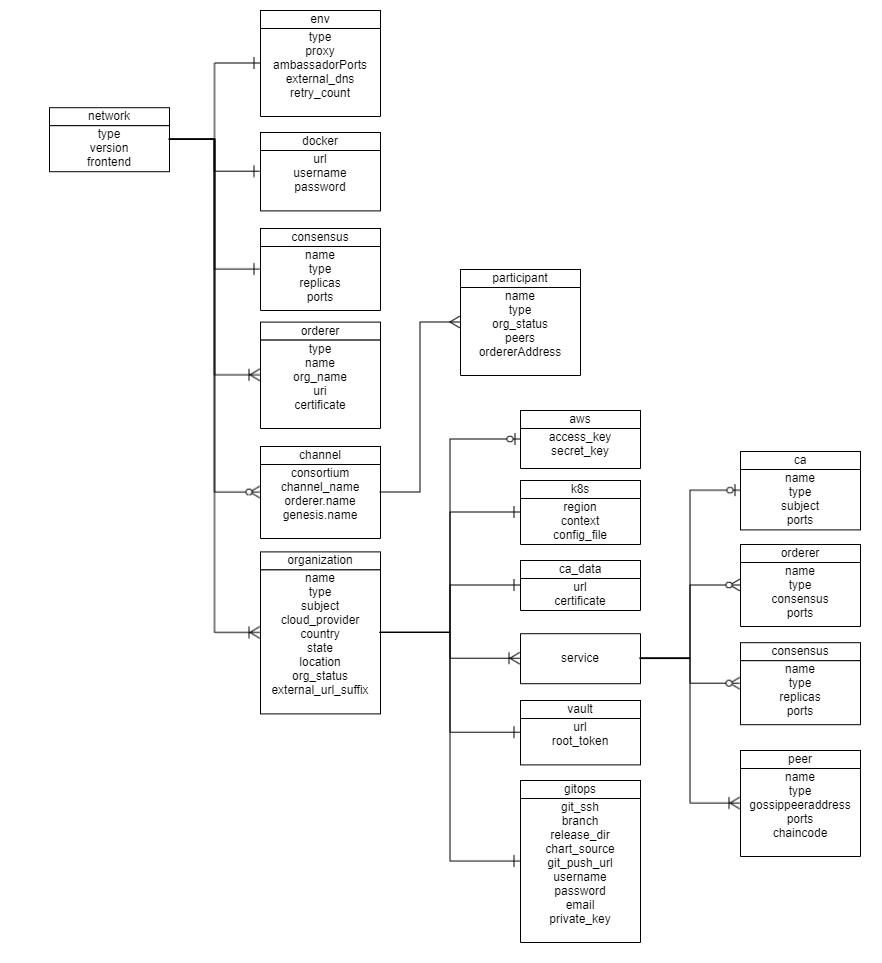
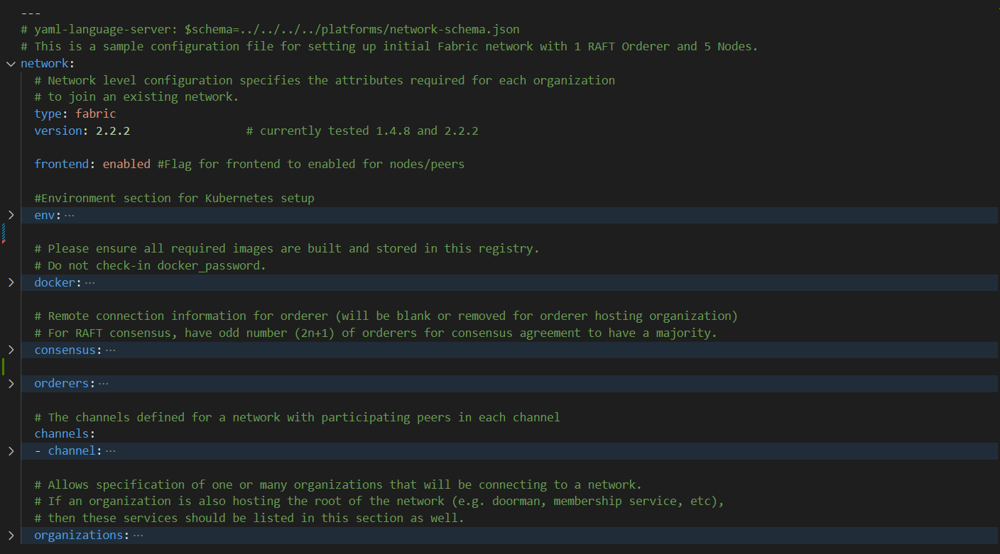

# Configuration file specification: Hyperledger-Fabric
A network.yaml file is the base configuration file designed in the Blockchain Automation Framework for setting up a Fabric DLT network. This file contains all the information related to the infrastructure and network specifications. Below shows its structure.


Before setting up a Fabric DLT network, this file needs to be updated with the required specifications.  
A sample configuration file is provided in the repo path:  
`platforms/hyperledger-fabric/configuration/samples/network-fabricv2.yaml` 

The configurations are grouped in the following sections for better understanding.

* type

* version

* docker

* frontend

* env

* orderers

* channels

* organizations

Here is the snapshot from the sample configuration file



The sections in the sample configuration file are  

`type` defines the platform choice like corda/fabric, here in the example its Fabric

`version` defines the version of platform being used. The current Fabric version support is 1.4.0, 1.4.4 and 2.0.0

`frontend` is a flag which defines if frontend is enabled for nodes or not. Its value can only be enabled/disabled. This is only applicable if the sample Supplychain App is being installed.

`env` section contains the environment type and additional (other than 8443) Ambassador port configuration. Vaule for proxy field under this section can be 'ambassador' or 'haproxy'

The snapshot of the `env` section with example value is below
```yaml 
  env:
    type: "env_type"              # tag for the environment. Important to run multiple flux on single cluster
    proxy: haproxy                  # values can be 'haproxy' or 'ambassador'
    ambassadorPorts: 15010,15020    # is valid only if proxy='ambassador'
    retry_count: 100                # Retry count for the checks
    external_dns: enabled           # Should be enabled if using external-dns for automatic route configuration
```
The fields under `env` section are 

| Field      | Description                                 |
|------------|---------------------------------------------|
| type       | Environment type. Can be like dev/test/prod.|
| proxy      | Choice of the Cluster Ingress controller. Currently supports 'haproxy' only as 'ambassador' has not been implemented for Fabric |
| ambassadorPorts   | Any additional Ambassador ports can be given here; must be comma-separated without spaces like `10010,10020`. This is only valid if `proxy: ambassador`     |
| retry_count       | Retry count for the checks. |
|external_dns       | If the cluster has the external DNS service, this has to be set `enabled` so that the hosted zone is automatically updated. |

`docker` section contains the credentials of the repository where all the required images are built and stored.

The snapshot of the `docker` section with example values is below
```yaml
  # Docker registry details where images are stored. This will be used to create k8s secrets
  # Please ensure all required images are built and stored in this registry.
  # Do not check-in docker_password.
  docker:
    url: "docker_url"
    username: "docker_username"
    password: "docker_password"
```
The fields under `docker` section are

| Field    | Description                            |
|----------|----------------------------------------|
| url      | Docker registry url                    |
| username | Username credential required for login |
| password | Password credential required for login |

---
**NOTE:** Please follow [these instructions](../operations/configure_prerequisites.md#docker) to build and store the docker images before running the Ansible playbooks.

---

`orderers` section contains a list of orderers with variables which will expose it for the network.

The snapshot of the `orderers` section with example values is below
```yaml
  # Remote connection information for orderer (will be blank or removed for orderer hosting organization)
  orderers:
    - orderer:
      type: orderer
      name: orderer1
      org_name: supplychain               #org_name should match one organization definition below in organizations: key            
      uri: orderer1.org1ambassador.blockchaincloudpoc.com:8443   # Can be external or internal URI for orderer which should be reachable by all peers
      certificate: /home/blockchain-automation-framework/build/orderer1.crt           # Ensure that the directory exists
    - orderer:
      type: orderer
      name: orderer2
      org_name: supplychain               #org_name should match one organization definition below in organizations: key            
      uri: orderer2.org1ambassador.blockchaincloudpoc.com:8443   # Can be external or internal URI for orderer which should be reachable by all peers
      certificate: /home/blockchain-automation-framework/build/orderer2.crt           # Ensure that the directory exists
```
The fields under the each `orderer` are

| Field       | Description                                              |
|-------------|----------------------------------------------------------|
| name        | Name of the orderer service                                  |
| type        | For Fabric, `orderer` is the only valid type of orderers.   |
| org_name    | Name of the organization to which this orderer belong to |
| uri         | Orderer URL                                              |
| certificate | Path to orderer certificate. For inital network setup, ensure that the directory is present, the file need not be present. For adding a new organization, ensure that the file is the crt file of the orderer of the existing network. |

The `channels` sections contains the list of channels mentioning the participating peers of the organizations.

The snapshot of channels section with its fields and sample values is below

```yaml
    # The channels defined for a network with participating peers in each channel
  channels:
  - channel:
    consortium: SupplyChainConsortium
    channel_name: AllChannel
    orderer: 
      name: supplychain
    participants:
    - organization:
      name: carrier
      type: creator       # creator organization will create the channel and instantiate chaincode, in addition to joining the channel and install chaincode
      peers:
      - peer:
        name: peer0
        gossipAddress: peer0.carrier-net.org3ambassador.blockchaincloudpoc.com:8443  # External or internal URI of the gossip peer
      ordererAddress: orderer1.org1ambassador.blockchaincloudpoc.com:8443             # External or internal URI of the orderer
    - organization:      
      name: store
      type: joiner        # joiner organization will only join the channel and install chaincode
      peers:
      - peer:
        name: peer0
        gossipAddress: peer0.store-net.org3ambassador.blockchaincloudpoc.com:8443
      ordererAddress: orderer1.org1ambassador.blockchaincloudpoc.com:8443
    - organization:
      name: warehouse
      type: joiner
      peers:
      - peer:
        name: peer0
        gossipAddress: peer0.warehouse-net.org2ambassador.blockchaincloudpoc.com:8443
      ordererAddress: orderer1.org1ambassador.blockchaincloudpoc.com:8443
    - organization:
      name: manufacturer
      type: joiner
      peers:
      - peer:
        name: peer0
        gossipAddress: peer0.manufacturer-net.org2ambassador.blockchaincloudpoc.com:8443
      ordererAddress: orderer1.org1ambassador.blockchaincloudpoc.com:8443
    genesis:
      name: OrdererGenesis
```
The fields under the `channel` are

| Field                           | Description                                                |
|---------------------------------|------------------------------------------------------------|
| consortium                      | Name of the consortium, the channel belongs to             |
| channel_name                    | Name of the channel                                        |
| genesis.name                    | Name of the genesis block                                  |
| orderer.name                    | Organization name to which the orderer belongs             |
| participants                    | Contains list of organizations participating in the channel|

Each `organization` field under `participants` field of the channel contains the following fields

| Field                           | Description                                                |
|---------------------------------|------------------------------------------------------------|
| name               | Organization name of the peer participating in the channel |
| type               | This field can be creator/joiner of channel                |
| ordererAddress     | URL of the orderer this peer connects to                   |
| peer.name          | Name of the peer                                           |
| peer.gossipAddress | Gossip address of the peer                                 |


The `organizations` section contains the specifications of each organization.  
In the sample configuration example, we have five organization under the `organizations` section

The snapshot of an organization field with sample values is below
```yaml
  organizations:
    # Specification for the 1st organization. Each organization maps to a VPC and a separate k8s cluster
    - organization:
      name: supplychain
      country: UK
      state: London
      location: London
      subject: "O=Orderer,L=51.50/-0.13/London,C=GB"
      type: orderer
      external_url_suffix: org1ambassador.blockchaincloudpoc.com
      cloud_provider: aws   # Options: aws, azure, gcp, minikube
```
Each `organization` under the `organizations` section has the following fields. 

| Field                                    | Description                                 |
|------------------------------------------|-----------------------------------------------------|
| name                                        | Name of the organization                                                                                         |
| country                                     | Country of the organization                                                                                      |
| state                                       | State of the organization                                                                                        |
| location                                    |  Location of the organization                                                                                    |
| subject                                     | Subject format can be referred at [OpenSSL Subject](https://www.openssl.org/docs/man1.0.2/man1/openssl-req.html) |
| type                                        | This field can be orderer/peer            |
| external_url_suffix                         | Public url suffix of the cluster.         |
| ca_data                                     | Contains the certificate authority url and certificate path; This has not been implemented yet |
| cloud_provider                              | Cloud provider of the Kubernetes cluster for this organization. This field can be aws, azure, gcp or minikube |
| aws                                         | When the organization cluster is on AWS |
| k8s                                         | Kubernetes cluster deployment variables.|
| vault                                       | Contains Hashicorp Vault server address and root-token in the example |
| gitops                                      | Git Repo details which will be used by GitOps/Flux. |
| services                                    | Contains list of services which could ca/peer/orderers/concensus based on the type of organization |

For the aws and k8s field the snapshot with sample values is below
```yaml
      aws:
        access_key: "<aws_access_key>"    # AWS Access key, only used when cloud_provider=aws
        secret_key: "<aws_secret>"        # AWS Secret key, only used when cloud_provider=aws
  
      # Kubernetes cluster deployment variables.
      k8s:        
        region: "<k8s_region>"
        context: "<cluster_context>"
        config_file: "<path_to_k8s_config_file>"
```

The `aws` field under each organization contains: (This will be ignored if cloud_provider is not 'aws')

| Field       | Description                                              |
|-------------|----------------------------------------------------------|
| access_key                              | AWS Access key  |
| secret_key                              | AWS Secret key  |

The `k8s` field under each organization contains

| Field       | Description                                              |
|-------------|----------------------------------------------------------|
| region                                  | Region where the Kubernetes cluster is deployed, e.g : eu-west-1        |
| context                                 | Context/Name of the cluster where the organization entities should be deployed                                   |
| config_file                             | Path to the kubernetes cluster configuration file                                                                |

For gitops fields the snapshot from the sample configuration file with the example values is below
```yaml
      # Git Repo details which will be used by GitOps/Flux.
      gitops:
        git_ssh: "git@github.com/<username>/blockchain-automation-framework.git" # Gitops ssh url for flux value files
        branch: "<branch_name>"                                                  # Git branch where release is being made
        release_dir: "platforms/hyperledger-fabric/releases/dev" # Relative Path in the Git repo for flux sync per environment. 
        chart_source: "platforms/hyperledger-fabric/charts"      # Relative Path where the Helm charts are stored in Git repo
        git_push_url: "github.com/<username>/blockchain-automation-framework.git" # without https://
        username: "<username>"          # Git Service user who has rights to check-in in all branches
        password: "<password>"          # Git Server user password/personal token
        email: "<git_email>"              # Email to use in git config
        private_key: "<path to gitops private key>"
```

The gitops field under each organization contains

| Field       | Description                                              |
|-------------|----------------------------------------------------------|
| git_ssh                              | SSH url of the repository where flux should be synced                                                            |
| branch                               | Branch of the repository where the Helm Charts and value files are stored                                        |
| release_dir                          | Relative path where flux should sync files                                                                       |
| chart_source                         | Relative path where the helm charts are stored                                                                   |
| git_push_url                         | Gitops https URL for git push like "github.com/hyperledger-labs/blockchain-automation-framework.git"             |
| username                             | Username which has access rights to read/write on repository                                                     |
| password                             | Password of the user which has access rights to read/write on repository                                         |
| email                                | Email of the user to be used in git config                                                                       |
| private_key                          | Path to the private key file which has write-access to the git repo                                              |

The services field for each organization under `organizations` section of Fabric contains list of `services` which could be ca/orderers/consensus/peers based on if the type of organization. 

Each organization will have a ca service under the service field. The snapshot of ca service with example values is below
```yaml
      # Services maps to the pods that will be deployed on the k8s cluster
      # This sample is an orderer service and includes a zk-kafka consensus
      services:
        ca:
          name: ca
          subject: "/C=GB/ST=London/L=London/O=Orderer/CN=ca.supplychain-net"
          type: ca
          grpc:
            port: 7054
```
The fields under `ca` service are

| Field       | Description                                              |
|-------------|----------------------------------------------------------|
| name                             | Certificate Authority service name        |
| subject                         | Subject format can be referred at [OpenSSL Subject](https://www.openssl.org/docs/man1.0.2/man1/openssl-req.html) |
| type | Type must be `ca` for certification authority |
| grpc.port                       | Grpc port number |


Each organization with type as peer will have a peers service. The snapshot of peers service with example values is below
```yaml
        peers:
        - peer:
          name: peer0          
          type: anchor    # This can be anchor/nonanchor. Atleast one peer should be anchor peer.         
          gossippeeraddress: peer0.manufacturer-net:7051 # Internal Address of the other peer in same Org for gossip, same peer if there is only one peer          
          grpc:
            port: 7051         
          events:
            port: 7053
          couchdb:
            port: 5984
          restserver:           # This is for the rest-api server
            targetPort: 20001
            port: 20001 
          expressapi:           # This is for the express api server
            targetPort: 3000
            port: 3000
          chaincode:
            name: "chaincode_name" #This has to be replaced with the name of the chaincode
            version: "chaincode_version" #This has to be replaced with the version of the chaincode
            maindirectory: "chaincode_main"  #The main directory where chaincode is needed to be placed
            repository:
              username: "git_username"          # Git Service user who has rights to check-in in all branches
              password: "git_password"
              url: "github.com/hyperledger-labs/blockchain-automation-framework.git"
              branch: develop
              path: "chaincode_src"   #The path to the chaincode 
            arguments: 'chaincode_args' #Arguments to be passed along with the chaincode parameters
            endorsements: "" #Endorsements (if any) provided along with the chaincode
```
The fields under `peer` service are

| Field       | Description                                              |
|-------------|----------------------------------------------------------|
| name                          | Name of the peer                                                                                                 |
| type                          | Type can be `anchor` and `nonanchor` for Peer                                                                    |
| gossippeeraddress             | Gossip address of the peer                                                                                       |
| grpc.port                     | Grpc port                                                                                                        |
| events.port                   | Events port                                                                                                      |
| couchdb.port                  | Couchdb port                                                                                                     |
| restserver.targetPort         | Restserver target port                                                                                           |
| restserver.port               | Restserver port                                                                                                  |
| expressapi.targetPort         | Express server target port                                                                                       |
| expressapi.port               | Express server port                                                                                              |
| chaincode.name                | Name of the chaincode                                                                                            |
| chaincode.version             | Version of the chaincode                                                                                         |
| chaincode.maindirectory       | Path of main.go file                                                                                             |
| chaincode.repository.username | Username which has access to the git repo containing chaincode                                                   |
| chaincode.repository.password | Password of the user which has access to the git repo containing chaincode                                       |
| services.peer.chaincode.repository.url      | URL of the git repository containing the chaincode                                                 |
| chaincode.repository.branch   | Branch in the repository where the chaincode resides                                                             |
| chaincode.repository.path     | Path of the chaincode in the repository branch                                                                   |
| chaincode.arguments           | Arguments to the chaincode                                                                                       |
| chaincode.endorsements        | This could be anchor/non-anchor ** |

The organization with orderer type will have concensus service. The snapshot of consensus service with example values is below
```yaml
        consensus:
          name: kafka
          type: broker
          replicas: 4
          grpc:
            port: 9092
```
The fields under `consensus` service are

| Field       | Description                                              |
|-------------|----------------------------------------------------------|
| name                     | Name of the Consensus service                                                                            |
| type                      | Consensus service type, for example: broker                                                                                 |
| replicas                  | Replica count of the brokers                                                                                     |
| grpc.port                 | Grpc port of consensus service |

The organization with orderer type will have orderers service. The snapshot of orderers service with example values is below
```yaml
        orderers:
        # This sample has multiple orderers as an example.
        # You can use a single orderer for most production implementations.
        - orderer:
          name: orderer1
          type: orderer
          consensus: kafka
          grpc:
            port: 7050
        - orderer:
          name: orderer2
          type: orderer
          consensus: kafka
          grpc:
            port: 7050 
```
The fields under `orderer` service are

| Field       | Description                                              |
|-------------|----------------------------------------------------------|
| name                        | Name of the Orderer service                                                                                                     |
| type          | This type must be `orderer`  |
| consensus                   | Consensus type, for example: kafka, raft                                                                               |
| grpc.port                   | Grpc port of orderer                                                                                             |
| ca_data.url                 | Orderer url                                                                                                      |
| ca_data.certificate         | Path to CA certificate ***  |


\* non-validating feature is in future scope  
** non-anchor feature is in future scope  
*** feature is in future scope
