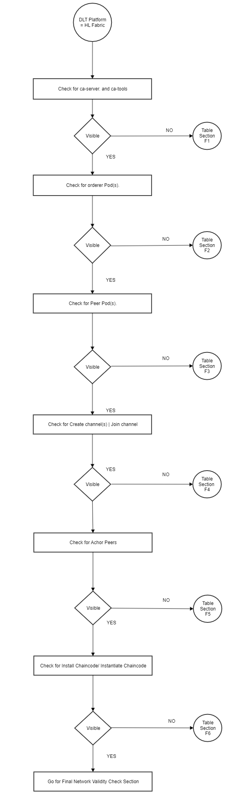

## Hyperledger Fabric verification in BAF
While deploying a HLF through BAF, The pods and other components take some time to setup.
The flow chart shows the Fabric Deployment process. To verify the steps of deployment, follow the verification Table 'F', to troubleshoot the general errors.

----


---
**Fabric Troubleshooting**

| Section | Problem                                                 | Possible Cause                                                                                                                                                                                                                                                                                                                                                                                                                                                                                                                                                                                                                                             | Solution                                                                                                                                                                                                                                                                                                                                                                                                                                                                                                                                                                                                                                                                                                                                                                                                                                                                                                                                                              |
|---------|---------------------------------------------------------|------------------------------------------------------------------------------------------------------------------------------------------------------------------------------------------------------------------------------------------------------------------------------------------------------------------------------------------------------------------------------------------------------------------------------------------------------------------------------------------------------------------------------------------------------------------------------------------------------------------------------------------------------------|-----------------------------------------------------------------------------------------------------------------------------------------------------------------------------------------------------------------------------------------------------------------------------------------------------------------------------------------------------------------------------------------------------------------------------------------------------------------------------------------------------------------------------------------------------------------------------------------------------------------------------------------------------------------------------------------------------------------------------------------------------------------------------------------------------------------------------------------------------------------------------------------------------------------------------------------------------------------------|
| F1      | CA Pods are not up/ Visible                             | 1.Value files are not properly generated <br/>2. Files are not pushed to git repo <br/>3. Release Failed                                                                                                                                                                                                                                                                                                                                                                                                                                                                                                                                                   | 1.Check if the value files are correctly generated <br/>2. Check whether git branch is right or is in sync with remote <br/>3. Check flux-helm operator logs and look for errors <br/>- Describe the HelmRelease File, Check the status. <br/>- If pod is already terminated, delete the release file. <br/>- Flux will redeploy the pod, check for logs                                                                                                                                                                                                                                                                                                                                                                                                                                                                                                                                                                                                              |
| F2      | Orderer Pods are not up,CrashLoopBackoff or Error State | 1. Value files are not properly generated.<br/>2. Files are not pushed to git repo<br/>3. Release Failed<br/> 4. Certificate Errors                                                                                                                                                                                                                                                                                                                                                                                                                                                                                                                        | 1.Check if the value files are correctly generated <br/>2. Check whether git branch is right or is in sync with remote <br/>3. Check flux-helm operator logs and look for errors <br/>- Describe the HelmRelease File, Check the status <br/>- If pod is already terminated, delete the release file.<br/>- Flux will redeploy the pod, check for logs If pod in in error or CrashLoopBackoff, Check logs for more details <br/>4. Certificate errors. Make sure you have deleted the previous certificate. Reset the network and try again Check whether the certificates are present at proper paths in the vault or if the certificates are properly fetched.<br/>If you see the error message remote error: tls: bad certificate on the client side, it usually means that the TLS server has enabled client authentication and the server either did not receive the correct client certificate or it received a client certificate that it does not trust.<br/> |
| F3      | Peer Pods are not up.                                   | 1. Value files are not properly generated or not properly pushed.<br/>2. Release Failed                                                                                                                                                                                                                                                                                                                                                                                                                                                                                                                                                                    | 1. Check if the value files are correctly generated <br/>- Check whether git branch is right or is in sync with remote <br/>2. Check flux-helm operator logs and look for errors <br/>- Describe the HelmRelease File, Check the status and details <br/>- If pod is already terminated, delete the release file.<br/>- Flux will redeploy the pod, check for logs                                                                                                                                                                                                                                                                                                                                                                                                                                                                                                                                                                                                    |
| F4      | Create Channel/ JoinChannel are not working.            | 1. Value files are not properly generated or not properly pushed.</br>2. Release Failed.Since create channel and Join channel are jobs, their pods are usually deleted after 5-6 retries if anything fails <br/>3. Orderer and peer are able to talk to each other <br/>- Error: failed to create deliver client: orderer client failed to connect to :7050: failed to create new connection: context deadline exceeded <br/>- got unexpected status: BAD_REQUEST – error authorizing update: error validating DeltaSet: policy for [Group] /Channel/Application not satisfied: Failed to reach implicit threshold of 1 sub-policies, required 1 remaining | 1. Check if the value files are correctly generated <br/>- Check whether git branch is right or is in sync with the remote <br/>2. Check flux-helm operator logs and look for errors <br/>- Describe the HelmRelease File, Check the status. <br/>- If pod is already terminated/unavailable after some time, delete the release file. <br/>- Flux will redeploy the pod, check for logs <br/>3. Check if the orderer and peer urls are correct and mapped properly Route53 service Not able to reach orderer, Check orderer logs for more details.<br/> Backtrace it, check if ambassador is working.<br/>The most common reasons for are: <br/>a) This identity is not in the organization’s administrator list. <br/>b) The organization certificate is not effectively signed by the organization’s CA chain. <br/>c) The organization that the orderer does not know about identity.                                                                             |
| F5      | Anchors Peers are not up.                               | 1. Value files are not properly generated or not properly pushed. <br/>2. Release Failed                                                                                                                                                                                                                                                                                                                                                                                                                                                                                                                                                                   | 1. Check if the value files are correctly generated <br/>- Check whether git branch is right or in sync with the remote <br/>2. Check flux-helm operator logs and look for errors <br/>- Describe the HelmRelease File, Check the status. <br/>- If pod is already terminated, delete the release file. <br/>- Flux will redeploy the pod, check for logs .<br/>Check peer logs, filter results using grep “anchor. If anchor peers are successful, you should find the list in the peer logs. The output should have the list of the anchor peers.                                                                                                                                                                                                                                                                                                                                                                                                                   |
| F6      | Install/ Instantiate chaincode are not up.              | 1. Value files are not properly generated or not properly pushed. <br/>2. Release Failed<br/>                                                                                                                                                                                                                                                                                                                                                                                                                                                                                                                                                              | 1. Check if the value files are correctly generated <br/>- Check whether git branch is right or is in sync with the remote <br/>2. Check flux-helm operator logs and look for errors <br/>- Describe the HelmRelease File, Check the status.<br/>- If pod is already terminated, delete the release file.<br/>- Flux will redeploy the pod, check for logs <br/>If the Pod is not up and running backtrack to which component is creating issue and check its logs.                                                                                                                                                                                                                                                                                                                                                                                                                                                                                                   |

**(Table 'F')**

----


##### Final network validity check.
For fabric
For checking the logs of specific pods like orderer pod, peer pod or channel pods etc.
Get the list of pods using

    kubectl get pods -A

Copy the name of the pods from the list. 

    kubectl logs <pod name> -n <namespace>

To check the logs of a particular container inside the pod.

    kubectl logs -c <container name> <pod name> -n <namespace>

For checking the anchors peers

     kubectl logs <pod name> -n <namespace> | grep anchor
The output should have the list of the anchor peers.

For final checking of the validity of the fabric network.

1. Create a cli pod for any organization.Use this sample template. 
```
    metadata:
      namespace: <namespace>
      images:
        fabrictools: hyperledger/fabric-tools:2.0
        alpineutils: index.docker.io/hyperledgerlabs/alpine-utils:1.0
    storage:
      class: <storage class name>
      size: 256Mi
    vault:
      role: vault-role
      address: <vault address>
      authpath: <auth path>
      adminsecretprefix: <Path to admin secret Prefix>
      orderersecretprefix: <Path to orderer secret prefix>
      serviceaccountname: <Service account name>
      imagesecretname: regcred
      tls: false
    peer:
      name: <peer name>
      localmspid: <msp id of peer>
      tlsstatus: true
      address: <peer address>
    orderer:
      address: <orderer address>
```

2. To install the cli.
```
    helm install -f cli.yaml /hyperledger-fabric/charts/fabric_cli -n <namespace>
```
3. Get the cli pod.
```    
    kubectl get pod -n <namespace>
```
4. Copy the cli pod name from the output list and enter the cli using.
```
    kubectl exec -it <cli pod name> -n <namespace> -- bash
```    
5. To see which chaincodes are installed 
```
    peer chaincode list --installed
```
6. Execute a transaction
For init:
```
        peer chaincode invoke -o <orderer url> --tls true --cafile <path of orderer tls cert> -C <channel name> -n <chaincode name> -c '{"Args":["init",""]}'
```
Upon successful invocation, should display a `status 200` msg.
