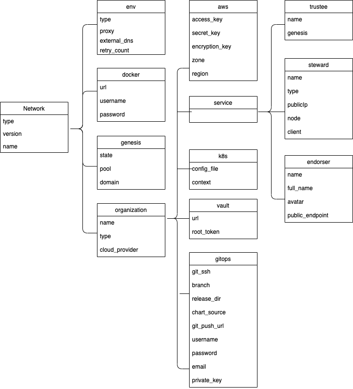
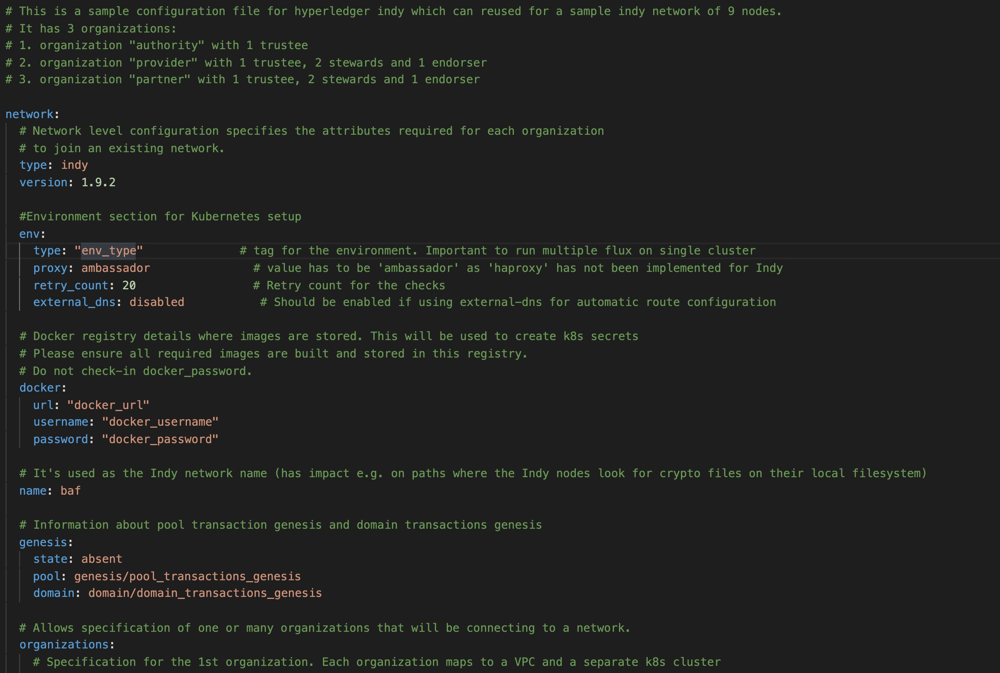

# Configuration file specification: Indy
A network.yaml file is the base configuration file for setting up a Indy network. This file contains all the information related to the infrastructure and network specifications. Here is the structure of it.


Before setting up a Indy network, this file needs to be updated with the required specifications.
A sample configuration file is provide in the repo path:  
`platforms/hyperledger-indy/configuration/samples/network-indyv3.yaml`  

The configurations are grouped in the following sections for better understanding.

* type

* version

* env

* docker

* name

* genesis

* organizations

Here is the snapshot from the sample configuration file



The sections in the sample configuration file are  

`type` defines the platform choice like corda/fabric/indy, here in example its Indy

`version` defines the version of platform being used, here in example the Indy version is 1.9.2.

`env` section contains the environment type and additional configuration. Value for proxy field under this section has to be 'ambassador' as 'haproxy' has not been implemented for Indy.

The snapshot of the `env` section with example values is below
```yaml
  env:
    type: "env_type"              # tag for the environment. Important to run multiple flux on single cluster
    proxy: ambassador               # value has to be 'ambassador' as 'haproxy' has not been implemented for Indy
    retry_count: 20                 # Retry count for the checks
    external_dns: disabled           # Should be enabled if using external-dns for automatic route configuration
```
The fields under `env` section are 

| Field      | Description                                 |
|------------|---------------------------------------------|
| type       | Environment type. Can be like dev/test/prod.|
| proxy      | Choice of the Cluster Ingress controller. Currently supports 'ambassador' only as 'haproxy' has not been implemented for Indy |
| retry_count       | Retry count for the checks.|
| external_dns       | If the cluster has the external DNS service, this has to be set `enabled` so that the hosted zone is automatically updated. |


`docker` section contains the credentials of the repository where all the required images are built and stored.

The snapshot of the `docker` section with example values is below
```yaml
  # Docker registry details where images are stored. This will be used to create k8s secrets
  # Please ensure all required images are built and stored in this registry.
  # Do not check-in docker_password.
  docker:
    url: "docker_url"
    username: "docker_username"
    password: "docker_password"
```
The fields under `docker` section are

| Field      | Description                                 |
|------------|---------------------------------------------|
| docker_url        | Docker registry url                         |
| username   | Username credential required for login      |
| password   | Password credential required for login      |

---
**NOTE:** Please follow [these instructions](../operations/configure_prerequisites.html#docker) to build and store the docker images before running the Ansible playbooks.

---

`name` is used as the Indy network name (has impact e.g. on paths where the Indy nodes look for crypto files on their local filesystem)

The snapshot of the `genesis` section with example values is below
```yaml
  # Information about pool transaction genesis and domain transactions genesis
  genesis:
    state: absent
    pool: genesis/pool_transactions_genesis
    domain: domain/domain_transactions_genesis
```
The `genesis` section contains Information about pool transaction genesis and domain transactions genesis. `genesis` contains the following fields:

| Field       | Description                                              |
|-------------|----------------------------------------------------------|
| state        | State is placeholder for future, when there will be option to join to existing cluter. Currently only "absent" is supported. That means, that genesis will be always generated    |
| pool         | Path to pool transaction genesis. [Readme here](https://github.com/hyperledger-labs/blockchain-automation-framework/blob/master/platforms/hyperledger-indy/configuration/roles/setup/pool_genesis/).    |
| domain | Path to domain transaction genesis. [Readme here](https://github.com/hyperledger-labs/blockchain-automation-framework/blob/master/platforms/hyperledger-indy/configuration/roles/setup/domain_genesis/).      |


The `organizations` section allows specification of one or many organizations that will be connecting to a network. If an organization is also hosting the root of the network (e.g. membership service, etc), then these services should be listed in this section as well.

The snapshot of an organization field with sample values is below
```yaml
    - organization:
      name: authority
      type: peer
      cloud_provider: aws-baremetal             # Currently eks is not supported due to aws_authenticator

```

Each organization under the `organizations` section has the following fields. 

| Field                                    | Description                                 |
|------------------------------------------|-----------------------------------------------------|
| name                                        | Name of the organization                              |
| type                                        | Type of organization. This field can be peer/              |
| cloud_provider                              | Cloud provider of the Kubernetes cluster for this organization. This field can be aws_baremetal. Currently eks is not supported due to aws_authenticator |
| aws                                         | When the organization cluster is on AWS |
| k8s                                         | Kubernetes cluster deployment variables.|
| vault                                       | Contains Hashicorp Vault server address and root-token in the example |
| gitops                                      | Git Repo details which will be used by GitOps/Flux. |
| services                                    | Contains list of services which could be trustee/steward/endorser |


For the aws and k8s field the snapshot with sample values is below
```yaml
      aws:
        access_key: "aws_access_key"            # AWS Access key
        secret_key: "aws_secret_key"            # AWS Secret key
        encryption_key: "encryption_key_id"     # AWS encryption key. If present, it's used as the KMS key id for K8S storage class encryption.
        zone: "availability_zone"               # AWS availability zone
        region: "region"                        # AWS region
        publicIps: []                           # List of all public IP addresses of each availability zone

      # Kubernetes cluster deployment variables. The config file path has to be provided in case
      # the cluster has already been created.
      k8s:
        config_file: "cluster_config"
        context: "kubernetes-admin@kubernetes"

```

The `aws` field under each organisation contains: (This will be ignored if cloud_provider is not 'aws')

| Field       | Description                                              |
|-------------|----------------------------------------------------------|
| access_key                              | AWS Access key  |
| secret_key                              | AWS Secret key  |
| encryption_key                              | AWS encryption key. If present, it's used as the KMS key id for K8S storage class encryption.  |
| zone                              | AWS availability zone  |
| region                              | AWS region  |
| publicIps                           | List of all public IP addresses of each availability zone from all organizations in the same k8s cluster |

*NOTE*: Network.yaml file consists of more organizations, where each organization can be under different availability zone. It means, that each organization has different IP. The field `publicIps` holds list of all IPs of all organizations in the same cluster.

The `k8s` field under each organisation contains

| Field       | Description                                              |
|-------------|----------------------------------------------------------|
| context                                 | Context/Name of the cluster where the organization entities should be deployed                                   |
| config_file                             | Path to the kubernetes cluster configuration file                                                                |


For the vault field the snapshot with sample values is below
```yaml
      # Hashicorp Vault server address and root-token. Vault should be unsealed.
      # Do not check-in root_token
      vault:
        url: "vault_addr"
        root_token: "vault_root_token"

```

The `vault` field under each organisation contains:

| Field       | Description                                              |
|-------------|----------------------------------------------------------|
| url                              | Vault server  |
| root_token                              | Vault root token  |

For gitops fields the snapshot from the sample configuration file with the example values is below
```yaml
      # Git Repo details which will be used by GitOps/Flux.
      # Do not check-in git_password
      gitops:
        git_ssh: "gitops_ssh_url"                   # Gitops ssh url for flux value files like "ssh://git@github.com/hyperledger-labs/blockchain-automation-framework.git"
        branch: "gitops_branch"                     # Git branch where release is being made
        release_dir: "gitops_release_dir"           # Relative Path in the Git repo for flux sync per environment. 
        chart_source: "gitops_charts"               # Relative Path where the Helm charts are stored in Git repo
        git_push_url: "gitops_push_url"             # Gitops https URL for git push like "github.com/hyperledger-labs/blockchain-automation-framework.git"
        username: "git_username"                    # Git Service user who has rights to check-in in all branches
        password: "git_password"                    # Git Server user password
        email: "git_email"                          # Email to use in git config
        private_key: "path_to_private_key"          # Path to private key file which has write-access to the git repo

```

The `gitops` field under each organization contains

| Field       | Description                                              |
|-------------|----------------------------------------------------------|
| git_ssh                              | SSH url of the repository where flux should be synced                                                            |
| branch                               | Branch of the repository where the Helm Charts and value files are stored                                        |
| release_dir                          | Relative path where flux should sync files                                                                       |
| chart_source                         | Relative path where the helm charts are stored                                                                   |
| git_push_url                         | Gitops https URL for git push like "github.com/hyperledger-labs/blockchain-automation-framework.git"             |
| username                             | Username which has access rights to read/write on repository                                                     |
| password                             | Password of the user which has access rights to read/write on repository                                         |
| email                                | Email of the user to be used in git config                                                                       |
| private_key                          | Path to the private key file which has write-access to the git repo                                              |


The services field for each organization under `organizations` section of Indy contains list of `services` which could be trustee/steward/endorser

The snapshot of trustee service with example values is below
```yaml
      services:
        trustees:
        - trustee:
          name: provider-trustee
          genesis: true
```

The fields under `trustee` service are (find more about differences between trustee/steward/endorser [here](https://readthedocs.org/projects/indy-node/downloads/pdf/latest/))

| Field       | Description                                              |
|-------------|----------------------------------------------------------|
| name            | Name for the trustee service                 |
| genesis         | If using domain and pool transaction genesis  |

The snapshot of steward service example values is below
```yaml
      services:
        stewards:
        - steward:
          name: provider-steward-1
          type: VALIDATOR
          genesis: true
          publicIp: 3.221.78.194
          node:
            port: 9711
            targetPort: 9711
            ambassador: 9711        # Port for ambassador service
          client:
            port: 9712
            targetPort: 9712
            ambassador: 9712        # Port for ambassador service
```
The fields under `steward` service are

| Field       | Description                                              |
|-------------|----------------------------------------------------------|
| name                | Name of the steward service                     |
| type      | type VALIDATOR/OBSERVER for steward service. Currenty only VALIDATOR type is supported. Validators are trusted parties who validate identities and transactions in a distributed fashion. They validate identities by the private key of the identity validator. An outside party can also verify claims using the public key of the validator. Observer nodes may be required as the network scales. From the perspective of Indy clients, an observer node is a read-only copy of the Sovrin ledger performing three functions (Read requests, Hot stanbys, Push subscriptions) |
| genesis              | If using domain and pool transaction genesis. |
| publicIp                    | Public Ip of service   |
| node.port       | HTTP node port number                                       |
| node.targetPort        | HTTP target node port number                                |
| node.ambassador                     | HTTP node port number of ambassador |
| client.port       |HTTP client port number                                       |
| client.targetPort        | HTTP client target port number                                   |
| client.ambassador                     | HTTP client port number of ambassador |


The snapshot of endorser service with example values is below
```yaml
      services:
        endorsers:
        - endorser:
          name: provider-endorser
          full_name: Some Decentralized Identity Mobile Services Provider
          avatar: https://provider.com/avatar.png
          public_endpoint: https://provider.com/public
```
The fields under `endorser` service are 

| Field       | Description                                              |
|-------------|----------------------------------------------------------|
| name                     | Name of the endorser service   |
| full_name                   | Full name of endorser service |
| avatar                      | Link to avatar  |
| public_endpoint                 | Link to public endpoint |
