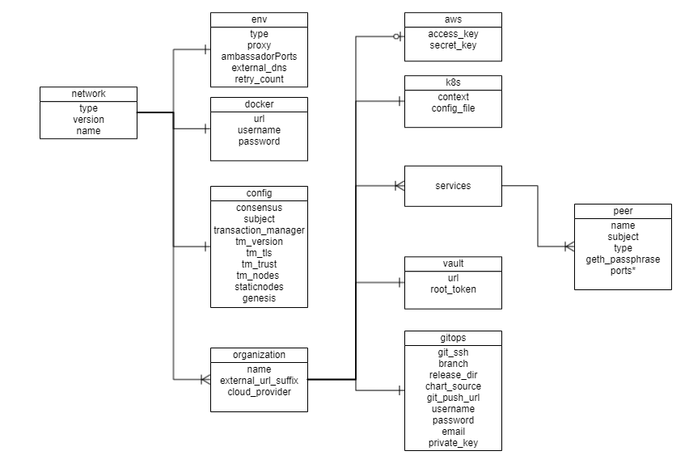
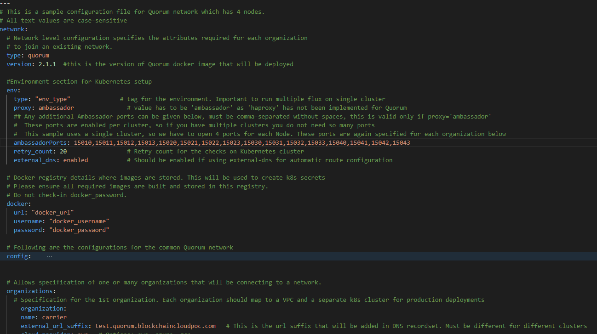

# Configuration file specification: Quorum
A network.yaml file is the base configuration file designed in the Blockchain Automation Framework for setting up a Quorum DLT network. This file contains all the configurations related to the network that has to be deployed. Below shows its structure.


Before setting up a Quorum DLT network, this file needs to be updated with the required specifications.  
A sample configuration file is provided in the repo path:  
`platforms/quorum/configuration/samples/network-quorum.yaml` 

The configurations are grouped in the following sections for better understanding.

* type

* version

* env

* docker

* config

* organizations

Here is the snapshot from the sample configuration file



The sections in the sample configuration file are  

`type` defines the platform choice like corda/fabric/indy/quorum, here in the example its **quorum**.

`version` defines the version of platform being used. The current Quorum version support is only for **2.5.0**

---
**NOTE**: Use Quorum Version 2.5.0 if you are deploying Supplychain smartcontracts from examples.

---

`env` section contains the environment type and additional (other than 8443) Ambassador port configuration. Vaule for proxy field under this section can be 'ambassador' or 'haproxy'

The snapshot of the `env` section with example value is below
```yaml 
  env:
    type: "env-type"              # tag for the environment. Important to run multiple flux on single cluster
    proxy: ambassador               # value has to be 'ambassador' as 'haproxy' has not been implemented for Quorum
    ## Any additional Ambassador ports can be given below, must be comma-separated without spaces, this is valid only if proxy='ambassador'
    #  These ports are enabled per cluster, so if you have multiple clusters you do not need so many ports
    #  This sample uses a single cluster, so we have to open 4 ports for each Node. These ports are again specified for each organization below
    ambassadorPorts: 15010,15011,15012,15013,15020,15021,15022,15023,15030,15031,15032,15033,15040,15041,15042,15043  
    retry_count: 50                # Retry count for the checks
    external_dns: enabled           # Should be enabled if using external-dns for automatic route configuration
```
The fields under `env` section are 

| Field      | Description                                 |
|------------|---------------------------------------------|
| type       | Environment type. Can be like dev/test/prod.|
| proxy      | Choice of the Cluster Ingress controller. Currently supports 'ambassador' only as 'haproxy' has not been implemented for Quorum |
| ambassadorPorts   | Any additional Ambassador ports can be given here; must be comma-separated without spaces like `10010,10020`. This is only valid if `proxy: ambassador`. These ports are enabled per cluster, so if you have multiple clusters you do not need so many ports to be opened on Ambassador. Our sample uses a single cluster, so we have to open 4 ports for each Node. These ports are again specified in the `organization` section.     |
| retry_count       | Retry count for the checks. Use a high number if your cluster is slow. |
|external_dns       | If the cluster has the external DNS service, this has to be set `enabled` so that the hosted zone is automatically updated. |

`docker` section contains the credentials of the repository where all the required images are built and stored.

The snapshot of the `docker` section with example values is below
```yaml
  # Docker registry details where images are stored. This will be used to create k8s secrets
  # Please ensure all required images are built and stored in this registry.
  # Do not check-in docker_password.
  docker:
    url: "docker_url"
    username: "docker_username"
    password: "docker_password"
```
The fields under `docker` section are

| Field    | Description                            |
|----------|----------------------------------------|
| url      | Docker registry url                    |
| username | Username required for login to docker registry|
| password | Password required for login to docker registry|


`config` section contains the common configurations for the Quorum network.

The snapshot of the `config` section with example values is below
```yaml
  config:    
    consensus: "raft"                 # Options are "raft" and "ibft"
    ## Certificate subject for the root CA of the network. 
    #  This is for development usage only where we create self-signed certificates and the truststores are generated automatically.
    #  Production systems should generate proper certificates and configure truststores accordingly.
    subject: "CN=DLT Root CA,OU=DLT,O=DLT,L=London,C=GB"
    transaction_manager: "tessera"    # Options are "tessera" and "constellation"
    # This is the version of "tessera" or "constellation" docker image that will be deployed
    # Supported versions #
    # constellation: 0.3.2 (For all versions of quorum)
    # tessera: 0.11 (for quorum 2.5.0)
    tm_version: "0.11"               # This is the version of "tessera" and "constellation" docker image that will be deployed
    tm_tls: "strict"                  # Options are "strict" and "off"
    tm_trust: "tofu"                  # Options are: "whitelist", "ca-or-tofu", "ca", "tofu"
    ## Transaction Manager nodes public addresses should be provided.
    #  For "tessera", all participating nodes should be provided
    #  For "constellation", only one is bootnode should be provided
    #
    # For constellation, use following. This will be the bootnode for all nodes
    #  - "http://carrier.test.quorum.blockchaincloudpoc.com:15012/"  #NOTE the end / is necessary and should not be missed
    # The above domain name is formed by the http://(peer.name).(org.external_url_suffix):(ambassador constellation port)/
    # In the example (for tessera ) below, the domain name is formed by the https://(peer.name).(org.external_url_suffix):(ambassador default port)
    tm_nodes: 
      - "https://carrier.test.quorum.blockchaincloudpoc.com:8443"
      - "https://manufacturer.test.quorum.blockchaincloudpoc.com:8443"
      - "https://store.test.quorum.blockchaincloudpoc.com:8443"
      - "https://warehouse.test.quorum.blockchaincloudpoc.com:8443"
    staticnodes: "/home/user/blockchain-automation-framework/build/quorum_staticnodes" # Location where staticnodes will be saved
    genesis: "/home/user/blockchain-automation-framework/build/quorum_genesis"   # Location where genesis file will be saved
    # NOTE for the above paths, the directories should exist
    ##### Following keys are only used when adding new Node(s) to existing network and should NOT be used to create new network.
    bootnode:
      #name of the bootnode that matches one from existing node
      name: carrier
      #ambassador url of the bootnode
      url: carrier.test.quorum.blockchaincloudpoc.com
      #rpc port of the bootnode
      rpcport: 15011
      #id of the bootnode
      nodeid: 1
```
The fields under `config` are

| Field       | Description                                              |
|-------------|----------------------------------------------------------|
| consensus   | Currently supports `raft` or `ibft`. Please update the remaining items according to the consensus chosen as not all values are valid for both the consensus.                                 |
| subject     | This is the subject of the root CA which will be created for the Quorum network. The root CA is for development purposes only, production networks should already have the root certificates.   |
| transaction_manager    | Options are `tessera` and `constellation`. Please update the remaining items according to the transaction_manager chosen as not all values are valid for both the transaction_manager. |
| tm_version         | This is the version of `tessera` and `constellation` docker image that will be deployed. Supported versions: `0.11` and `0.9.2` for `tessera` and `0.3.2` for `constellation`. |
| tm_tls | Options are `strict` and `off`. This enables TLS for the transaction managers, and is not related to the actual Quorum network. `off` is not recommended for production. |
| tm_trust | Options are: `whitelist`, `ca-or-tofu`, `ca`, `tofu`. This is the trust relationships for the transaction managers. More details [for tessera]( https://github.com/jpmorganchase/tessera/wiki/TLS) and [for consellation](https://github.com/jpmorganchase/constellation/blob/master/sample.conf).|
| tm_nodes | The Transaction Manager nodes public addresses should be provided. For `tessera`, all participating nodes should be provided, for `constellation`, only one bootnode should be provided. NOTE The difference in the addresses for Tessera and Constellation. |
| staticnodes | This is the path where staticnodes will be stored for a new network; for adding new node, the existing network's staticnodes should be available in yaml format in this file.|
| genesis | This is the path where genesis.json will be stored for a new network; for adding new node, the existing network's genesis.json should be available in json format in this file.|
| bootnode | This is only applicable when adding a new node to existing network and contains the boot node rpc details |


The `organizations` section contains the specifications of each organization.  
In the sample configuration example, we have four organization under the `organizations` section.

The snapshot of an organization field with sample values is below
```yaml
  organizations:
    # Specification for the 1st organization. Each organization maps to a VPC and a separate k8s cluster
    - organization:
      name: carrier
      external_url_suffix: test.quorum.blockchaincloudpoc.com   # This is the url suffix that will be added in DNS recordset. Must be different for different clusters
      cloud_provider: aws   # Options: aws, azure, gcp, minikube
```
Each `organization` under the `organizations` section has the following fields. 

| Field                                    | Description                                 |
|------------------------------------------|-----------------------------------------------------|
| name                                        | Name of the organization     |
| external_url_suffix                         | Public url suffix of the cluster.         |
| cloud_provider                              | Cloud provider of the Kubernetes cluster for this organization. This field can be aws, azure, gcp or minikube |
| aws                                         | When the organization cluster is on AWS |
| k8s                                         | Kubernetes cluster deployment variables.|
| vault                                       | Contains Hashicorp Vault server address and root-token in the example |
| gitops                                      | Git Repo details which will be used by GitOps/Flux. |
| services                                    | Contains list of services which could ca/peer/orderers/concensus based on the type of organization |

For the `aws` and `k8s` field the snapshot with sample values is below
```yaml
      aws:
        access_key: "<aws_access_key>"    # AWS Access key, only used when cloud_provider=aws
        secret_key: "<aws_secret>"        # AWS Secret key, only used when cloud_provider=aws
  
      # Kubernetes cluster deployment variables.
      k8s:
        context: "<cluster_context>"
        config_file: "<path_to_k8s_config_file>"
```

The `aws` field under each organization contains: (This will be ignored if cloud_provider is not `aws`)

| Field       | Description                                              |
|-------------|----------------------------------------------------------|
| access_key                              | AWS Access key  |
| secret_key                              | AWS Secret key  |

The `k8s` field under each organization contains

| Field       | Description                                              |
|-------------|----------------------------------------------------------|
| context                                 | Context/Name of the cluster where the organization entities should be deployed                                   |
| config_file                             | Path to the kubernetes cluster configuration file                                                                |

For gitops fields the snapshot from the sample configuration file with the example values is below
```yaml
      # Git Repo details which will be used by GitOps/Flux.
      gitops:
        git_ssh: "git@github.com/<username>/blockchain-automation-framework.git" # Gitops ssh url for flux value files
        branch: "<branch_name>"                                                  # Git branch where release is being made
        release_dir: "platforms/Quorum/releases/dev" # Relative Path in the Git repo for flux sync per environment. 
        chart_source: "platforms/Quorum/charts"      # Relative Path where the Helm charts are stored in Git repo
        git_push_url: "github.com/<username>/blockchain-automation-framework.git" # without https://
        username: "<username>"          # Git Service user who has rights to check-in in all branches
        password: "<password>"          # Git Server user password/personal token
        email: "<git_email>"              # Email to use in git config
        private_key: "<path to gitops private key>"
```

The gitops field under each organization contains

| Field       | Description                                              |
|-------------|----------------------------------------------------------|
| git_ssh                              | SSH url of the repository where flux should be synced                                                            |
| branch                               | Branch of the repository where the Helm Charts and value files are stored                                        |
| release_dir                          | Relative path where flux should sync files                                                                       |
| chart_source                         | Relative path where the helm charts are stored                                                                   |
| git_push_url                         | Gitops https URL for git push like "github.com/hyperledger-labs/blockchain-automation-framework.git"             |
| username                             | Username which has access rights to read/write on repository                                                     |
| password                             | Password of the user which has access rights to read/write on repository                                         |
| email                                | Email of the user to be used in git config                                                                       |
| private_key                          | Path to the private key file which has write-access to the git repo                                              |

The services field for each organization under `organizations` section of Quorum contains list of `services` which could be ony peers as of now.

Each organization with type as peer will have a peers service. The snapshot of peers service with example values is below
```yaml
        peers:
        - peer:
          name: carrier
          subject: "O=Carrier,OU=Carrier,L=51.50/-0.13/London,C=GB" # This is the node subject. L=lat/long is mandatory for supplychain sample app
          type: validator         # value can be validator or non-validator, only applicable if consensus = 'ibft'
          geth_passphrase: 12345  # Passphrase to be used to generate geth account
          p2p:
            port: 21000
            ambassador: 15010       #Port exposed on ambassador service (use one port per org if using single cluster)
          rpc:
            port: 8546
            ambassador: 15011       #Port exposed on ambassador service (use one port per org if using single cluster)
          transaction_manager:
            port: 8443          # use port: 9001 when transaction_manager = "constellation"
            ambassador: 8443    # use ambassador: 15012 when transaction_manager = "constellation"
          raft:                     # Only used if consensus = 'raft'
            port: 50401
            ambassador: 15013
          db:                       # Only used if transaction_manager = "tessera"
            port: 3306
```
The fields under `peer` service are

| Field       | Description                                              |
|-------------|----------------------------------------------------------|
| name            | Name of the peer                |
| subject     | This is the alternative identity of the peer node    |
| type           | Type can be `validator` and `nonvalidator`. This is only applicable for `ibft` consensus. |
| geth_passphrase | This is the passphrase used to generate the geth account. |
| p2p.port   | P2P port for Quorum|
| p2p.ambassador | The P2P Port when exposed on ambassador service|
| rpc.port   | RPC port for Quorum|
| rpc.ambassador | The RPC Port when exposed on ambassador service|
| transaction_manager.port   | Port used by Transaction manager `tessera` or `constellation`. Use 8443 for Tessera and 9001 for Constellation |
| transaction_manager.ambassador | The tm port when exposed on ambassador service. Must use 8443 for Tessera, and a corresponding port like 15023 for Constellation. |
| raft.port   | RAFT port for Quorum when `consensus: raft` |
| raft.ambassador | The RAFT Port when exposed on ambassador service|
| db.port   | MySQL DB internal port, only valid if `transaction_manager: tessera`|


*** feature is in future scope
