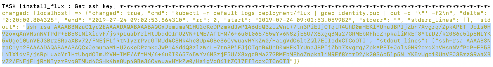

# Setting up a DLT network
Ansible playbooks are used to set up a DLT network. For this, [Ansible host and controller](https://docs.ansible.com/ansible/latest/network/getting_started/basic_concepts.html) is first configured with the pre-requisites like kubectl, helm, vault, aws cli and auth (where k8s.provider is aws) and then the DLT network is setup as per the specifications mentioned in the [network.yaml](https://innersource.accenture.com/projects/BLOCKOFZ/repos/blockchain-automation-framework.git/browse/platforms/hyperledger-fabric/configuration/samples/network-fabricv2.yaml), [network yaml details for R3-Corda](./corda_networkyaml.md) and [network yaml details for Hyperledger-Fabric](./fabric_networkyaml.md)

The ansible playbook [site.yaml](https://innersource.accenture.com/projects/BLOCKOFZ/repos/blockchain-automation-framework.git/browse/platforms/shared/configuration/site.yaml) ([ReadMe](https://innersource.accenture.com/projects/BLOCKOFZ/repos/blockchain-automation-framework.git/browse/platforms/shared/configuration/README.md)) runs 4 roles, first being the setting up an environment, second being Gitops integraton for each organization cloud infrastructure and third role chosen based on the DLT platform specified in [network.yaml for Hyperledger-Fabric](https://innersource.accenture.com/projects/BLOCKOFZ/repos/blockchain-automation-framework.git/browse/platforms/hyperledger-fabric/configuration/samples/network-fabricv2.yaml) or [network.yaml for R3-Corda](https://innersource.accenture.com/projects/BLOCKOFZ/repos/blockchain-automation-framework.git/browse/platforms/r3-corda/configuration/samples/network-cordav2.yaml). Based on the DLT platform selected, either of [deploy-network.yaml for Fabric](https://innersource.accenture.com/projects/BLOCKOFZ/repos/blockchain-automation-framework.git/browse/platforms/hyperledger-fabric/configuration/deploy-network.yaml) ([ReadMe](https://innersource.accenture.com/projects/BLOCKOFZ/repos/blockchain-automation-framework.git/browse/platforms/hyperledger-fabric/configuration/README.md)) or [deploy-network.yaml for Corda](https://innersource.accenture.com/projects/BLOCKOFZ/repos/blockchain-automation-framework.git/browse/platforms/r3-corda/configuration/deploy-network.yaml) ([ReadMe](https://innersource.accenture.com/projects/BLOCKOFZ/repos/blockchain-automation-framework.git/browse/platforms/r3-corda/configuration/README.md)) will execute. These roles consume the network.yaml file with the specified configurations to set up the network. 

## Manually setting up a DLT network
The above mentioned playbook [site.yaml](https://innersource.accenture.com/projects/BLOCKOFZ/repos/blockchain-automation-framework.git/browse/platforms/shared/configuration/site.yaml) ([ReadMe](https://innersource.accenture.com/projects/BLOCKOFZ/repos/blockchain-automation-framework.git/browse/platforms/shared/configuration/README.md)) can be manually run after the configuration file [network.yaml](https://innersource.accenture.com/projects/BLOCKOFZ/repos/blockchain-automation-framework.git/browse/platforms/hyperledger-fabric/configuration/samples/network-fabricv2.yaml), [network yaml details for R3-Corda](corda_networkyaml.md) and [network yaml details for Hyperledger-Fabric](fabric_networkyaml.md), has the required specifications by using the command:
```
ansible-playbook platforms/shared/configuration/site.yaml --extra-vars "@path-to-network.yaml"
```

### Add SSH Key to Git
While running the above command, The Blockchain Automation Framework configures Flux for each cluster, this generates an SSH key for each cluster which has to be added in the Git repo with read-write access.
The Ansible logs/output will show the public ssh key (start with **ssh-rsa**) as highlighted in the image shown below:


A user has to manually copy and paste this public ssh key to this Git repo to make sure flux can access this repo properly.

## Verify successful configuration of DLT network
To verify if the network is successfully configured or not check if all the kubernetes pods are up and running or not.
Below are some commands to check the pod's status:
* `Kubectl get pods --all-namespaces` : To get list of all the pods and their status across all the namespaces. It will look as below -


* `Kubectl get pods -n xxxxx` : To check status of pods of a single namespace mentioned in place of xxxxx. Example


* `Kubectl logs -f <PODNAME> -n <NAMESPACE>` : To check logs of a pod by giving required pod name and namespace in the command. Example-


For a successful setup of DLT Network all the pods should be in running state.


## Deleting an existing DLT network
The playbook [reset-network.yaml](https://innersource.accenture.com/projects/BLOCKOFZ/repos/blockchain-automation-framework.git/browse/platforms/hyperledger-fabric/configuration/reset-network.yaml), ([reset-network yaml README for r3-corda](https://innersource.accenture.com/projects/BLOCKOFZ/repos/blockchain-automation-framework.git/browse/platforms/r3-corda/configuration/README.md) and [reset-network yaml README for hyperledger fabric](https://innersource.accenture.com/projects/BLOCKOFZ/repos/blockchain-automation-framework.git/browse/platforms/hyperledger-fabric/configuration/README.md)), is used to reset the existing network based on specifications mentioned in configured [network.yaml](https://innersource.accenture.com/projects/BLOCKOFZ/repos/blockchain-automation-framework.git/browse/platforms/hyperledger-fabric/configuration/samples/network-fabricv2.yaml), [network yaml details for R3-Corda](corda_networkyaml.md) and [network yaml details for Hyperledger-Fabric](fabric_networkyaml.md). This can also be done manually by using the command:
```
ansible-playbook path-to-reset-network.yaml --extra-vars "@path-to-network.yaml"
```
