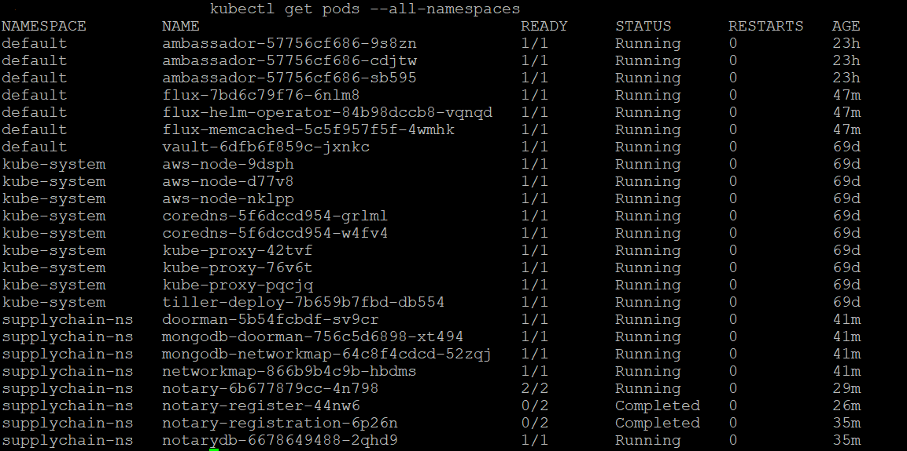
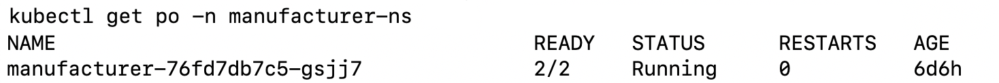
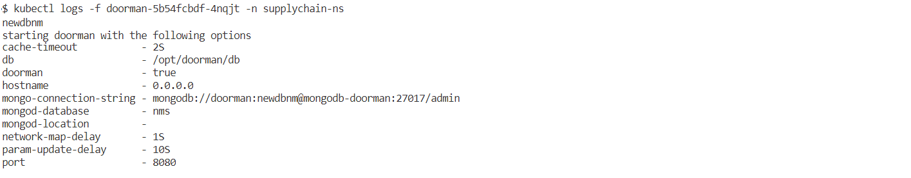

# Setting up a DLT network
## Pre-requisites
To create a Production DLT network, ensure you have the following:

1. One running Kubernetes Cluster and the Config file (kubeconfig.yaml) per Organization.
1. One running Hashicorp Vault server per Organization. Unsealed and configured as per [guidance here](./configure_prerequisites#vaultunseal).
1. Domain Name(s) configured as per [guidance here](./configure_prerequisites#ambassador).
1. Private key file per Organization for GitOps with write-access to the Git repo as per [guidance here](./configure_prerequisites#privatekey).
1. Git user details per Organization as per [pre-requisites](../prerequisites).
1. Ansible controller configured as per [guidance here](./configure_prerequisites#Ansible_Inventory).

---
**NOTE**: All commands are executed from the `blockchain-automation-framework` directory which is the default directory created when you clone our Git repo.

---

## Prepare build folder
If not already done, clone the git repository on your Ansible controller.
```
git clone https://github.com/<your username>/blockchain-automation-framework.git
```
Create a folder called `build` inside `blockchain-automation-framework`.
```
cd blockchain-automation-framework
mkdir build
```
Copy the following files inside `build` folder:
* All the Kubernetes config files (kubeconfig.yaml).
* All the private key files.
    
## Edit the configuration file
Depending on your choice of DLT Platform, select a network.yaml and copy it to `build` folder.
```bash
 # eg for Fabric
 cp platforms/hyperledger-fabric/configuration/samples/network-fabricv2.yaml build/network.yaml
```
Open and update the `network.yaml` according to the following Platform specific guides.

| Platform-specific configuration file|
|---------------------------------|
| [Hyperledger-Fabric](./fabric_networkyaml.md)|
| [R3-Corda](./corda_networkyaml.md) 
| [ Hyperledger-Indy](./indy_networkyaml.md)
| [Quorum](./quorum_networkyaml.md) |

In summary, you will need to update the following:
1. `docker` url, username and password.
1. `external_url_suffix` depending on your Domain Name(s).
1. All DNS addresses depending on your Domain Name(s).
1. `cloud_provider`
1. `k8s` section depending on your Kubernetes zone/cluster name/config filepath.
1. `vault`
1. `gitops` section depending on your git username, tokens and private key filepath.

## Executing provisioning script

After all the configurations are updated in the `network.yaml`, execute the following to create the DLT network
```
# Run the provisioning scripts
ansible-playbook platforms/shared/configuration/site.yaml -e "@./build/network.yaml" 

```
The `site.yaml` playbook, in turn calls various playbooks depending on the configuration file and sets up your DLT network.

## Verify successful configuration of DLT network
To verify if the network is successfully configured or not check if all the kubernetes pods are up and running or not.
Below are some commands to check the pod's status:
* `Kubectl get pods --all-namespaces` : To get list of all the pods and their status across all the namespaces. It will look as below -


* `Kubectl get pods -n xxxxx` : To check status of pods of a single namespace mentioned in place of xxxxx. Example



* `Kubectl logs -f <PODNAME> -n <NAMESPACE>` : To check logs of a pod by giving required pod name and namespace in the command. Example-




For a successful setup of DLT Network all the pods should be in running state.


## Deleting an existing DLT network
The above mentioned playbook [site.yaml](https://github.com/hyperledger-labs/blockchain-automation-framework/tree/master/platforms/shared/configuration/site.yaml) ([ReadMe](https://github.com/hyperledger-labs/blockchain-automation-framework/tree/master/platforms/shared/configuration/)) can be run to reset the network using the network configuration file having the specifications which was used to setup the network using the following command:
```
ansible-playbook platforms/shared/configuration/site.yaml -e "@./build/network.yaml" -e "reset=true"
```
