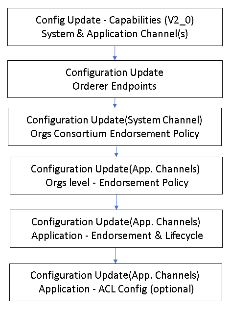

[//]: # (##############################################################################################)
[//]: # (Copyright Accenture. All Rights Reserved.)
[//]: # (SPDX-License-Identifier: Apache-2.0)
[//]: # (##############################################################################################)

<a name = "upgrading-fabric"></a>
# Upgrading Hyperledger Fabric version from 1.4.x to 2.2.2

- [Pre-requisites](#pre_req)
- [Steps to upgrade](#upgrade_steps)

<a name = "pre_req"></a>
## Pre-requisites
A DLT system which is using Hyperledger Fabric version 1.4.8 and is setup using Bevel automation framework

<a name = "upgrade_steps"></a>
## Steps to upgrade
This involve upgrading the nodes and channels to the version 2.2.2 of Fabric is, at a high level, a four step process.

1. Backup the ledger and MSPs.
2. Upgrade the orderer binaries in a rolling fashion to the latest Fabric version.
3. Upgrade the peer binaries in a rolling fashion to the latest Fabric version.
4. Update the orderer system channel and any application channels to the latest capability levels, where available.

As mentioned in prerequisite, existing system(will be called as source system) is setup using Hyperledger Bevel and currently using verion 1.4.x. This guide provide the steps to upgrade it to Hyperledger Fabric version 2.2.2 and the upgraded system(will be called as target system)

The Hyperledger framework can spread across different organizations(hereafter called authorities) which controls their own network.yaml and using Hyperledger Bevel framework created/joined an overarching Hyperledger Fabric network. To upgrade it across different authorities manual faciliation is required. This guide will cover those steps as well.

The following are the steps to be  performed:
## 1. Setup network.yaml for upgrade
Update the network network.yaml [here](https://github.com/hyperledger/bevel/tree/main/platforms/hyperledger-fabric/configuration/samples/network-fabricv2.yaml)
 
	a. Set the required version tag under `network.version` for upgrading the base images of CA, orderer and peer.
	b. Add the upgrade flag to true
	For example:
		network:
	  		version: 2.2.2
			upgrade: true			

This change is required in each network.yaml file owned by different authorities.

## 2. Executing Ansible playbook
The playbook [site.yaml](https://github.com/hyperledger/bevel/tree/main/platforms/shared/configuration/site.yaml) ([ReadMe](https://github.com/hyperledger/bevel/tree/main/platforms/shared/configuration/)) can be run after the configuration file (for example: [network.yaml](https://github.com/hyperledger/bevel/tree/main/platforms/hyperledger-fabric/configuration/samples/network-fabricv2.yaml) for Fabric) has been updated.
```
ansible-playbook platforms/shared/configuration/site.yaml --extra-vars "@path-to-network.yaml"
```
It covers the first three [steps](#upgrade_steps). This step need to be executed by each authority having different netyork.yaml file and using Hyperledger Bevel framework.

## 3. Upgrade Capabilities level
To upgrade the capabilities in system channel and across application channel, the steps in below image needs to be performed. 



As pointed earlier, here we can have two scenarios, one when all organizations are available in single network.yaml file and second there exists multiple network.yaml which are controlled by different authorities.

In latter case one or more autoritie(s) have to be a facilitator and collaborate to get signature for the upgradation of system channel and application channels.

A list of application channels and the respective authoritie(s) have to be prepared, so that one authority can act as application channel upgrade facilitator to update their respective application channels

TODO: The steps will be mentioned for both the cases above will be detailed

## 4. Compare core.yaml & orderer.yaml
When core.yaml and orderer.yaml was modified in source system, a diff is done with new core.yaml and orderer.yaml in the target system. Based on this analysis the target system files can be modified

## 5. Upgrade existing Chaincode lifecycle
Any existing chaincode should be verified as it should continue running as usual. It will be good practice to update them new Hyperledger Fabric 2.2.2 lifecycle.

TODO: the steps for upgrade to be mentioned here.