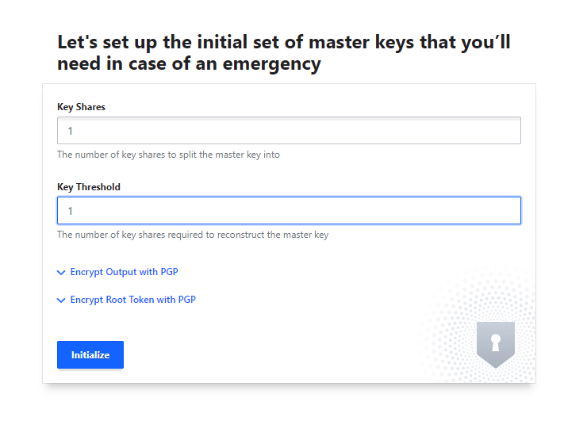

[//]: # (##############################################################################################)
[//]: # (Copyright Accenture. All Rights Reserved.)
[//]: # (SPDX-License-Identifier: Apache-2.0)
[//]: # (##############################################################################################)

# Developer Pre-requisites

To setup a development environment for Bevel, these pre-requisites are needed.  

The process of setting up developer pre-requisites can be done manually or via an automation script.

## Script Based Setup
You can use the scripts [here](https://github.com/hyperledger/bevel/tree/main/platforms/shared/scripts) to setup developer pre-requisites for Windows or Mac OS.   

!!! warning
    
    You need to run the script with admin rights. This can be done by right clicking the script and selecting 'Run as admininstrator'.

## Manual Setup

**The estimated total effort is 55 mins.**

!!! important

    You will need at least 16GB RAM to run Bevel on local machine.

### Setting up Git on your machine

_Estimated Time: 10 minutes_

To use Git, you need to install the software on your local machine.

1. Download and install **git bash** from [http://git-scm.com/downloads](http://git-scm.com/downloads).
1. Open 'git bash' (For Windows, Start > Run, `C:\Program Files (x86)\Git\bin\sh.exe --login -i` )
1. After the install has completed you can test whether Git has installed correctly by running the command `git --version`
1. If this works successfully you will need to configure your Git instance by specifying your username and email address. This is done with the following two commands (Use your GitHub username and email address, if you already have a Github Account):
   ```bash
   git config --global user.name "<username>"
   git config --global user.email "<useremail>"
   ```
1. To verify that the username and password was entered correctly, check by running

   ```bash
   git config user.name
   git config user.email
   ```

1. Windows users should additionally execute the following so that the EOLs are not updated to Windows CRLF.

   ```bash
   git config --global core.autocrlf false
   ```

### Setting up Github

_Estimated Time: 5 minutes_

[GitHub](https://github.com/) is a web-based Git repository hosting service. It offers all of the distributed revision control and source code management (SCM) functionality of Git as well as adding its own features. You can create projects and repositories for you and your teams’ need.

Complete the following steps to download and configure Bevel repository on your local machine.

1. If you already have an account from previously, you can use the same account. If you don't have an account, create one.
1. Go to [bevel](https://github.com/hyperledger/bevel) on GitHub and click **Fork** button on top right. This will create a copy of the repo to your own GitHub account.

1. Create a `project` directory in your home directory and clone the forked repository to your local machine.
   ```bash
   mkdir project
   cd project
   git clone https://github.com/<username>/bevel.git
   ```
1. Checkout the develop branch.
   ```bash
   cd bevel
   git checkout develop
   ```

!!! note

    If you have 2-Factor Authentication enabled on your GitHub account, you have to use GitHub token. Otherwise, password is fine.


    ??? note "How To Generate GitHub Token"

        1. On GitHub page, click your profile icon and then click **Settings**.
        2. On the sidebar, click **Developer settings**.
        3. On the sidebar, click **Personal access tokens**.
        4. Click **Generate new token**.
        5. Add a token description, enable suitable access and click **Generate token**.
        6. Copy the token to a secure location or password management app.

        For security reasons, after you leave the page, you can no longer see the token again.

### Setting up Docker

_Estimated Time: 10 minutes_

Install Docker CLI for [Windows](https://download.docker.com/win/static/stable/x86_64/docker-20.10.12.zip) or [Mac](https://download.docker.com/mac/static/stable/x86_64/docker-20.10.12.tgz) to make sure your local environment has the capability to execute `docker` commands.
You can check the version of Docker you have installed with the following
command from a terminal prompt:

```bash
docker --version
```

### Setting up HashiCorp Vault

_Estimated Time: 15 minutes_

We need [Hashicorp Vault](https://www.vaultproject.io/) for the certificate and key storage.

1. To install the precompiled binary, [download](https://www.vaultproject.io/downloads/) the appropriate package for your system.

    !!! important
        Vault version should be **1.13.1**

1. Once the zip is downloaded, unzip it into any directory. The `vault` binary inside is all that is necessary to run Vault (or `vault.exe` for Windows). Any additional files, if any, aren't required to run Vault.

1. Create a directory `project/bin` and copy the binary there. Add `project/bin` directory to your `PATH`. Run following from git bash.
   ```bash
   mkdir project/bin
   mv vault.exe project/bin
   export PATH=./project/bin:$PATH
   ```
1. Create a `config.hcl` file in the `project` directory with the following contents (use a file path in the `path` attribute which exists on your local machine)
   ```
   ui = true
   storage "file" {
      path    = "./project/data"
   }
   listener "tcp" {
      address     = "0.0.0.0:8200"
      tls_disable = 1
   }
   ```
1. Start the Vault server by executing (this will occupy one terminal). Do not close this terminal.
   ```
   vault server -config=config.hcl
   ```
1. Open browser at [http://localhost:8200/](http://localhost:8200/). And initialize the Vault by providing your choice of key shares and threshold. (below example uses 1)
   
1. Click **Download Keys** or copy the keys, you will need them. Then click **Continue to Unseal**. Provide the unseal key first and then the root token to login.
1. If you need to restart Vault, use the saved unseal keys and root token.

### Setting up Minikube

_Estimated Time: 15 minutes_

For development environment, minikube can be used as the Kubernetes cluster on which the DLT network will be deployed.

!!! important
    
    Minikube setup process keeps changing, so please read the official minikube documentation for latest process and supported hypervisors.

1. Follow platform specific [instructions](https://kubernetes.io/docs/tasks/tools/install-minikube/) to install minikube on your local machine. Also, for Windows install [Virtualbox](https://www.virtualbox.org/wiki/Downloads) as the Hypervisor. For Mac, install hyperkit by `brew install hyperkit` (If you already have **HyperV** it should be removed or disabled.)
1. Minikube is also a binary, so move it into your `./project/bin` directory as it is already added to `PATH`.
1. Configure minikube to use 4GB memory and default kubernetes version
   ```bash
   minikube config set memory 4096
   minikube config set kubernetes-version v1.23.1
   ```
1. Then start minikube. This will take longer the first time.
   ```bash
   minikube start --vm-driver=virtualbox #for Windows
   minikube start --vm-driver=hyperkit #for Mac
   ```
1. Check status of minikube by running
   ```bash
   minikube status
   ```
   The Kubernetes config file is generated at `~/.kube/config`
1. To stop (do not delete) minikube execute the following
   ```bash
   minikube stop
   ```
   Now your development environment is ready!

!!! tip

    Minikube uses port in range 30000-32767. If you would like to change it, use the following command:

    ```bash
    minikube start --vm-driver=virtualbox --extra-config=apiserver.service-node-port-range=15000-20000
    ```

### Troubleshooting

At Step 5, if you get the following error:

```bash
2020-03-10T17:00:21.664Z [ERROR] core: failed to initialize barrier: error="failed to persist keyring: mkdir /project: permission denied"
```

Update the `path` in Vault `config.hcl` to absolute path:

```
storage "file" {
   path    = "/full/path/to/project/vault"
}
```

For example, `/home/users/Desktop/project/vault`.
